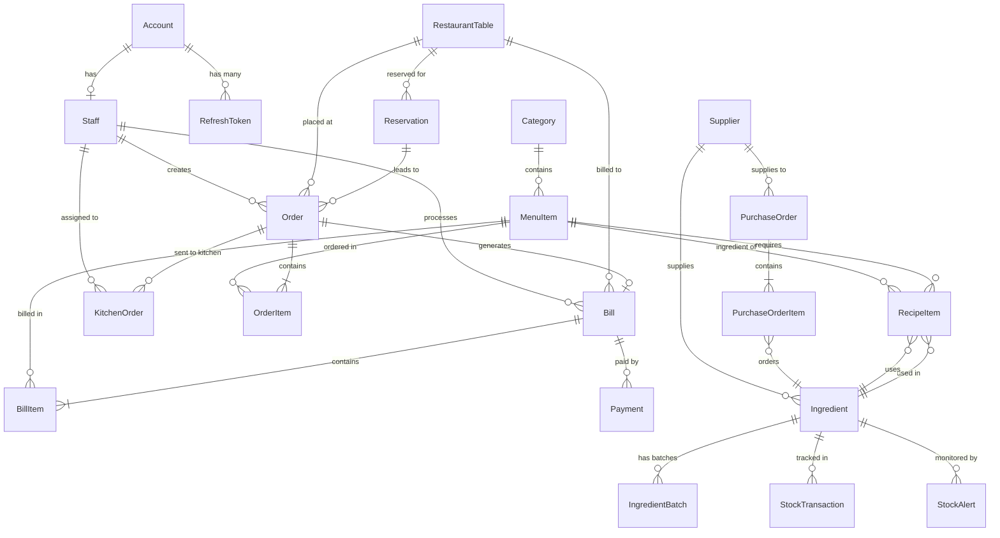

# Restaurant Management System - Database Documentation

## 📋 Table of Contents
- [Overview](#overview)
- [Entity Relationship Diagram](#entity-relationship-diagram)
- [Database Tables](#database-tables)
  - [Authentication & User Management](#authentication--user-management)
  - [Menu & Category Management](#menu--category-management)
  - [Table Management](#table-management)
  - [Reservation Management](#reservation-management)
  - [Order Management](#order-management)
  - [Kitchen Management](#kitchen-management)
  - [Billing & Payment](#billing--payment)
  - [Inventory Management](#inventory-management)
- [Enumerations](#enumerations)
- [Relationships](#relationships)
- [Indexing Strategy](#indexing-strategy)
- [Common Queries](#common-queries)

## Overview

The Restaurant Management System database is designed using PostgreSQL with Prisma ORM. It provides comprehensive functionality for managing a modern restaurant including:

- **User Management**: Authentication, authorization, and staff management
- **Menu Management**: Categories, items, pricing, and inventory
- **Table Management**: Table allocation, status tracking, and QR codes
- **Reservation System**: Online booking, table assignments, and notifications
- **Order Processing**: Order creation, tracking, and kitchen integration
- **Billing**: Payment processing, multiple payment methods, and receipts
- **Inventory**: Stock management, suppliers, recipes, and automatic deduction

### Key Features
- ✅ Multi-role staff access control
- ✅ Real-time table status updates
- ✅ Online reservation system
- ✅ Kitchen order management
- ✅ Multiple payment methods
- ✅ Comprehensive inventory tracking
- ✅ Audit trails with timestamps
- ✅ Soft deletes with isActive flags

## Entity Relationship Diagram



## Database Tables

### Authentication & User Management

#### `accounts`
Stores user authentication information for system access.

| Field | Type | Constraints | Description |
|-------|------|-------------|-------------|
| accountId | SERIAL | PRIMARY KEY | Unique account identifier |
| username | VARCHAR(50) | UNIQUE, NOT NULL | Login username |
| email | VARCHAR(255) | UNIQUE, NOT NULL | Email address |
| phoneNumber | VARCHAR(20) | UNIQUE, NOT NULL | Contact phone number |
| password | VARCHAR(255) | NOT NULL | Hashed password |
| isActive | BOOLEAN | DEFAULT true | Account active status |
| lastLogin | TIMESTAMP | NULLABLE | Last login timestamp |
| createdAt | TIMESTAMP | DEFAULT now() | Account creation time |
| updatedAt | TIMESTAMP | AUTO UPDATE | Last update time |

**Indexes:**
- `accounts_username_key` (UNIQUE)
- `accounts_email_key` (UNIQUE)
- `accounts_phoneNumber_key` (UNIQUE)
- `accounts_email_idx` (INDEX)
- `accounts_username_idx` (INDEX)

#### `refresh_tokens`
Manages JWT refresh tokens for session management.

| Field | Type | Constraints | Description |
|-------|------|-------------|-------------|
| tokenId | SERIAL | PRIMARY KEY | Token identifier |
| accountId | INT | FOREIGN KEY, NOT NULL | Reference to account |
| token | TEXT | UNIQUE, NOT NULL | Refresh token value |
| expiresAt | TIMESTAMP | NOT NULL | Token expiration time |
| deviceInfo | VARCHAR(500) | NULLABLE | Device information |
| ipAddress | VARCHAR(45) | NULLABLE | IP address |
| isRevoked | BOOLEAN | DEFAULT false | Token revocation status |
| createdAt | TIMESTAMP | DEFAULT now() | Token creation time |
| revokedAt | TIMESTAMP | NULLABLE | Revocation timestamp |

**Indexes:**
- `refresh_tokens_token_key` (UNIQUE)
- `refresh_tokens_accountId_idx` (INDEX)
- `refresh_tokens_token_idx` (INDEX)
- `refresh_tokens_expiresAt_idx` (INDEX)

**Foreign Keys:**
- `accountId` → `accounts(accountId)` ON DELETE CASCADE

#### `staff`
Contains staff member details and role assignments.

| Field | Type | Constraints | Description |
|-------|------|-------------|-------------|
| staffId | SERIAL | PRIMARY KEY | Staff identifier |
| accountId | INT | UNIQUE, FOREIGN KEY | Reference to account |
| fullName | VARCHAR(255) | NOT NULL | Full name |
| address | VARCHAR(500) | NULLABLE | Residential address |
| dateOfBirth | DATE | NULLABLE | Date of birth |
| hireDate | DATE | DEFAULT now() | Employment start date |
| salary | DECIMAL(12,2) | NULLABLE | Monthly salary |
| role | Role | NOT NULL | Staff role (enum) |
| isActive | BOOLEAN | DEFAULT true | Employment status |
| createdAt | TIMESTAMP | DEFAULT now() | Record creation time |
| updatedAt | TIMESTAMP | AUTO UPDATE | Last update time |

**Indexes:**
- `staff_accountId_key` (UNIQUE)
- `staff_role_idx` (INDEX)
- `staff_isActive_idx` (INDEX)

**Foreign Keys:**
- `accountId` → `accounts(accountId)` ON DELETE CASCADE

### Menu & Category Management

#### `categories`
Organizes menu items into categories.

| Field | Type | Constraints | Description |
|-------|------|-------------|-------------|
| categoryId | SERIAL | PRIMARY KEY | Category identifier |
| categoryName | VARCHAR(100) | UNIQUE, NOT NULL | Category name |
| description | VARCHAR(500) | NULLABLE | Category description |
| displayOrder | INT | DEFAULT 0 | Display order |
| isActive | BOOLEAN | DEFAULT true | Active status |
| imageUrl | VARCHAR(500) | NULLABLE | Category image URL |
| createdAt | TIMESTAMP | DEFAULT now() | Creation time |
| updatedAt | TIMESTAMP | AUTO UPDATE | Last update time |

**Indexes:**
- `categories_categoryName_key` (UNIQUE)
- `categories_isActive_idx` (INDEX)

#### `menu_items`
Contains all menu items with pricing and availability.

| Field | Type | Constraints | Description |
|-------|------|-------------|-------------|
| itemId | SERIAL | PRIMARY KEY | Item identifier |
| itemCode | VARCHAR(20) | UNIQUE, NOT NULL | Item code/SKU |
| itemName | VARCHAR(100) | NOT NULL | Item name |
| categoryId | INT | FOREIGN KEY, NOT NULL | Category reference |
| price | DECIMAL(10,2) | NOT NULL | Selling price |
| cost | DECIMAL(10,2) | NULLABLE | Cost price |
| description | VARCHAR(1000) | NULLABLE | Item description |
| imageUrl | VARCHAR(500) | NULLABLE | Item image URL |
| isAvailable | BOOLEAN | DEFAULT true | Currently available |
| isActive | BOOLEAN | DEFAULT true | Active in system |
| preparationTime | INT | NULLABLE | Prep time in minutes |
| spicyLevel | INT | DEFAULT 0 | Spicy level (0-5) |
| isVegetarian | BOOLEAN | DEFAULT false | Vegetarian flag |
| calories | INT | NULLABLE | Calorie count |
| displayOrder | INT | DEFAULT 0 | Display order |
| createdAt | TIMESTAMP | DEFAULT now() | Creation time |
| updatedAt | TIMESTAMP | AUTO UPDATE | Last update time |

**Indexes:**
- `menu_items_itemCode_key` (UNIQUE)
- `menu_items_categoryId_idx` (INDEX)
- `menu_items_isAvailable_idx` (INDEX)
- `menu_items_isActive_idx` (INDEX)

**Foreign Keys:**
- `categoryId` → `categories(categoryId)` ON DELETE RESTRICT

### Table Management

#### `restaurant_tables`
Manages physical tables in the restaurant.

| Field | Type | Constraints | Description |
|-------|------|-------------|-------------|
| tableId | SERIAL | PRIMARY KEY | Table identifier |
| tableNumber | VARCHAR(20) | UNIQUE, NOT NULL | Table number |
| tableName | VARCHAR(50) | NULLABLE | Table name |
| capacity | INT | NOT NULL | Maximum capacity |
| minCapacity | INT | DEFAULT 1 | Minimum capacity |
| floor | INT | DEFAULT 1 | Floor number |
| section | VARCHAR(50) | NULLABLE | Section (VIP, Garden, etc.) |
| status | TableStatus | DEFAULT 'available' | Current status (enum) |
| qrCode | VARCHAR(255) | UNIQUE, NULLABLE | QR code for ordering |
| isActive | BOOLEAN | DEFAULT true | Active status |
| createdAt | TIMESTAMP | DEFAULT now() | Creation time |
| updatedAt | TIMESTAMP | AUTO UPDATE | Last update time |

**Indexes:**
- `restaurant_tables_tableNumber_key` (UNIQUE)
- `restaurant_tables_qrCode_key` (UNIQUE)
- `restaurant_tables_status_idx` (INDEX)
- `restaurant_tables_floor_idx` (INDEX)
- `restaurant_tables_isActive_idx` (INDEX)

### Reservation Management

#### `reservations`
Manages customer table reservations.

| Field | Type | Constraints | Description |
|-------|------|-------------|-------------|
| reservationId | SERIAL | PRIMARY KEY | Reservation identifier |
| reservationCode | VARCHAR(50) | UNIQUE, DEFAULT uuid() | Reservation code |
| customerName | VARCHAR(255) | NOT NULL | Customer name |
| phoneNumber | VARCHAR(20) | NOT NULL | Contact number |
| email | VARCHAR(255) | NULLABLE | Email address |
| tableId | INT | FOREIGN KEY, NOT NULL | Reserved table |
| reservationDate | DATE | NOT NULL | Reservation date |
| reservationTime | TIME(0) | NOT NULL | Reservation time |
| duration | INT | DEFAULT 120 | Duration in minutes |
| headCount | INT | NOT NULL | Number of guests |
| specialRequest | TEXT | NULLABLE | Special requests |
| depositAmount | DECIMAL(10,2) | NULLABLE | Deposit amount |
| status | ReservationStatus | DEFAULT 'pending' | Status (enum) |
| notes | TEXT | NULLABLE | Internal notes |
| createdAt | TIMESTAMP | DEFAULT now() | Creation time |
| updatedAt | TIMESTAMP | AUTO UPDATE | Last update time |

**Indexes:**
- `reservations_reservationCode_key` (UNIQUE)
- `reservations_reservationDate_idx` (INDEX)
- `reservations_status_idx` (INDEX)
- `reservations_phoneNumber_idx` (INDEX)
- `reservations_tableId_idx` (INDEX)

**Foreign Keys:**
- `tableId` → `restaurant_tables(tableId)` ON DELETE RESTRICT

#### Reservation System Workflow

1. **Online Reservation Creation**
   - Customer submits reservation request
   - System generates unique reservation code
   - Table availability is checked
   - Confirmation email/SMS sent

2. **Table Status Management**
   - Tables marked as 'reserved' when booking confirmed
   - Status changes to 'occupied' when seated
   - Returns to 'available' after completion

3. **Reservation States**
   - `pending`: Initial request
   - `confirmed`: Approved by staff
   - `seated`: Customer arrived and seated
   - `completed`: Reservation completed
   - `cancelled`: Cancelled by customer/staff
   - `no_show`: Customer didn't arrive

4. **Notification System**
   - Confirmation notifications
   - Reminder notifications (24h, 2h before)
   - Status change notifications
   - Cancellation notifications

5. **Integration with Orders**
   - Reservations link to orders via `reservationId`
   - Order can be pre-created from reservation
   - Special requests transfer to order notes

### Order Management

#### `orders`
Tracks customer orders.

| Field | Type | Constraints | Description |
|-------|------|-------------|-------------|
| orderId | SERIAL | PRIMARY KEY | Order identifier |
| orderNumber | VARCHAR(50) | UNIQUE, DEFAULT uuid() | Order number |
| tableId | INT | FOREIGN KEY, NOT NULL | Table reference |
| staffId | INT | FOREIGN KEY, NULLABLE | Waiter reference |
| reservationId | INT | FOREIGN KEY, NULLABLE | Reservation link |
| customerName | VARCHAR(255) | NULLABLE | Customer name |
| customerPhone | VARCHAR(20) | NULLABLE | Customer phone |
| headCount | INT | DEFAULT 1 | Number of guests |
| status | OrderStatus | DEFAULT 'pending' | Order status (enum) |
| notes | TEXT | NULLABLE | Order notes |
| orderTime | TIMESTAMP | DEFAULT now() | Order time |
| confirmedAt | TIMESTAMP | NULLABLE | Confirmation time |
| completedAt | TIMESTAMP | NULLABLE | Completion time |
| createdAt | TIMESTAMP | DEFAULT now() | Creation time |
| updatedAt | TIMESTAMP | AUTO UPDATE | Last update time |

**Indexes:**
- `orders_orderNumber_key` (UNIQUE)
- `orders_orderNumber_idx` (INDEX)
- `orders_tableId_idx` (INDEX)
- `orders_status_idx` (INDEX)
- `orders_orderTime_idx` (INDEX)

**Foreign Keys:**
- `tableId` → `restaurant_tables(tableId)` ON DELETE RESTRICT
- `staffId` → `staff(staffId)` ON DELETE SET NULL
- `reservationId` → `reservations(reservationId)` ON DELETE SET NULL

#### `order_items`
Individual items within an order.

| Field | Type | Constraints | Description |
|-------|------|-------------|-------------|
| orderItemId | SERIAL | PRIMARY KEY | Order item identifier |
| orderId | INT | FOREIGN KEY, NOT NULL | Order reference |
| itemId | INT | FOREIGN KEY, NOT NULL | Menu item reference |
| quantity | INT | NOT NULL | Quantity ordered |
| unitPrice | DECIMAL(10,2) | NOT NULL | Price per unit |
| subtotal | DECIMAL(10,2) | NOT NULL | Item subtotal |
| specialRequest | VARCHAR(500) | NULLABLE | Special requests |
| status | OrderStatus | DEFAULT 'pending' | Item status (enum) |
| createdAt | TIMESTAMP | DEFAULT now() | Creation time |
| updatedAt | TIMESTAMP | AUTO UPDATE | Last update time |

**Indexes:**
- `order_items_orderId_idx` (INDEX)
- `order_items_itemId_idx` (INDEX)
- `order_items_status_idx` (INDEX)

**Foreign Keys:**
- `orderId` → `orders(orderId)` ON DELETE CASCADE
- `itemId` → `menu_items(itemId)` ON DELETE RESTRICT

### Kitchen Management

#### `kitchen_orders`
Manages kitchen order processing.

| Field | Type | Constraints | Description |
|-------|------|-------------|-------------|
| kitchenOrderId | SERIAL | PRIMARY KEY | Kitchen order identifier |
| orderId | INT | FOREIGN KEY, NOT NULL | Order reference |
| staffId | INT | FOREIGN KEY, NULLABLE | Chef assigned |
| priority | INT | DEFAULT 0 | Priority level |
| status | OrderStatus | DEFAULT 'pending' | Status (enum) |
| startedAt | TIMESTAMP | NULLABLE | Start time |
| completedAt | TIMESTAMP | NULLABLE | Completion time |
| estimatedTime | INT | NULLABLE | Estimated time (minutes) |
| notes | TEXT | NULLABLE | Kitchen notes |
| createdAt | TIMESTAMP | DEFAULT now() | Creation time |
| updatedAt | TIMESTAMP | AUTO UPDATE | Last update time |

**Indexes:**
- `kitchen_orders_orderId_idx` (INDEX)
- `kitchen_orders_status_idx` (INDEX)
- `kitchen_orders_priority_idx` (INDEX)

**Foreign Keys:**
- `orderId` → `orders(orderId)` ON DELETE CASCADE
- `staffId` → `staff(staffId)` ON DELETE SET NULL

### Billing & Payment

#### `bills`
Customer bills and invoices.

| Field | Type | Constraints | Description |
|-------|------|-------------|-------------|
| billId | SERIAL | PRIMARY KEY | Bill identifier |
| billNumber | VARCHAR(50) | UNIQUE, DEFAULT uuid() | Bill number |
| orderId | INT | UNIQUE, FOREIGN KEY | Order reference |
| tableId | INT | FOREIGN KEY, NOT NULL | Table reference |
| staffId | INT | FOREIGN KEY, NULLABLE | Cashier reference |
| subtotal | DECIMAL(12,2) | NOT NULL | Subtotal amount |
| taxAmount | DECIMAL(12,2) | DEFAULT 0 | Tax amount |
| taxRate | DECIMAL(5,2) | DEFAULT 0 | Tax rate (%) |
| discountAmount | DECIMAL(12,2) | DEFAULT 0 | Discount amount |
| serviceCharge | DECIMAL(12,2) | DEFAULT 0 | Service charge |
| totalAmount | DECIMAL(12,2) | NOT NULL | Total amount |
| paidAmount | DECIMAL(12,2) | DEFAULT 0 | Amount paid |
| changeAmount | DECIMAL(12,2) | DEFAULT 0 | Change given |
| paymentStatus | PaymentStatus | DEFAULT 'pending' | Payment status (enum) |
| paymentMethod | PaymentMethod | NULLABLE | Payment method (enum) |
| notes | TEXT | NULLABLE | Bill notes |
| createdAt | TIMESTAMP | DEFAULT now() | Creation time |
| paidAt | TIMESTAMP | NULLABLE | Payment time |
| updatedAt | TIMESTAMP | AUTO UPDATE | Last update time |

**Indexes:**
- `bills_billNumber_key` (UNIQUE)
- `bills_orderId_key` (UNIQUE)
- `bills_billNumber_idx` (INDEX)
- `bills_orderId_idx` (INDEX)
- `bills_paymentStatus_idx` (INDEX)
- `bills_createdAt_idx` (INDEX)

**Foreign Keys:**
- `orderId` → `orders(orderId)` ON DELETE RESTRICT
- `tableId` → `restaurant_tables(tableId)` ON DELETE RESTRICT
- `staffId` → `staff(staffId)` ON DELETE SET NULL

#### `bill_items`
Line items in a bill.

| Field | Type | Constraints | Description |
|-------|------|-------------|-------------|
| billItemId | SERIAL | PRIMARY KEY | Bill item identifier |
| billId | INT | FOREIGN KEY, NOT NULL | Bill reference |
| itemId | INT | FOREIGN KEY, NOT NULL | Menu item reference |
| itemName | VARCHAR(100) | NOT NULL | Item name snapshot |
| quantity | INT | NOT NULL | Quantity |
| unitPrice | DECIMAL(10,2) | NOT NULL | Unit price |
| subtotal | DECIMAL(10,2) | NOT NULL | Subtotal |
| discount | DECIMAL(10,2) | DEFAULT 0 | Item discount |
| total | DECIMAL(10,2) | NOT NULL | Item total |
| createdAt | TIMESTAMP | DEFAULT now() | Creation time |

**Indexes:**
- `bill_items_billId_idx` (INDEX)

**Foreign Keys:**
- `billId` → `bills(billId)` ON DELETE CASCADE
- `itemId` → `menu_items(itemId)` ON DELETE RESTRICT

#### `payments`
Payment transactions for bills.

| Field | Type | Constraints | Description |
|-------|------|-------------|-------------|
| paymentId | SERIAL | PRIMARY KEY | Payment identifier |
| billId | INT | FOREIGN KEY, NOT NULL | Bill reference |
| paymentMethod | PaymentMethod | NOT NULL | Payment method (enum) |
| amount | DECIMAL(12,2) | NOT NULL | Payment amount |
| transactionId | VARCHAR(100) | NULLABLE | Transaction ID |
| cardNumber | VARCHAR(20) | NULLABLE | Last 4 digits |
| cardHolderName | VARCHAR(255) | NULLABLE | Cardholder name |
| status | PaymentStatus | DEFAULT 'pending' | Payment status (enum) |
| notes | TEXT | NULLABLE | Payment notes |
| paymentDate | TIMESTAMP | DEFAULT now() | Payment date |
| createdAt | TIMESTAMP | DEFAULT now() | Creation time |

**Indexes:**
- `payments_billId_idx` (INDEX)
- `payments_transactionId_idx` (INDEX)

**Foreign Keys:**
- `billId` → `bills(billId)` ON DELETE CASCADE

### Inventory Management

#### `suppliers`
Supplier information for inventory.

| Field | Type | Constraints | Description |
|-------|------|-------------|-------------|
| supplierId | SERIAL | PRIMARY KEY | Supplier identifier |
| supplierCode | VARCHAR(20) | UNIQUE, NOT NULL | Supplier code |
| supplierName | VARCHAR(255) | NOT NULL | Supplier name |
| contactPerson | VARCHAR(255) | NULLABLE | Contact person |
| phoneNumber | VARCHAR(20) | NOT NULL | Phone number |
| email | VARCHAR(255) | NULLABLE | Email address |
| address | TEXT | NULLABLE | Address |
| taxId | VARCHAR(50) | NULLABLE | Tax ID |
| paymentTerms | VARCHAR(100) | NULLABLE | Payment terms |
| notes | TEXT | NULLABLE | Notes |
| isActive | BOOLEAN | DEFAULT true | Active status |
| createdAt | TIMESTAMP | DEFAULT now() | Creation time |
| updatedAt | TIMESTAMP | AUTO UPDATE | Last update time |

**Indexes:**
- `suppliers_supplierCode_key` (UNIQUE)
- `suppliers_isActive_idx` (INDEX)

#### `ingredients`
Inventory ingredients and raw materials.

| Field | Type | Constraints | Description |
|-------|------|-------------|-------------|
| ingredientId | SERIAL | PRIMARY KEY | Ingredient identifier |
| ingredientCode | VARCHAR(20) | UNIQUE, NOT NULL | Ingredient code |
| ingredientName | VARCHAR(255) | NOT NULL | Ingredient name |
| categoryName | VARCHAR(100) | NULLABLE | Category name |
| unit | VARCHAR(20) | NOT NULL | Measurement unit |
| currentStock | DECIMAL(10,3) | DEFAULT 0 | Current stock level |
| minimumStock | DECIMAL(10,3) | DEFAULT 0 | Minimum threshold |
| maximumStock | DECIMAL(10,3) | NULLABLE | Maximum threshold |
| reorderPoint | DECIMAL(10,3) | NULLABLE | Reorder point |
| unitCost | DECIMAL(10,2) | NULLABLE | Cost per unit |
| supplierId | INT | FOREIGN KEY, NULLABLE | Default supplier |
| storageLocation | VARCHAR(100) | NULLABLE | Storage location |
| requiresBatchTracking | BOOLEAN | DEFAULT false | Batch tracking flag |
| isActive | BOOLEAN | DEFAULT true | Active status |
| createdAt | TIMESTAMP | DEFAULT now() | Creation time |
| updatedAt | TIMESTAMP | AUTO UPDATE | Last update time |

**Indexes:**
- `ingredients_ingredientCode_key` (UNIQUE)
- `ingredients_supplierId_idx` (INDEX)
- `ingredients_isActive_idx` (INDEX)
- `ingredients_currentStock_idx` (INDEX)

**Foreign Keys:**
- `supplierId` → `suppliers(supplierId)` ON DELETE SET NULL

#### `ingredient_batches`
Tracks ingredient batches for expiration and quality control.

| Field | Type | Constraints | Description |
|-------|------|-------------|-------------|
| batchId | SERIAL | PRIMARY KEY | Batch identifier |
| ingredientId | INT | FOREIGN KEY, NOT NULL | Ingredient reference |
| batchNumber | VARCHAR(50) | NOT NULL | Batch number |
| quantity | DECIMAL(10,3) | NOT NULL | Batch quantity |
| remainingQuantity | DECIMAL(10,3) | NOT NULL | Remaining quantity |
| unitCost | DECIMAL(10,2) | NOT NULL | Cost per unit |
| supplierId | INT | FOREIGN KEY, NULLABLE | Supplier reference |
| purchaseOrderId | INT | FOREIGN KEY, NULLABLE | Purchase order ref |
| receivedDate | DATE | NOT NULL | Received date |
| manufactureDate | DATE | NULLABLE | Manufacture date |
| expiryDate | DATE | NULLABLE | Expiry date |
| storageLocation | VARCHAR(100) | NULLABLE | Storage location |
| status | VARCHAR(20) | DEFAULT 'active' | Status (active/expired/used) |
| notes | TEXT | NULLABLE | Notes |
| createdAt | TIMESTAMP | DEFAULT now() | Creation time |
| updatedAt | TIMESTAMP | AUTO UPDATE | Last update time |

**Indexes:**
- `ingredient_batches_ingredientId_idx` (INDEX)
- `ingredient_batches_batchNumber_idx` (INDEX)
- `ingredient_batches_expiryDate_idx` (INDEX)
- `ingredient_batches_status_idx` (INDEX)

**Foreign Keys:**
- `ingredientId` → `ingredients(ingredientId)` ON DELETE CASCADE
- `supplierId` → `suppliers(supplierId)` ON DELETE SET NULL
- `purchaseOrderId` → `purchase_orders(purchaseOrderId)` ON DELETE SET NULL

#### `recipe_items`
Recipe ingredients for menu items.

| Field | Type | Constraints | Description |
|-------|------|-------------|-------------|
| recipeItemId | SERIAL | PRIMARY KEY | Recipe item identifier |
| itemId | INT | FOREIGN KEY, NOT NULL | Menu item reference |
| ingredientId | INT | FOREIGN KEY, NOT NULL | Ingredient reference |
| quantity | DECIMAL(10,3) | NOT NULL | Quantity needed |
| unit | VARCHAR(20) | NOT NULL | Measurement unit |
| notes | TEXT | NULLABLE | Preparation notes |
| createdAt | TIMESTAMP | DEFAULT now() | Creation time |
| updatedAt | TIMESTAMP | AUTO UPDATE | Last update time |

**Indexes:**
- `recipe_items_itemId_idx` (INDEX)
- `recipe_items_ingredientId_idx` (INDEX)
- Composite: `recipe_items_itemId_ingredientId_idx` (UNIQUE)

**Foreign Keys:**
- `itemId` → `menu_items(itemId)` ON DELETE CASCADE
- `ingredientId` → `ingredients(ingredientId)` ON DELETE RESTRICT

#### `purchase_orders`
Purchase orders for inventory replenishment.

| Field | Type | Constraints | Description |
|-------|------|-------------|-------------|
| purchaseOrderId | SERIAL | PRIMARY KEY | PO identifier |
| poNumber | VARCHAR(50) | UNIQUE, NOT NULL | PO number |
| supplierId | INT | FOREIGN KEY, NOT NULL | Supplier reference |
| staffId | INT | FOREIGN KEY, NULLABLE | Staff who created |
| orderDate | DATE | DEFAULT now() | Order date |
| expectedDate | DATE | NULLABLE | Expected delivery |
| receivedDate | DATE | NULLABLE | Actual received date |
| status | VARCHAR(20) | DEFAULT 'pending' | Status |
| subtotal | DECIMAL(12,2) | NOT NULL | Subtotal amount |
| taxAmount | DECIMAL(12,2) | DEFAULT 0 | Tax amount |
| totalAmount | DECIMAL(12,2) | NOT NULL | Total amount |
| notes | TEXT | NULLABLE | Notes |
| createdAt | TIMESTAMP | DEFAULT now() | Creation time |
| updatedAt | TIMESTAMP | AUTO UPDATE | Last update time |

**Status values**: pending, confirmed, received, partially_received, cancelled

**Indexes:**
- `purchase_orders_poNumber_key` (UNIQUE)
- `purchase_orders_supplierId_idx` (INDEX)
- `purchase_orders_status_idx` (INDEX)
- `purchase_orders_orderDate_idx` (INDEX)

**Foreign Keys:**
- `supplierId` → `suppliers(supplierId)` ON DELETE RESTRICT
- `staffId` → `staff(staffId)` ON DELETE SET NULL

#### `purchase_order_items`
Line items in purchase orders.

| Field | Type | Constraints | Description |
|-------|------|-------------|-------------|
| poItemId | SERIAL | PRIMARY KEY | PO item identifier |
| purchaseOrderId | INT | FOREIGN KEY, NOT NULL | PO reference |
| ingredientId | INT | FOREIGN KEY, NOT NULL | Ingredient reference |
| quantity | DECIMAL(10,3) | NOT NULL | Ordered quantity |
| receivedQuantity | DECIMAL(10,3) | DEFAULT 0 | Received quantity |
| unitPrice | DECIMAL(10,2) | NOT NULL | Unit price |
| subtotal | DECIMAL(12,2) | NOT NULL | Item subtotal |
| notes | TEXT | NULLABLE | Notes |
| createdAt | TIMESTAMP | DEFAULT now() | Creation time |
| updatedAt | TIMESTAMP | AUTO UPDATE | Last update time |

**Indexes:**
- `purchase_order_items_purchaseOrderId_idx` (INDEX)
- `purchase_order_items_ingredientId_idx` (INDEX)

**Foreign Keys:**
- `purchaseOrderId` → `purchase_orders(purchaseOrderId)` ON DELETE CASCADE
- `ingredientId` → `ingredients(ingredientId)` ON DELETE RESTRICT

#### `stock_transactions`
Tracks all inventory movements.

| Field | Type | Constraints | Description |
|-------|------|-------------|-------------|
| transactionId | SERIAL | PRIMARY KEY | Transaction identifier |
| ingredientId | INT | FOREIGN KEY, NOT NULL | Ingredient reference |
| batchId | INT | FOREIGN KEY, NULLABLE | Batch reference |
| transactionType | VARCHAR(20) | NOT NULL | Transaction type |
| quantity | DECIMAL(10,3) | NOT NULL | Quantity (+ or -) |
| unit | VARCHAR(20) | NOT NULL | Measurement unit |
| unitCost | DECIMAL(10,2) | NULLABLE | Cost per unit |
| totalCost | DECIMAL(12,2) | NULLABLE | Total cost |
| referenceType | VARCHAR(50) | NULLABLE | Reference type |
| referenceId | INT | NULLABLE | Reference ID |
| balanceBefore | DECIMAL(10,3) | NOT NULL | Balance before |
| balanceAfter | DECIMAL(10,3) | NOT NULL | Balance after |
| notes | TEXT | NULLABLE | Notes |
| staffId | INT | FOREIGN KEY, NULLABLE | Staff reference |
| transactionDate | TIMESTAMP | DEFAULT now() | Transaction date |
| createdAt | TIMESTAMP | DEFAULT now() | Creation time |

**Transaction Types**:
- `purchase`: Stock received from supplier
- `usage`: Stock used in production
- `adjustment`: Manual adjustment
- `waste`: Spoilage or waste
- `return`: Return to supplier
- `transfer`: Transfer between locations

**Indexes:**
- `stock_transactions_ingredientId_idx` (INDEX)
- `stock_transactions_transactionType_idx` (INDEX)
- `stock_transactions_transactionDate_idx` (INDEX)
- `stock_transactions_referenceType_idx` (INDEX)

**Foreign Keys:**
- `ingredientId` → `ingredients(ingredientId)` ON DELETE RESTRICT
- `batchId` → `ingredient_batches(batchId)` ON DELETE SET NULL
- `staffId` → `staff(staffId)` ON DELETE SET NULL

#### `stock_alerts`
Automated alerts for low stock levels.

| Field | Type | Constraints | Description |
|-------|------|-------------|-------------|
| alertId | SERIAL | PRIMARY KEY | Alert identifier |
| ingredientId | INT | FOREIGN KEY, NOT NULL | Ingredient reference |
| alertType | VARCHAR(20) | NOT NULL | Alert type |
| currentStock | DECIMAL(10,3) | NOT NULL | Current stock level |
| thresholdValue | DECIMAL(10,3) | NOT NULL | Threshold value |
| severity | VARCHAR(20) | DEFAULT 'medium' | Severity level |
| status | VARCHAR(20) | DEFAULT 'active' | Alert status |
| acknowledgedBy | INT | FOREIGN KEY, NULLABLE | Staff who acknowledged |
| acknowledgedAt | TIMESTAMP | NULLABLE | Acknowledgment time |
| notes | TEXT | NULLABLE | Notes |
| createdAt | TIMESTAMP | DEFAULT now() | Creation time |
| resolvedAt | TIMESTAMP | NULLABLE | Resolution time |

**Alert Types**:
- `low_stock`: Below minimum threshold
- `reorder_point`: Reached reorder point
- `out_of_stock`: Stock depleted
- `expiring_soon`: Batch expiring within threshold
- `expired`: Batch has expired

**Severity Levels**: low, medium, high, critical

**Indexes:**
- `stock_alerts_ingredientId_idx` (INDEX)
- `stock_alerts_status_idx` (INDEX)
- `stock_alerts_alertType_idx` (INDEX)
- `stock_alerts_createdAt_idx` (INDEX)

**Foreign Keys:**
- `ingredientId` → `ingredients(ingredientId)` ON DELETE CASCADE
- `acknowledgedBy` → `staff(staffId)` ON DELETE SET NULL

#### Automatic Stock Deduction System

The system automatically deducts ingredients when orders are placed:

1. **Order Item Creation**
   - When an order item is created, trigger stock deduction
   - Look up recipe items for the menu item
   - Calculate total ingredient quantities needed

2. **Stock Deduction Process**
   ```sql
   -- Triggered on order_items INSERT
   FOR each recipe_item in menu_item:
     quantity_needed = recipe_item.quantity * order_item.quantity
     
     IF ingredient.requiresBatchTracking:
       -- FIFO: Use oldest batches first
       WHILE quantity_needed > 0:
         SELECT oldest active batch
         DEDUCT from batch
         CREATE stock_transaction (type: 'usage')
     ELSE:
       -- Direct deduction
       UPDATE ingredient SET currentStock = currentStock - quantity_needed
       CREATE stock_transaction (type: 'usage')
   ```

3. **Stock Alert Generation**
   - After each deduction, check stock levels
   - Generate alerts if below thresholds
   - Notify relevant staff

4. **Batch Tracking**
   - Follows FIFO (First-In-First-Out) principle
   - Automatically selects batches nearing expiry first
   - Updates batch remaining quantity
   - Marks batches as 'used' when depleted

## Enumerations

### Role
Staff roles in the system.
- `admin`: Full system access
- `manager`: Management functions
- `waiter`: Order taking and service
- `chef`: Kitchen operations
- `bartender`: Beverage preparation
- `cashier`: Payment processing

### TableStatus
Current status of restaurant tables.
- `available`: Ready for customers
- `occupied`: Currently in use
- `reserved`: Reserved for booking
- `maintenance`: Under maintenance

### OrderStatus
Order processing states.
- `pending`: Initial state
- `confirmed`: Order confirmed
- `preparing`: Being prepared
- `ready`: Ready for serving
- `served`: Served to customer
- `cancelled`: Order cancelled

### PaymentStatus
Payment transaction states.
- `pending`: Awaiting payment
- `paid`: Payment completed
- `refunded`: Payment refunded
- `cancelled`: Payment cancelled

### PaymentMethod
Available payment methods.
- `cash`: Cash payment
- `card`: Credit/debit card
- `momo`: MoMo e-wallet
- `bank_transfer`: Bank transfer

### ReservationStatus
Reservation states.
- `pending`: Initial request
- `confirmed`: Confirmed by staff
- `seated`: Customer arrived and seated
- `completed`: Reservation completed
- `cancelled`: Cancelled
- `no_show`: Customer didn't arrive

## Relationships

### One-to-One
- `Account` ↔ `Staff`
- `Order` ↔ `Bill`

### One-to-Many
- `Account` → `RefreshToken[]`
- `Staff` → `Order[]`
- `Staff` → `Bill[]`
- `Staff` → `KitchenOrder[]`
- `Category` → `MenuItem[]`
- `MenuItem` → `OrderItem[]`
- `MenuItem` → `BillItem[]`
- `MenuItem` → `RecipeItem[]`
- `RestaurantTable` → `Reservation[]`
- `RestaurantTable` → `Order[]`
- `RestaurantTable` → `Bill[]`
- `Reservation` → `Order[]`
- `Order` → `OrderItem[]`
- `Order` → `KitchenOrder[]`
- `Bill` → `BillItem[]`
- `Bill` → `Payment[]`
- `Supplier` → `PurchaseOrder[]`
- `Supplier` → `Ingredient[]`
- `Ingredient` → `IngredientBatch[]`
- `Ingredient` → `StockTransaction[]`
- `Ingredient` → `RecipeItem[]`
- `Ingredient` → `StockAlert[]`
- `PurchaseOrder` → `PurchaseOrderItem[]`

### Many-to-Many (through junction tables)
- `MenuItem` ↔ `Ingredient` (through `RecipeItem`)
- `Order` ↔ `MenuItem` (through `OrderItem`)
- `Bill` ↔ `MenuItem` (through `BillItem`)

## Indexing Strategy

### Primary Keys
All tables use `SERIAL` primary keys for:
- Fast lookups
- Auto-incrementing IDs
- Referential integrity

### Unique Indexes
Applied to business keys and codes:
- Account credentials (username, email, phone)
- Item codes and numbers
- QR codes
- Transaction numbers

### Composite Indexes
For frequent multi-column queries:
- `(reservationDate, status)` - Reservation lookups
- `(orderTime, status)` - Order tracking
- `(ingredientId, batchNumber)` - Batch lookups
- `(itemId, ingredientId)` - Recipe lookups

### Foreign Key Indexes
All foreign keys are indexed for:
- Join performance
- Referential integrity checks
- Cascade operations

### Status Indexes
All status fields indexed for:
- Filtering by state
- Dashboard queries
- Report generation

### Temporal Indexes
Time-based fields indexed for:
- Date range queries
- Analytics
- Reporting
- Audit trails

## Common Queries

For detailed query examples, see [common-queries.sql](./common-queries.sql)

### Frequently Used Queries

1. **Get Available Tables**
   ```sql
   SELECT * FROM restaurant_tables 
   WHERE status = 'available' AND isActive = true
   ORDER BY floor, tableNumber;
   ```

2. **Check Reservation Availability**
   ```sql
   SELECT tableId FROM restaurant_tables 
   WHERE capacity >= :headCount 
     AND isActive = true
     AND tableId NOT IN (
       SELECT tableId FROM reservations 
       WHERE reservationDate = :date 
         AND status IN ('pending', 'confirmed', 'seated')
     );
   ```

3. **Get Active Orders for Kitchen**
   ```sql
   SELECT ko.*, o.orderNumber, o.tableId, rt.tableNumber
   FROM kitchen_orders ko
   JOIN orders o ON ko.orderId = o.orderId
   JOIN restaurant_tables rt ON o.tableId = rt.tableId
   WHERE ko.status IN ('pending', 'preparing')
   ORDER BY ko.priority DESC, ko.createdAt ASC;
   ```

4. **Daily Revenue Report**
   ```sql
   SELECT 
     DATE(createdAt) as date,
     COUNT(*) as total_bills,
     SUM(totalAmount) as total_revenue,
     SUM(taxAmount) as total_tax,
     AVG(totalAmount) as average_bill
   FROM bills
   WHERE paymentStatus = 'paid'
     AND createdAt >= CURRENT_DATE - INTERVAL '30 days'
   GROUP BY DATE(createdAt)
   ORDER BY date DESC;
   ```

5. **Low Stock Alert**
   ```sql
   SELECT i.*, s.supplierName
   FROM ingredients i
   LEFT JOIN suppliers s ON i.supplierId = s.supplierId
   WHERE i.currentStock <= i.minimumStock
     AND i.isActive = true
   ORDER BY (i.currentStock / NULLIF(i.minimumStock, 0)) ASC;
   ```

6. **Expiring Batches**
   ```sql
   SELECT ib.*, i.ingredientName
   FROM ingredient_batches ib
   JOIN ingredients i ON ib.ingredientId = i.ingredientId
   WHERE ib.expiryDate <= CURRENT_DATE + INTERVAL '7 days'
     AND ib.status = 'active'
     AND ib.remainingQuantity > 0
   ORDER BY ib.expiryDate ASC;
   ```

7. **Menu Item Popularity**
   ```sql
   SELECT 
     mi.itemName,
     mi.categoryId,
     COUNT(oi.orderItemId) as times_ordered,
     SUM(oi.quantity) as total_quantity,
     SUM(oi.subtotal) as total_revenue
   FROM menu_items mi
   JOIN order_items oi ON mi.itemId = oi.itemId
   JOIN orders o ON oi.orderId = o.orderId
   WHERE o.createdAt >= CURRENT_DATE - INTERVAL '30 days'
     AND o.status != 'cancelled'
   GROUP BY mi.itemId, mi.itemName, mi.categoryId
   ORDER BY times_ordered DESC
   LIMIT 20;
   ```

8. **Staff Performance**
   ```sql
   SELECT 
     s.fullName,
     s.role,
     COUNT(DISTINCT o.orderId) as orders_handled,
     COUNT(DISTINCT b.billId) as bills_processed,
     SUM(b.totalAmount) as total_sales
   FROM staff s
   LEFT JOIN orders o ON s.staffId = o.staffId
   LEFT JOIN bills b ON s.staffId = b.staffId
   WHERE o.createdAt >= CURRENT_DATE - INTERVAL '30 days'
     OR b.createdAt >= CURRENT_DATE - INTERVAL '30 days'
   GROUP BY s.staffId, s.fullName, s.role
   ORDER BY total_sales DESC;
   ```

9. **Reservation Fulfillment Rate**
   ```sql
   SELECT 
     DATE(reservationDate) as date,
     COUNT(*) as total_reservations,
     SUM(CASE WHEN status = 'completed' THEN 1 ELSE 0 END) as completed,
     SUM(CASE WHEN status = 'no_show' THEN 1 ELSE 0 END) as no_shows,
     SUM(CASE WHEN status = 'cancelled' THEN 1 ELSE 0 END) as cancelled,
     ROUND(100.0 * SUM(CASE WHEN status = 'completed' THEN 1 ELSE 0 END) / COUNT(*), 2) as fulfillment_rate
   FROM reservations
   WHERE reservationDate >= CURRENT_DATE - INTERVAL '30 days'
   GROUP BY DATE(reservationDate)
   ORDER BY date DESC;
   ```

10. **Ingredient Cost Analysis**
    ```sql
    SELECT 
      i.ingredientName,
      i.currentStock,
      i.unitCost,
      i.currentStock * i.unitCost as stock_value,
      COUNT(st.transactionId) as transaction_count,
      SUM(CASE WHEN st.transactionType = 'usage' THEN st.quantity ELSE 0 END) as total_usage
    FROM ingredients i
    LEFT JOIN stock_transactions st ON i.ingredientId = st.ingredientId
      AND st.transactionDate >= CURRENT_DATE - INTERVAL '30 days'
    WHERE i.isActive = true
    GROUP BY i.ingredientId, i.ingredientName, i.currentStock, i.unitCost
    ORDER BY stock_value DESC;
    ```

---

## See Also

- [Database Setup Script](./database-setup.sql) - Complete SQL script for database creation
- [Common Queries](./common-queries.sql) - Additional query examples
- [ERD Diagram Source](./erd-diagram.mmd) - Mermaid diagram source file
- [Main README](../README.md) - Project documentation

---

**Last Updated**: October 2025  
**Database Version**: PostgreSQL 16+  
**ORM**: Prisma 5+
