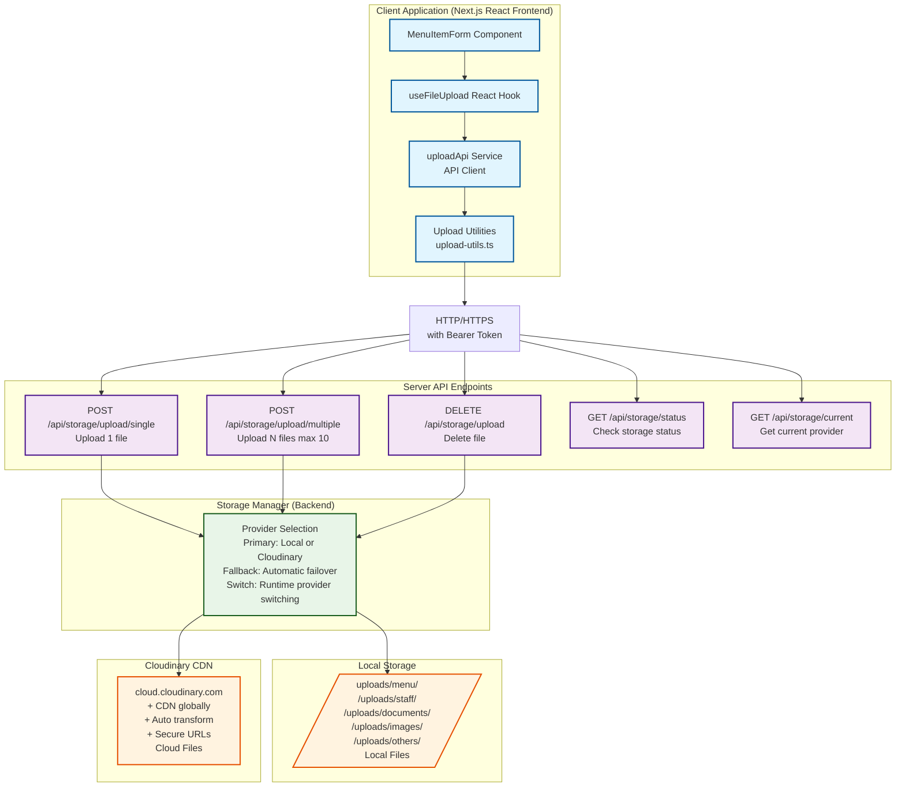

# Hướng Dẫn Chi Tiết: Chức Năng Upload và Lưu Trữ File

## Mục Lục

1. [Tổng Quan](#tổng-quan)
2. [Kiến Trúc Hệ Thống](#kiến-trúc-hệ-thống)
3. [Các Loại File và Giới Hạn](#các-loại-file-và-giới-hạn)
4. [API Endpoints](#api-endpoints)
5. [Sử Dụng từ Client](#sử-dụng-từ-client)
    - [Client Implementation (Triển Khai Hoàn Chỉnh)](#client-implementation-triển-khai-hoàn-chỉnh)
    - [JavaScript/TypeScript (Fetch API)](#javascripttypescript-fetch-api)
6. [Hướng Dẫn Lập Trình](#hướng-dẫn-lập-trình)
    - [Client-Side Implementation (Triển Khai Frontend)](#client-side-implementation-triển-khai-frontend)
    - [Sử Dụng Upload Service trong Código Backend](#sử-dụng-upload-service-trong-código-backend)
7. [Xử Lý Lỗi](#xử-lý-lỗi)
8. [Dọn Dẹp Tự Động](#dọn-dẹp-tự-động)
9. [Cấu Hình Lưu Trữ](#cấu-hình-lưu-trữ)
10. [Câu Hỏi Thường Gặp](#câu-hỏi-thường-gặp)
    - [Client Implementation Questions](#client-implementation-questions)

---

## Tổng Quan

Hệ thống upload và lưu trữ file của ứng dụng Restaurant Management hỗ trợ:

-   **Hai nhà cung cấp lưu trữ**: Local (máy chủ) và Cloudinary (CDN)
-   **Chuyển đổi nhà cung cấp** tại runtime
-   **Tự động dự phòng** giữa các nhà cung cấp nếu cái chính lỗi
-   **Quản lý nhiều loại file**: Hình ảnh, tài liệu, video
-   **Bảo mật**: Xác thực, xác nhận loại file, giới hạn kích thước
-   **Client Implementation**: Đã triển khai hoàn chỉnh với React hooks, services và utilities

### Thư Mục Lưu Trữ

```
uploads/
├── menu/        # Hình ảnh thực đơn
├── staff/       # Ảnh nhân viên
├── documents/   # Tài liệu (PDF, Word, Excel)
├── images/      # Hình ảnh chung
└── others/      # Các loại tệp khác
```

---

## Kiến Trúc Hệ Thống

### Sơ Đồ Kiến Trúc



### Các Thành Phần Chính

| Thành Phần             | Vị Trí                                                  | Chức Năng                        |
| ---------------------- | ------------------------------------------------------- | -------------------------------- |
| **Client Components**  |                                                         |                                  |
| **MenuItemForm**       | `client/src/components/feautures/menu/MenuItemForm.tsx` | Form với upload tích hợp         |
| **ImageUploadCropper** | `client/src/components/shared/ImageUploadCropper.tsx`   | Component crop & upload ảnh      |
| **Upload Hook**        | `client/src/hooks/useFileUpload.ts`                     | React hook quản lý upload state  |
| **Upload Service**     | `client/src/services/upload.service.ts`                 | API client cho upload operations |
| **Upload Utils**       | `client/src/lib/upload-utils.ts`                        | Helper functions & utilities     |
| **Upload Examples**    | `client/src/lib/upload-examples.tsx`                    | Code examples & patterns         |
|                        |                                                         |                                  |
| **Backend Components** |                                                         |                                  |
| **Storage Routes**     | `storage.routes.ts`                                     | Định nghĩa các endpoint          |
| **Storage Controller** | `storage.controller.ts`                                 | Xử lý yêu cầu quản lý lưu trữ    |
| **Upload Controller**  | `upload.controller.ts`                                  | Xử lý yêu cầu upload file        |
| **Upload Service**     | `services/upload.service.ts`                            | Logic upload file cấp cao        |
| **Storage Manager**    | `services/storage/storage.manager.ts`                   | Quản lý nhà cung cấp lưu trữ     |
| **Local Storage**      | `services/storage/local.storage.ts`                     | Triển khai lưu trữ cục bộ        |
| **Cloudinary Storage** | `services/storage/cloudinary.storage.ts`                | Triển khai Cloudinary            |
| **Upload Middleware**  | `middlewares/upload.middleware.ts`                      | Middleware Multer & helper       |
| **Upload Constants**   | `constants/upload.constants.ts`                         | Cấu hình & hằng số               |

---

## Các Loại File và Giới Hạn

### Hình Ảnh (Image)

| Tiêu Chí                       | Giá Trị                                                                            |
| ------------------------------ | ---------------------------------------------------------------------------------- |
| **Kích thước tối đa**          | 5 MB                                                                               |
| **Định dạng MIME được phép**   | `image/jpeg`, `image/jpg`, `image/png`, `image/gif`, `image/webp`, `image/svg+xml` |
| **Tiện ích mở rộng được phép** | `.jpg`, `.jpeg`, `.png`, `.gif`, `.webp`, `.svg`                                   |
| **Thư mục mặc định**           | `uploads/images/`                                                                  |

**Ví dụ:**

```
menu.jpg (✓ Được phép)
photo.JPEG (✓ Được phép)
logo.svg (✓ Được phép)
document.pdf (✗ Không được phép - là tài liệu)
```

### Tài Liệu (Document)

| Tiêu Chí                       | Giá Trị                                                                                                                                                                                                                                       |
| ------------------------------ | --------------------------------------------------------------------------------------------------------------------------------------------------------------------------------------------------------------------------------------------- |
| **Kích thước tối đa**          | 10 MB                                                                                                                                                                                                                                         |
| **Định dạng MIME được phép**   | `application/pdf`, `application/msword`, `application/vnd.openxmlformats-officedocument.wordprocessingml.document`, `application/vnd.ms-excel`, `application/vnd.openxmlformats-officedocument.spreadsheetml.sheet`, `text/plain`, `text/csv` |
| **Tiện ích mở rộng được phép** | `.pdf`, `.doc`, `.docx`, `.xls`, `.xlsx`, `.txt`, `.csv`                                                                                                                                                                                      |

**Ví dụ:**

```
invoice.pdf (✓ Được phép)
contract.docx (✓ Được phép)
data.csv (✓ Được phép)
image.png (✗ Không được phép - là hình ảnh)
```

### Video

| Tiêu Chí                       | Giá Trị                                                                       |
| ------------------------------ | ----------------------------------------------------------------------------- |
| **Kích thước tối đa**          | 50 MB                                                                         |
| **Định dạng MIME được phép**   | `video/mp4`, `video/mpeg`, `video/quicktime`, `video/x-msvideo`, `video/webm` |
| **Tiện ích mở rộng được phép** | `.mp4`, `.mpeg`, `.mov`, `.avi`, `.webm`                                      |

**Ví dụ:**

```
demo.mp4 (✓ Được phép)
tutorial.mov (✓ Được phép)
advertisement.webm (✓ Được phép)
```

---

## API Endpoints

### 1. Kiểm Tra Trạng Thái Lưu Trữ

**Endpoint:** `GET /api/storage/status`

**Yêu Cầu:**

```bash
curl -X GET http://localhost:3001/api/storage/status \
  -H "Authorization: Bearer YOUR_TOKEN"
```

**Phản Hồi (Thành Công - 200):**

```json
{
    "success": true,
    "message": "Storage status retrieved successfully",
    "data": {
        "primary": "local",
        "primaryAvailable": true,
        "fallback": "cloudinary",
        "fallbackAvailable": false,
        "currentType": "local"
    }
}
```

**Mô Tả Trường:**

-   `primary`: Nhà cung cấp chính được cấu hình
-   `primaryAvailable`: Nhà cung cấp chính có sẵn không
-   `fallback`: Nhà cung cấp dự phòng
-   `fallbackAvailable`: Nhà cung cấp dự phòng có sẵn không
-   `currentType`: Nhà cung cấp hiện đang sử dụng

---

### 2. Lấy Loại Lưu Trữ Hiện Tại

**Endpoint:** `GET /api/storage/current`

**Yêu Cầu:**

```bash
curl -X GET http://localhost:3001/api/storage/current \
  -H "Authorization: Bearer YOUR_TOKEN"
```

**Phản Hồi (Thành Công - 200):**

```json
{
    "success": true,
    "data": {
        "storageType": "local"
    }
}
```

---

### 3. Chuyển Đổi Nhà Cung Cấp Lưu Trữ

**Endpoint:** `POST /api/storage/switch`

**Yêu Cầu:**

```bash
curl -X POST http://localhost:3001/api/storage/switch \
  -H "Authorization: Bearer YOUR_TOKEN" \
  -H "Content-Type: application/json" \
  -d '{
    "provider": "cloudinary"
  }'
```

**Tham Số:**

-   `provider` (string, bắt buộc): `"local"` hoặc `"cloudinary"`

**Phản Hồi (Thành Công - 200):**

```json
{
    "success": true,
    "message": "Storage provider switched to cloudinary",
    "data": {
        "primary": "cloudinary",
        "primaryAvailable": false,
        "fallback": "local",
        "fallbackAvailable": true,
        "currentType": "cloudinary"
    }
}
```

**Phản Hồi (Lỗi - 400):**

```json
{
    "success": false,
    "error": "Invalid provider. Must be \"local\" or \"cloudinary\""
}
```

---

### 4. Upload File Đơn

**Endpoint:** `POST /api/storage/upload/single`

**Yêu Cầu (FormData):**

```bash
curl -X POST http://localhost:3001/api/storage/upload/single \
  -H "Authorization: Bearer YOUR_TOKEN" \
  -F "file=@/path/to/file.jpg" \
  -F "folder=menu" \
  -F "category=image"
```

**Tham Số FormData:**

-   `file` (file, bắt buộc): Tệp để upload
-   `folder` (string, tùy chọn): Thư mục đích - `temp`, `menu`, `staff`, `documents`, `images`, `others`. Mặc định: `temp`
-   `category` (string, tùy chọn): Loại tệp - `image`, `document`, `video`. Mặc định: `image`

**Phản Hồi (Thành Công - 201):**

```json
{
    "success": true,
    "message": "File uploaded successfully",
    "data": {
        "filename": "menu_1635123456789_abc123.jpg",
        "originalName": "menu.jpg",
        "path": "uploads/menu/menu_1635123456789_abc123.jpg",
        "size": 245000,
        "mimetype": "image/jpeg",
        "url": "http://localhost:3001/uploads/menu/menu_1635123456789_abc123.jpg",
        "uploadedAt": "2024-10-26T12:34:56.789Z"
    }
}
```

**Phản Hồi (Lỗi - 400):**

```json
{
    "success": false,
    "error": "No file provided"
}
```

---

### 5. Upload Nhiều File

**Endpoint:** `POST /api/storage/upload/multiple`

**Yêu Cầu (FormData):**

```bash
curl -X POST http://localhost:3001/api/storage/upload/multiple \
  -H "Authorization: Bearer YOUR_TOKEN" \
  -F "files=@file1.jpg" \
  -F "files=@file2.jpg" \
  -F "files=@file3.pdf" \
  -F "folder=images" \
  -F "category=image"
```

**Tham Số FormData:**

-   `files` (array of files, bắt buộc): Các tệp để upload (tối đa 10 tệp)
-   `folder` (string, tùy chọn): Thư mục đích. Mặc định: `temp`
-   `category` (string, tùy chọn): Loại tệp. Mặc định: `image`

**Phản Hồi (Thành Công - 201):**

```json
{
    "success": true,
    "message": "Files uploaded successfully",
    "data": {
        "files": [
            {
                "filename": "photo1_1635123456789_abc123.jpg",
                "originalName": "photo1.jpg",
                "path": "uploads/images/photo1_1635123456789_abc123.jpg",
                "size": 245000,
                "mimetype": "image/jpeg",
                "url": "http://localhost:3001/uploads/images/photo1_1635123456789_abc123.jpg",
                "uploadedAt": "2024-10-26T12:34:56.789Z"
            },
            {
                "filename": "photo2_1635123456790_def456.jpg",
                "originalName": "photo2.jpg",
                "path": "uploads/images/photo2_1635123456790_def456.jpg",
                "size": 312000,
                "mimetype": "image/jpeg",
                "url": "http://localhost:3001/uploads/images/photo2_1635123456790_def456.jpg",
                "uploadedAt": "2024-10-26T12:34:57.000Z"
            }
        ],
        "count": 2
    }
}
```

---

### 6. Xóa File

**Endpoint:** `DELETE /api/storage/upload`

**Yêu Cầu (JSON):**

```bash
curl -X DELETE http://localhost:3001/api/storage/upload \
  -H "Authorization: Bearer YOUR_TOKEN" \
  -H "Content-Type: application/json" \
  -d '{
    "filePath": "uploads/menu/menu_1635123456789_abc123.jpg"
  }'
```

**Tham Số JSON:**

-   `filePath` (string, bắt buộc): Đường dẫn tệp cần xóa (được trả về từ upload)

**Phản Hồi (Thành Công - 200):**

```json
{
    "success": true,
    "message": "File deleted successfully",
    "data": null
}
```

**Phản Hồi (Lỗi - 400):**

```json
{
    "success": false,
    "error": "File path is required"
}
```

---

## Sử Dụng từ Client

### Client Implementation (Triển Khai Hoàn Chỉnh)

Hệ thống đã được triển khai hoàn chỉnh với các service, hook và component sẵn sàng sử dụng:

#### Upload Service (`client/src/services/upload.service.ts`)

```typescript
import { uploadApi } from "@/services/upload.service";

// Upload file đơn
const uploadedFile = await uploadApi.uploadSingle(
    file,
    "menu", // folder: temp|menu|staff|documents|images|others
    "image" // category: image|document|video
);

// Upload nhiều file (max 10)
const uploadedFiles = await uploadApi.uploadMultiple(
    [file1, file2, file3],
    "staff",
    "image"
);

// Xóa file
await uploadApi.deleteFile("uploads/menu/file.jpg");

// Kiểm tra trạng thái storage
const status = await uploadApi.getStatus();
console.log("Current provider:", status.currentType); // 'local' or 'cloudinary'
```

#### Upload Hook (`client/src/hooks/useFileUpload.ts`)

```typescript
import { useFileUpload } from "@/hooks/useFileUpload";

const { upload, uploading, error, uploadedFile } = useFileUpload({
    onSuccess: (file) => console.log("Uploaded:", file.url),
    onError: (error) => console.error("Error:", error.message),
});

// Upload file
const result = await upload(imageFile, "menu", "image");
if (result) {
    console.log("File URL:", result.url);
}
```

#### MenuItemForm Component (Đã Tích Hợp)

```tsx
// Form đã sẵn sàng sử dụng, không cần thay đổi gì
<MenuItemForm
    item={editingItem}
    categories={categories}
    onSubmit={handleSubmit}
    onCancel={() => setEditingItem(null)}
/>

// Upload tự động:
// 1. User chọn ảnh → crop
// 2. User submit form → upload tự động
// 3. Lấy URL → submit data
```

#### Upload Utilities (`client/src/lib/upload-utils.ts`)

```typescript
import {
    validateFile,
    uploadWithRetry,
    batchUpload,
    formatFileSize,
} from "@/lib/upload-utils";

// Validate file trước upload
const { valid, error } = validateFile(file, "image");
if (!valid) {
    console.error(error);
}

// Upload với retry (3 lần)
const result = await uploadWithRetry(file, "menu", "image", 3);

// Batch upload với progress
const results = await batchUpload(
    [file1, file2, file3],
    "menu",
    "image",
    (current, total) => console.log(`${current}/${total}`)
);

// Format file size
console.log(formatFileSize(12345)); // "12.05 KB"
```

### JavaScript/TypeScript (Fetch API)

#### Upload File Đơn

```typescript
async function uploadSingleFile(
    file: File,
    folder: string = "temp",
    category: string = "image"
) {
    const formData = new FormData();
    formData.append("file", file);
    formData.append("folder", folder);
    formData.append("category", category);

    try {
        const response = await fetch("/api/storage/upload/single", {
            method: "POST",
            headers: {
                Authorization: `Bearer ${authToken}`,
            },
            body: formData,
        });

        if (!response.ok) {
            throw new Error("Upload failed");
        }

        const data = await response.json();
        return data.data; // Returns UploadedFileInfo
    } catch (error) {
        console.error("Upload error:", error);
        throw error;
    }
}

// Sử dụng:
const fileInput = document.getElementById("fileInput") as HTMLInputElement;
const file = fileInput.files?.[0];
if (file) {
    const uploadedFile = await uploadSingleFile(file, "menu", "image");
    console.log("File URL:", uploadedFile.url);
}
```

#### Upload Nhiều File

```typescript
async function uploadMultipleFiles(
    files: FileList,
    folder: string = "temp",
    category: string = "image"
) {
    const formData = new FormData();

    // Thêm tất cả tệp
    for (let i = 0; i < files.length; i++) {
        formData.append("files", files[i]);
    }

    formData.append("folder", folder);
    formData.append("category", category);

    try {
        const response = await fetch("/api/storage/upload/multiple", {
            method: "POST",
            headers: {
                Authorization: `Bearer ${authToken}`,
            },
            body: formData,
        });

        if (!response.ok) {
            throw new Error("Upload failed");
        }

        const data = await response.json();
        return data.data.files; // Array of UploadedFileInfo
    } catch (error) {
        console.error("Upload error:", error);
        throw error;
    }
}

// Sử dụng:
const fileInputs = document.getElementById("fileInputs") as HTMLInputElement;
if (fileInputs.files) {
    const uploadedFiles = await uploadMultipleFiles(
        fileInputs.files,
        "staff",
        "image"
    );
    uploadedFiles.forEach((file) => {
        console.log("Uploaded:", file.url);
    });
}
```

#### Xóa File

```typescript
async function deleteFile(filePath: string) {
    try {
        const response = await fetch("/api/storage/upload", {
            method: "DELETE",
            headers: {
                Authorization: `Bearer ${authToken}`,
                "Content-Type": "application/json",
            },
            body: JSON.stringify({ filePath }),
        });

        if (!response.ok) {
            throw new Error("Delete failed");
        }

        console.log("File deleted successfully");
    } catch (error) {
        console.error("Delete error:", error);
        throw error;
    }
}

// Sử dụng:
await deleteFile("uploads/menu/menu_1635123456789_abc123.jpg");
```

### React Component Example

```typescript
import React, { useState } from "react";

export const FileUploadComponent: React.FC = () => {
    const [file, setFile] = useState<File | null>(null);
    const [uploading, setUploading] = useState(false);
    const [uploadedUrl, setUploadedUrl] = useState<string>("");
    const [error, setError] = useState<string>("");

    const handleFileChange = (e: React.ChangeEvent<HTMLInputElement>) => {
        setFile(e.target.files?.[0] || null);
    };

    const handleUpload = async () => {
        if (!file) {
            setError("Please select a file");
            return;
        }

        setUploading(true);
        setError("");

        const formData = new FormData();
        formData.append("file", file);
        formData.append("folder", "menu");
        formData.append("category", "image");

        try {
            const response = await fetch("/api/storage/upload/single", {
                method: "POST",
                headers: {
                    Authorization: `Bearer ${authToken}`,
                },
                body: formData,
            });

            const data = await response.json();

            if (!response.ok) {
                setError(data.error || "Upload failed");
                return;
            }

            setUploadedUrl(data.data.url);
            setFile(null);
        } catch (err) {
            setError(err instanceof Error ? err.message : "Upload error");
        } finally {
            setUploading(false);
        }
    };

    return (
        <div>
            <input
                type="file"
                onChange={handleFileChange}
                disabled={uploading}
            />
            <button onClick={handleUpload} disabled={!file || uploading}>
                {uploading ? "Uploading..." : "Upload"}
            </button>

            {error && <p style={{ color: "red" }}>{error}</p>}

            {uploadedUrl && (
                <div>
                    <p>Upload successful!</p>
                    
                </div>
            )}
        </div>
    );
};
```

---

## Hướng Dẫn Lập Trình

### Client-Side Implementation (Triển Khai Frontend)

#### Sử Dụng Upload Hook trong React Components

```typescript
import { useFileUpload } from "@/hooks/useFileUpload";
import { useState } from "react";

export function MenuImageUpload() {
    const [selectedFile, setSelectedFile] = useState<File | null>(null);

    const { upload, uploading, error, uploadedFile } = useFileUpload({
        onSuccess: (file) => {
            console.log("Upload successful:", file.url);
            // Lưu file.url vào form state hoặc database
        },
        onError: (error) => {
            console.error("Upload failed:", error.message);
            // Hiển thị error message cho user
        },
    });

    const handleFileSelect = (e: React.ChangeEvent<HTMLInputElement>) => {
        const file = e.target.files?.[0];
        if (file) {
            setSelectedFile(file);
        }
    };

    const handleUpload = async () => {
        if (!selectedFile) return;

        const result = await upload(selectedFile, "menu", "image");
        if (result) {
            // Upload thành công, result chứa UploadedFileInfo
            console.log("File uploaded to:", result.url);
            setSelectedFile(null); // Reset
        }
    };

    return (
        <div>
            <input
                type="file"
                onChange={handleFileSelect}
                accept="image/*"
                disabled={uploading}
            />
            <button
                onClick={handleUpload}
                disabled={!selectedFile || uploading}
            >
                {uploading ? "Uploading..." : "Upload"}
            </button>

            {error && <p style={{ color: "red" }}>{error.message}</p>}
            {uploadedFile && (
                <p style={{ color: "green" }}>Upload successful!</p>
            )}
        </div>
    );
}
```

#### Sử Dụng Upload Service Trực Tiếp

```typescript
import { uploadApi } from "@/services/upload.service";

export class MenuService {
    async createMenuWithImage(menuData: MenuData, file: File) {
        try {
            // Upload file trước
            const uploadedFile = await uploadApi.uploadSingle(
                file,
                "menu",
                "image"
            );

            // Tạo menu với URL ảnh
            const menu = await this.createMenu({
                ...menuData,
                imageUrl: uploadedFile.url,
                imagePath: uploadedFile.path,
            });

            return menu;
        } catch (error) {
            console.error("Failed to create menu with image:", error);
            throw error;
        }
    }

    async updateMenuImage(
        menuId: string,
        oldImagePath: string | null,
        newFile: File
    ) {
        try {
            // Upload file mới
            const uploadedFile = await uploadApi.uploadSingle(
                newFile,
                "menu",
                "image"
            );

            // Xóa file cũ nếu có
            if (oldImagePath) {
                await uploadApi.deleteFile(oldImagePath);
            }

            // Update menu
            const menu = await this.updateMenu(menuId, {
                imageUrl: uploadedFile.url,
                imagePath: uploadedFile.path,
            });

            return menu;
        } catch (error) {
            console.error("Failed to update menu image:", error);
            throw error;
        }
    }
}
```

#### Sử Dụng Upload Utilities

```typescript
import {
    validateFile,
    uploadWithRetry,
    batchUpload,
    formatFileSize,
    checkStorageHealth,
} from "@/lib/upload-utils";

export function FileUploadManager() {
    // Validate file trước upload
    const validateAndUpload = async (file: File) => {
        const validation = validateFile(file, "image");
        if (!validation.valid) {
            throw new Error(validation.error);
        }

        // Upload với retry mechanism
        const result = await uploadWithRetry(file, "menu", "image", 3);
        return result;
    };

    // Batch upload với progress tracking
    const uploadMultipleFiles = async (files: File[]) => {
        const results = await batchUpload(
            files,
            "menu",
            "image",
            (current, total) => {
                console.log(`Uploaded ${current}/${total} files`);
            }
        );

        return results;
    };

    // Kiểm tra storage health
    const checkStorage = async () => {
        const status = await checkStorageHealth();
        console.log("Storage status:", status);
        return status;
    };

    return {
        validateAndUpload,
        uploadMultipleFiles,
        checkStorage,
    };
}
```

#### Tích Hợp với Form (React Hook Form)

```typescript
import { useForm } from "react-hook-form";
import { useFileUpload } from "@/hooks/useFileUpload";

export function MenuItemForm() {
    const form = useForm<MenuItem>();
    const { upload, uploading, error: uploadError } = useFileUpload();

    const onSubmit = async (data: MenuItem) => {
        let imageUrl = data.imageUrl;

        // Upload image nếu có file mới được chọn
        if (selectedImageFile) {
            const uploadedFile = await upload(
                selectedImageFile,
                "menu",
                "image"
            );
            if (!uploadedFile) {
                // Upload failed, error đã được set trong hook
                return;
            }
            imageUrl = uploadedFile.url;
        }

        // Submit form với image URL
        await createMenuItem({
            ...data,
            imageUrl,
        });
    };

    return (
        <form onSubmit={form.handleSubmit(onSubmit)}>
            {/* Form fields */}

            {/* Image upload */}
            <ImageUploadCropper
                onImageSelect={(file, preview) => {
                    setSelectedImageFile(file);
                    form.setValue("imageUrl", preview);
                }}
                currentImage={form.watch("imageUrl")}
            />

            {/* Upload status */}
            {uploading && <p>Uploading image...</p>}
            {uploadError && (
                <p style={{ color: "red" }}>{uploadError.message}</p>
            )}

            <button type="submit" disabled={uploading}>
                {uploading ? "Creating..." : "Create Menu Item"}
            </button>
        </form>
    );
}
```

### Sử Dụng Upload Service trong Código Backend

#### Upload File Từ Service Khác

```typescript
import { uploadService } from "@/features/storage/services/upload.service";

export class MenuService {
    async createMenuWithImage(menuData: MenuData, file: Express.Multer.File) {
        try {
            // Upload file trước
            const uploadedFile = await uploadService.uploadFile(file, "menu");

            // Tạo menu với URL ảnh
            const menu = await prisma.menu.create({
                data: {
                    ...menuData,
                    imageUrl: uploadedFile.url,
                    imagePath: uploadedFile.path,
                },
            });

            return menu;
        } catch (error) {
            logger.error("Failed to create menu with image:", error);
            throw error;
        }
    }

    async updateMenuImage(
        menuId: string,
        oldImagePath: string | null,
        newFile: Express.Multer.File
    ) {
        try {
            // Upload file mới
            const uploadedFile = await uploadService.uploadFile(
                newFile,
                "menu"
            );

            // Xóa file cũ nếu có
            if (oldImagePath) {
                await uploadService.deleteFile(oldImagePath);
            }

            // Update menu
            const menu = await prisma.menu.update({
                where: { id: menuId },
                data: {
                    imageUrl: uploadedFile.url,
                    imagePath: uploadedFile.path,
                },
            });

            return menu;
        } catch (error) {
            logger.error("Failed to update menu image:", error);
            throw error;
        }
    }
}
```

#### Upload Nhiều File

```typescript
async function uploadMenuImages(files: Express.Multer.File[]) {
    try {
        // Upload tất cả file
        const uploadedFiles = await uploadService.uploadFiles(files, "menu");

        console.log(`Uploaded ${uploadedFiles.length} files`);
        return uploadedFiles;
    } catch (error) {
        logger.error("Failed to upload menu images:", error);
        throw error;
    }
}
```

### Sử Dụng Storage Manager Trực Tiếp

```typescript
import { storageManager } from "@/features/storage/services/storage/storage.manager";

// Kiểm tra nhà cung cấp hiện tại
const currentType = storageManager.getStorageType();
console.log("Current storage:", currentType); // 'local' or 'cloudinary'

// Lấy trạng thái lưu trữ
const status = await storageManager.getStatus();
console.log("Storage status:", status);

// Chuyển đổi nhà cung cấp
const success = await storageManager.switchProvider("cloudinary");
if (success) {
    console.log("Switched to Cloudinary");
}

// Upload file (tự động xử lý dự phòng)
const file = req.file!;
const result = await storageManager.upload(file, "menu");
console.log("Uploaded to:", result.url);

// Xóa file
const deleteResult = await storageManager.delete("uploads/menu/file.jpg");
if (deleteResult.success) {
    console.log("File deleted");
}
```

### Sử Dụng Upload Middleware Helper Functions

```typescript
import {
    getFileUrl,
    getFilePath,
    deleteFile,
    replaceFile,
} from "@/features/storage";

// Chuyển đổi đường dẫn sang URL
const fileUrl = getFileUrl("uploads/menu/file.jpg");
console.log(fileUrl); // '/uploads/menu/file.jpg'

// Chuyển đổi URL sang đường dẫn
const filePath = getFilePath("/uploads/menu/file.jpg");
console.log(filePath); // 'uploads/menu/file.jpg'

// Xóa file cục bộ
const deleted = deleteFile("uploads/menu/file.jpg");
console.log(deleted); // true or false

// Thay thế file (xóa file cũ)
replaceFile(oldFilePath, newFilePath);
```

---

## Xử Lý Lỗi

### Các Lỗi Phổ Biến

| Lỗi                                 | Mã  | Nguyên Nhân                      | Giải Pháp                                |
| ----------------------------------- | --- | -------------------------------- | ---------------------------------------- |
| **No file provided**                | 400 | Không gửi file                   | Kiểm tra tham số `file` hoặc `files`     |
| **File size exceeds maximum limit** | 400 | File quá lớn                     | Kiểm tra kích thước tối đa cho loại file |
| **Invalid file type**               | 400 | Loại file không được phép        | Kiểm tra định dạng file                  |
| **Invalid file extension**          | 400 | Tiện ích mở rộng không được phép | Sử dụng đúng định dạng file              |
| **Too many files uploaded**         | 400 | Vượt quá 10 file                 | Upload tối đa 10 file một lần            |
| **File deleted successfully**       | 200 | (OK)                             | -                                        |
| **Failed to delete file**           | 500 | Lỗi xóa file                     | Kiểm tra đường dẫn file hoặc quyền       |
| **Unauthorized**                    | 401 | Token không hợp lệ               | Kiểm tra token xác thực                  |

### Xử Lý Lỗi trong Client

```typescript
async function uploadFileWithErrorHandling(
    file: File,
    folder: string = "temp"
) {
    const formData = new FormData();
    formData.append("file", file);
    formData.append("folder", folder);

    try {
        const response = await fetch("/api/storage/upload/single", {
            method: "POST",
            headers: {
                Authorization: `Bearer ${authToken}`,
            },
            body: formData,
        });

        const data = await response.json();

        if (!response.ok) {
            // Xử lý lỗi dựa trên mã trạng thái HTTP
            switch (response.status) {
                case 400:
                    console.error("Bad Request:", data.error);
                    // Hiển thị thông báo lỗi cho người dùng
                    showErrorMessage(data.error);
                    break;
                case 401:
                    console.error("Unauthorized - Please login again");
                    redirectToLogin();
                    break;
                case 500:
                    console.error("Server Error:", data.error);
                    showErrorMessage(
                        "Server error occurred. Please try again later."
                    );
                    break;
                default:
                    console.error("Unknown error:", data.error);
            }
            return null;
        }

        return data.data;
    } catch (error) {
        console.error("Network error:", error);
        showErrorMessage("Network error. Please check your connection.");
        return null;
    }
}
```

---

## Cấu Hình Lưu Trữ

### Biến Môi Trường

**Tệp `.env` (Lưu trữ Cục Bộ - Mặc Định):**

```bash
# Storage Configuration
STORAGE_TYPE=local
BASE_URL=http://localhost:3001
```

**Tệp `.env` (Cloudinary):**

```bash
# Storage Configuration
STORAGE_TYPE=cloudinary
CLOUDINARY_CLOUD_NAME=your_cloud_name
CLOUDINARY_API_KEY=your_api_key
CLOUDINARY_API_SECRET=your_api_secret
BASE_URL=https://your-domain.com
```

### Cấu Hình Thư Mục Upload

Các thư mục được tạo tự động nếu không tồn tại:

```
project/
└── uploads/
    ├── menu/        (hình ảnh thực đơn)
    ├── staff/       (ảnh nhân viên)
    ├── documents/   (tài liệu)
    ├── images/      (hình ảnh chung)
    └── others/      (file khác)
```

### Giới Hạn File (Có Thể Tùy Chỉnh)

Trong `src/features/storage/constants/upload.constants.ts`:

```typescript
export const MAX_FILE_SIZE = {
    IMAGE: 5 * 1024 * 1024, // 5MB
    DOCUMENT: 10 * 1024 * 1024, // 10MB
    VIDEO: 50 * 1024 * 1024, // 50MB
} as const;
```

---

## Các Trường Hợp Sử Dụng Thông Dụng

### 1. Upload Ảnh Thực Đơn

**Luồng hoạt động:**

1. **Client gửi request**: Gửi file ảnh thực đơn kèm tham số `folder=menu` và `category=image`
2. **Server xử lý**: Validate file (kiểm tra loại, kích thước), upload vào thư mục `menu`
3. **Lưu database**: Lưu URL và path của file vào bảng `menu` trong database
4. **Trả về response**: Client nhận được URL để hiển thị ảnh

**Kết quả:** Ảnh thực đơn được lưu trữ và có thể truy cập qua URL được trả về.

### 2. Upload Ảnh Nhân Viên (Nhiều File)

**Luồng hoạt động:**

1. **Client gửi request**: Gửi nhiều file ảnh nhân viên cùng lúc với `folder=staff`
2. **Server xử lý**: Validate từng file, upload tất cả vào thư mục `staff`
3. **Lưu database**: Tạo bản ghi trong bảng `staffPhoto` cho mỗi file
4. **Trả về response**: Client nhận danh sách các file đã upload với URL tương ứng

**Kết quả:** Nhiều ảnh nhân viên được upload đồng thời và lưu trữ có tổ chức.

### 3. Thay Thế Ảnh Cũ

**Luồng hoạt động:**

1. **Upload ảnh mới**: Gửi file ảnh mới với folder tương ứng
2. **Xóa ảnh cũ**: Nếu có ảnh cũ, xóa khỏi storage (local hoặc Cloudinary)
3. **Cập nhật database**: Thay thế URL và path của ảnh cũ bằng ảnh mới
4. **Trả về response**: Client nhận thông tin ảnh mới

**Kết quả:** Ảnh cũ được thay thế hoàn toàn, tránh lãng phí storage.

### 4. Chuyển Đổi Nhà Cung Cấp Lưu Trữ

**Luồng hoạt động:**

1. **Gửi request chuyển đổi**: Client yêu cầu chuyển từ local sang Cloudinary hoặc ngược lại
2. **Storage Manager xử lý**: Cập nhật provider chính và kiểm tra tính khả dụng
3. **Fallback tự động**: Nếu provider mới không khả dụng, tự động chuyển về provider cũ
4. **Áp dụng cho upload sau**: Tất cả upload tiếp theo sẽ sử dụng provider mới

**Kết quả:** Hệ thống có thể chuyển đổi linh hoạt giữa local và cloud storage.

### 5. Kiểm Tra Trạng Thái Lưu Trữ (Monitoring)

**Luồng hoạt động:**

1. **Gửi request health check**: Client hoặc monitoring tool gọi endpoint kiểm tra
2. **Storage Manager kiểm tra**: Kiểm tra trạng thái của cả primary và fallback provider
3. **Đánh giá tình trạng**: Nếu cả hai provider đều không khả dụng → trả về lỗi 503
4. **Trả về thông tin**: Chi tiết trạng thái của từng provider

**Kết quả:** Giám sát được tình trạng storage service để đảm bảo tính ổn định.

---

## Câu Hỏi Thường Gặp

### Client Implementation Questions

### Q0.1: Làm cách nào để sử dụng upload trong React component?

**A:** Có 3 cách chính:

**Cách 1: Sử dụng Hook (Khuyến nghị)**

```typescript
import { useFileUpload } from "@/hooks/useFileUpload";

const { upload, uploading, error } = useFileUpload({
    onSuccess: (file) => console.log("Uploaded:", file.url),
    onError: (error) => console.error(error.message),
});

const result = await upload(file, "menu", "image");
```

**Cách 2: Sử dụng Service Trực Tiếp**

```typescript
import { uploadApi } from "@/services/upload.service";

const uploadedFile = await uploadApi.uploadSingle(file, "menu", "image");
```

**Cách 3: MenuItemForm đã sẵn sàng**

```tsx
<MenuItemForm
    item={editingItem}
    categories={categories}
    onSubmit={handleSubmit}
    onCancel={() => setEditingItem(null)}
/>
```

### Q0.2: Làm cách nào để validate file trước upload?

**A:** Sử dụng `validateFile` từ upload-utils:

```typescript
import { validateFile } from "@/lib/upload-utils";

const { valid, error } = validateFile(file, "image");
if (!valid) {
    console.error(error); // "File size exceeds 5MB limit" hoặc "Invalid file type"
}
```

### Q0.3: Upload bị lỗi, làm cách nào để debug?

**A:**

1. **Mở DevTools Console (F12)**: Xem logs từ upload
2. **Mở DevTools Network**: Tìm request `POST /api/storage/upload/single`
3. **Kiểm tra Response**: Status 201 (thành công) hoặc 400/500 (lỗi)
4. **Kiểm tra Auth**: Đảm bảo Bearer token hợp lệ
5. **Kiểm tra File**: Size < 5MB, type đúng format

### Q0.4: Làm cách nào để upload với retry tự động?

**A:** Sử dụng `uploadWithRetry`:

```typescript
import { uploadWithRetry } from "@/lib/upload-utils";

const result = await uploadWithRetry(file, "menu", "image", 3); // Retry 3 lần
```

### Q0.5: Làm cách nào để upload nhiều file cùng lúc?

**A:** Sử dụng `batchUpload` với progress tracking:

```typescript
import { batchUpload } from "@/lib/upload-utils";

const results = await batchUpload(
    [file1, file2, file3],
    "menu",
    "image",
    (current, total) => console.log(`${current}/${total}`)
);
```

### Q0.6: File size được format như thế nào?

**A:** Sử dụng `formatFileSize`:

```typescript
import { formatFileSize } from "@/lib/upload-utils";

console.log(formatFileSize(12345)); // "12.05 KB"
console.log(formatFileSize(5242880)); // "5.00 MB"
```

### Q0.7: Làm cách nào để kiểm tra storage status?

**A:**

```typescript
import { uploadApi } from "@/services/upload.service";

const status = await uploadApi.getStatus();
console.log("Primary:", status.primary); // 'local'
console.log("Current:", status.currentType); // 'local' or 'cloudinary'
console.log("Available:", status.primaryAvailable); // true/false
```

### Q0.8: Upload hook có callback nào?

**A:** Có, `onSuccess` và `onError`:

```typescript
const { upload } = useFileUpload({
    onSuccess: (file) => {
        // File uploaded successfully
        console.log("URL:", file.url);
        console.log("Path:", file.path);
        console.log("Size:", file.size);
    },
    onError: (error) => {
        // Upload failed
        console.error("Error:", error.message);
        // Show error to user
    },
});
```

### Q0.9: Làm cách nào để reset upload state?

**A:** Hook có method `reset()`:

```typescript
const { upload, reset, error } = useFileUpload();

// Sau khi upload thành công hoặc thất bại
reset(); // Clear all states
```

### Q0.10: Upload có hỗ trợ progress indicator không?

**A:** Có, thông qua `uploading` state:

```tsx
const { uploading } = useFileUpload();

return (
    <button disabled={uploading}>
        {uploading ? "Uploading..." : "Upload"}
    </button>
);
```

### Q1: File được lưu ở đâu?

**A:** Tùy vào cấu hình:

-   **Lưu trữ Cục Bộ (Local)**: `project/uploads/[folder]/`
-   **Cloudinary**: Trên CDN Cloudinary (URL được trả về)

### Q2: Làm cách nào để chuyển file từ Cloudinary sang Local?

**A:** File đã upload không thể chuyển trực tiếp. Bạn cần:

1. Chuyển nhà cung cấp thành `local`
2. Upload lại file mới
3. Xóa file cũ khỏi Cloudinary

### Q3: Tôi có thể upload file lớn hơn giới hạn không?

**A:** Không được khuyến khích. Nếu cần thiết, cập nhật giới hạn trong `upload.constants.ts` và restart server.

### Q4: Làm cách nào để xóa tất cả file upload?

**A:**

```bash
# Linux/Mac
rm -rf uploads/

# Windows PowerShell
Remove-Item uploads -Recurse -Force
```

### Q5: File upload có được bảo mật không?

**A:** Có, hệ thống:

-   Yêu cầu xác thực (Bearer token)
-   Xác nhận loại file (MIME type & extension)
-   Giới hạn kích thước file
-   Tạo tên file duy nhất với timestamp
-   Cho phép chỉ những loại tệp cụ thể

### Q6: Làm cách nào để phục hồi file đã xóa?

**A:** File xóa không thể phục hồi. Luôn sao lưu file quan trọng.

### Q7: Khi nào nên sử dụng Cloudinary thay vì Local Storage?

**A:** Sử dụng Cloudinary cho:

-   Ứng dụng production (scalability)
-   Nhiều người dùng upload cùng lúc
-   Cần CDN global (tốc độ)
-   Dung lượng lưu trữ lớn

Sử dụng Local cho:

-   Phát triển (development)
-   Testing
-   Ứng dụng nhỏ (single server)

### Q8: Tôi có thể tùy chỉnh thư mục upload không?

**A:** Có, cập nhật `UPLOAD_DIRS` trong `upload.constants.ts`:

```typescript
export const UPLOAD_DIRS = {
    IMAGES: "custom/path/images",
    MENU: "custom/path/menu",
    // ... các thư mục khác
};
```

### Q9: Làm cách nào để xem file đã upload?

**A:**

-   **Local**: Truy cập `http://localhost:3001/uploads/[path]`
-   **Cloudinary**: URL được trả về từ API (ví dụ: `https://res.cloudinary.com/...`)

### Q10: Làm cách nào để tích hợp upload vào form React?

**A:** Sử dụng `useFileUpload` hook với React Hook Form:

```tsx
import { useForm } from "react-hook-form";
import { useFileUpload } from "@/hooks/useFileUpload";

function MyForm() {
    const { register, handleSubmit } = useForm();
    const { upload, uploading, uploadedFile } = useFileUpload({
        onSuccess: (file) => {
            // Set file URL to form field
            setValue("imageUrl", file.url);
        },
    });

    const onSubmit = async (data) => {
        // Upload file first
        if (data.image) {
            await upload(data.image, "menu", "image");
        }
        // Then submit form
        console.log("Form data:", data);
    };

    return (
        <form onSubmit={handleSubmit(onSubmit)}>
            <input type="file" {...register("image")} accept="image/*" />
            <button type="submit" disabled={uploading}>
                {uploading ? "Uploading..." : "Submit"}
            </button>
        </form>
    );
}
```

### Q11: Upload component có sẵn không?

**A:** Có, `ImageUploadCropper` component:

```tsx
import { ImageUploadCropper } from "@/components/shared/ImageUploadCropper";

function MenuForm() {
    const [imageUrl, setImageUrl] = useState("");

    return (
        <ImageUploadCropper
            value={imageUrl}
            onChange={setImageUrl}
            folder="menu"
            category="image"
            aspectRatio={16 / 9}
            maxSize={5 * 1024 * 1024} // 5MB
        />
    );
}
```

### Q12: Làm cách nào để xử lý upload trong component class?

**A:** Sử dụng `uploadApi` trực tiếp:

```tsx
import { uploadApi } from "@/services/upload.service";

class MyComponent extends React.Component {
    async handleUpload(file) {
        try {
            const uploadedFile = await uploadApi.uploadSingle(
                file,
                "menu",
                "image"
            );
            this.setState({ imageUrl: uploadedFile.url });
        } catch (error) {
            console.error("Upload failed:", error);
        }
    }
}
```

### Q13: Upload có hỗ trợ drag & drop không?

**A:** Có, thông qua `useMultipleFileUpload` hook:

```tsx
import { useMultipleFileUpload } from "@/hooks/useFileUpload";

function DragDropUpload() {
    const { uploadMultiple, uploading, uploadedFiles } =
        useMultipleFileUpload();

    const handleDrop = async (files) => {
        await uploadMultiple(files, "documents", "document");
    };

    return (
        <div
            onDrop={handleDrop}
            onDragOver={(e) => e.preventDefault()}
            className="border-2 border-dashed p-8"
        >
            {uploading ? "Uploading..." : "Drop files here"}
        </div>
    );
}
```

### Q14: Làm cách nào để preview file trước khi upload?

**A:** Sử dụng FileReader API:

```tsx
function FilePreview({ file }) {
    const [preview, setPreview] = useState("");

    useEffect(() => {
        if (file && file.type.startsWith("image/")) {
            const reader = new FileReader();
            reader.onload = (e) => setPreview(e.target.result);
            reader.readAsDataURL(file);
        }
    }, [file]);

    return preview ?  : null;
}
```

### Q15: Upload có retry mechanism không?

**A:** Có, service tự động retry 3 lần với exponential backoff:

```typescript
// Trong upload.service.ts
const uploadWithRetry = async (file, folder, category, retries = 3) => {
    try {
        return await uploadApi.uploadSingle(file, folder, category);
    } catch (error) {
        if (retries > 0) {
            await new Promise((resolve) =>
                setTimeout(resolve, Math.pow(2, 4 - retries) * 1000)
            );
            return uploadWithRetry(file, folder, category, retries - 1);
        }
        throw error;
    }
};
```

---

## Tài Liệu Liên Quan

### Client Implementation Documentation

-   [QUICK_START_UPLOAD.md](../../QUICK_START_UPLOAD.md) - Quick start guide (5 min read)
-   [client/UPLOAD_IMPLEMENTATION.md](../client/UPLOAD_IMPLEMENTATION.md) - Detailed implementation guide
-   [UPLOAD_IMPLEMENTATION_SUMMARY.md](../../UPLOAD_IMPLEMENTATION_SUMMARY.md) - Complete overview
-   [ARCHITECTURE_DIAGRAM.md](../../ARCHITECTURE_DIAGRAM.md) - System architecture
-   [FILES_MANIFEST.txt](../../FILES_MANIFEST.txt) - All created files
-   [verify-upload.sh](../../verify-upload.sh) - Verification script

### Backend Documentation

-   [Swagger API Documentation](/api-docs)
-   [Database Schema](./DATABASE.md)
-   [Business Use Cases](./BUSINESS_USE_CASES.md)
-   [Cloudinary Documentation](https://cloudinary.com/documentation)
-   [Multer Documentation](https://github.com/expressjs/multer)

---

**Phiên Bản Tài Liệu**: 1.3  
**Cập Nhật Lần Cuối**: October 29, 2025  
**Tác Giả**: Le huy
**Client Implementation**: ✅ Hoàn thành (29-10-2025)  
**Documentation Consolidation**: ✅ Hoàn thành (29-10-2025)
