# Biểu Đồ Quản Lý Xác Thực và Tài Khoản

## 1. Biểu Đồ Tổng Quan Hệ Thống Xác Thực

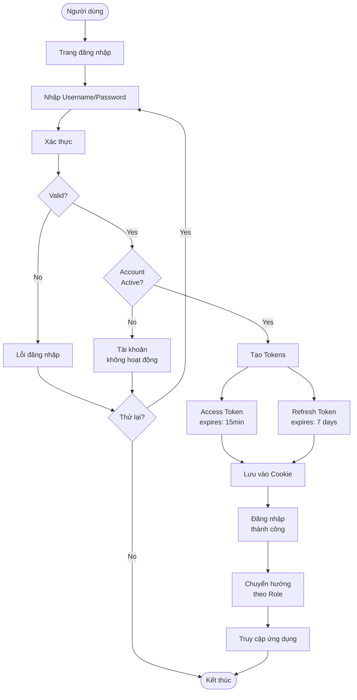

## 2. Biểu Đồ Luồng Đăng Ký Tài Khoản

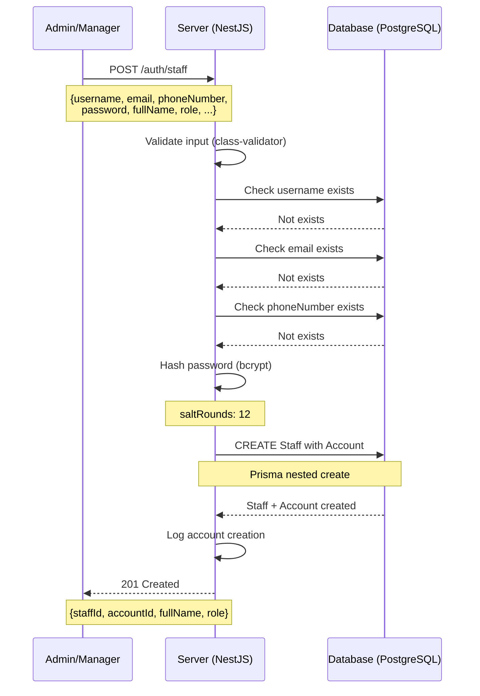

## 3. Biểu Đồ Trạng Thái Tài Khoản

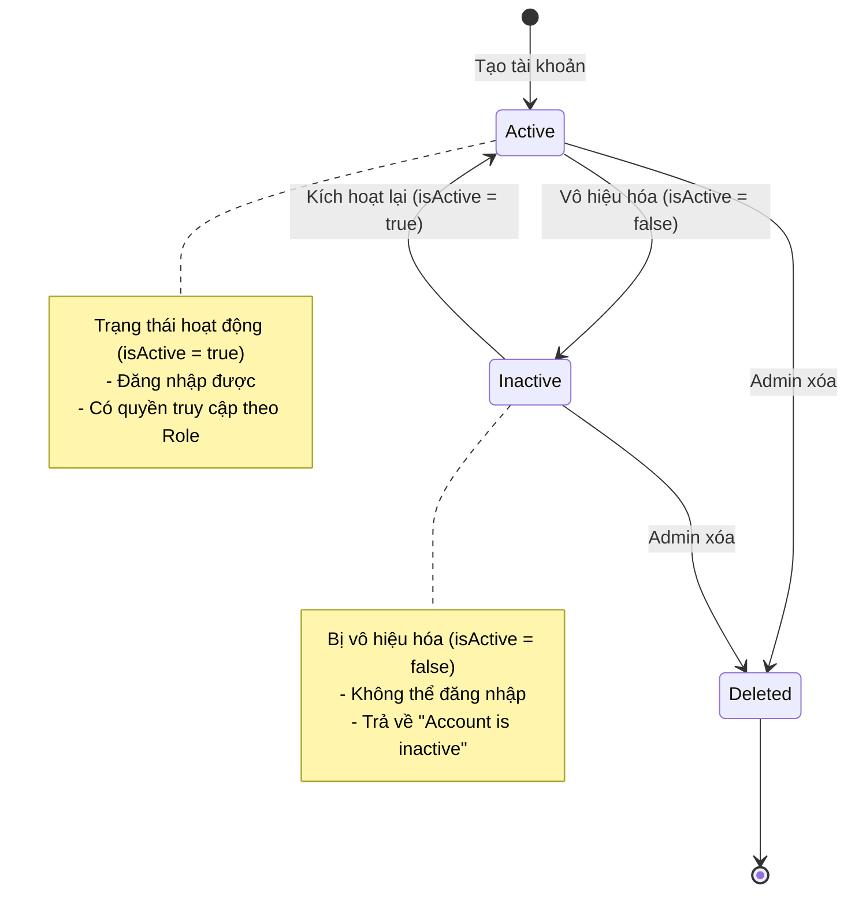

## 4. Biểu Đồ Luồng Đăng Nhập JWT

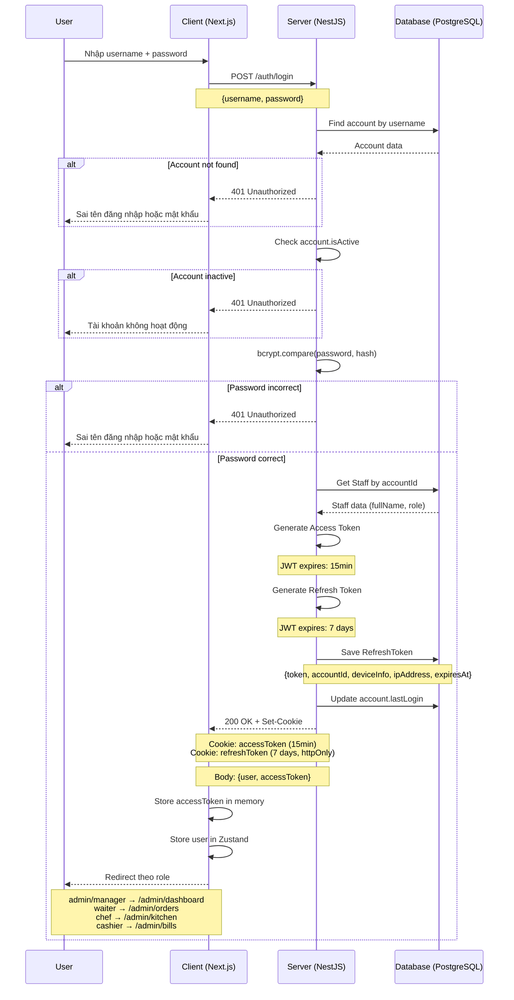

## 5. Biểu Đồ Vòng Đời JWT Token

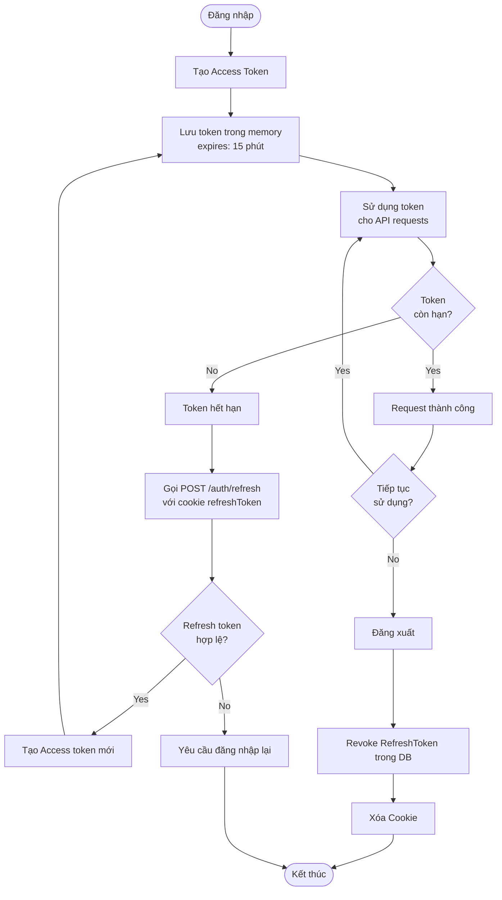

## 6. Biểu Đồ Làm Mới Token

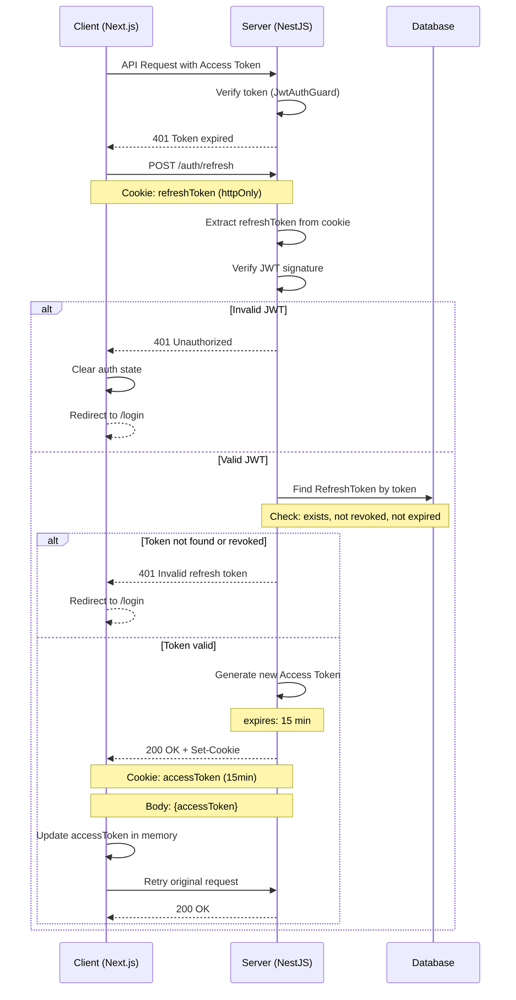

## 7. Biểu Đồ Đăng Xuất

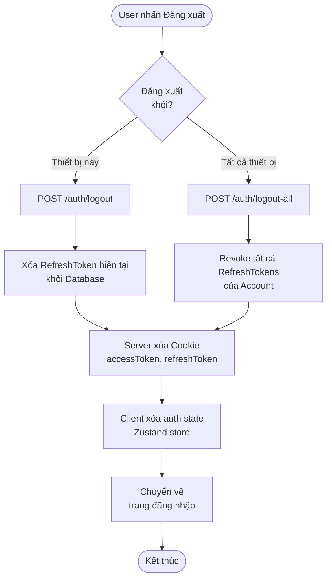

## 8. Biểu Đồ Đổi Mật Khẩu

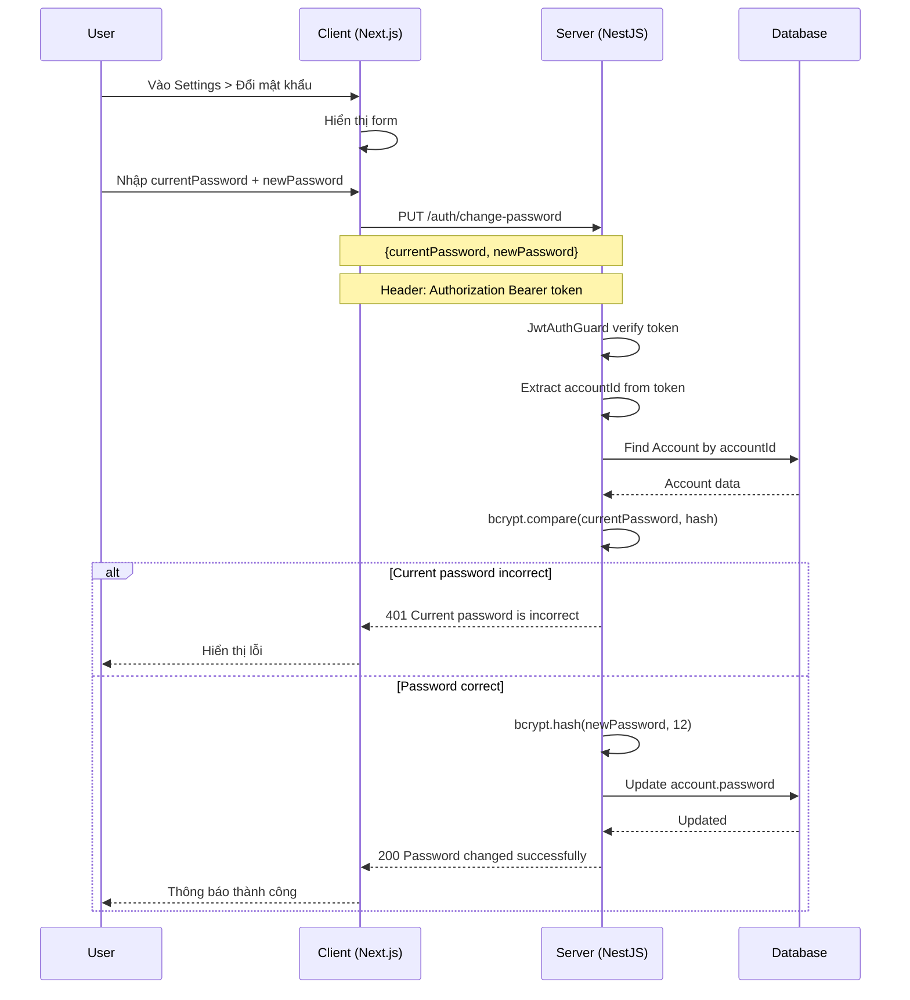

## 9. Biểu Đồ Cập Nhật Profile

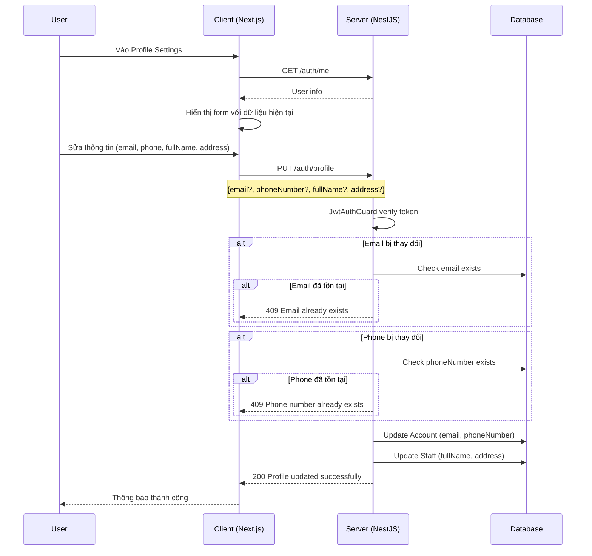

## 10. Biểu Đồ ERD Xác Thực (Thực tế Triển Khai)

```mermaid
erDiagram
    ACCOUNTS ||--|| STAFF : has
    ACCOUNTS ||--o{ REFRESH_TOKENS : has
    STAFF }o--|| ROLE : has
    
    ACCOUNTS {
        int accountId PK
        string username UK "VarChar(50)"
        string email UK "VarChar(255)"
        string phoneNumber UK "VarChar(20)"
        string password "VarChar(255) bcrypt hash"
        boolean isActive "default true"
        datetime lastLogin "nullable"
        datetime createdAt
        datetime updatedAt
    }
    
    STAFF {
        int staffId PK
        int accountId FK UK
        string fullName "VarChar(255)"
        string address "VarChar(500) nullable"
        date dateOfBirth "nullable"
        date hireDate "default now()"
        decimal salary "Decimal(12,2) nullable"
        enum role "admin|manager|waiter|chef|cashier"
        boolean isActive "default true"
        datetime createdAt
        datetime updatedAt
    }
    
    REFRESH_TOKENS {
        int tokenId PK
        int accountId FK
        string token UK "Text"
        datetime expiresAt
        string deviceInfo "VarChar(500) nullable"
        string ipAddress "VarChar(45) nullable"
        boolean isRevoked "default false"
        datetime createdAt
        datetime revokedAt "nullable"
    }
    
    ROLE {
        enum_value admin
        enum_value manager
        enum_value waiter
        enum_value chef
        enum_value cashier
    }
```

## 11. Biểu Đồ Ma Trận Phân Quyền

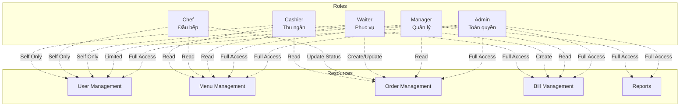

## 12. Biểu Đồ Kiểm Tra Quyền (Authorization)

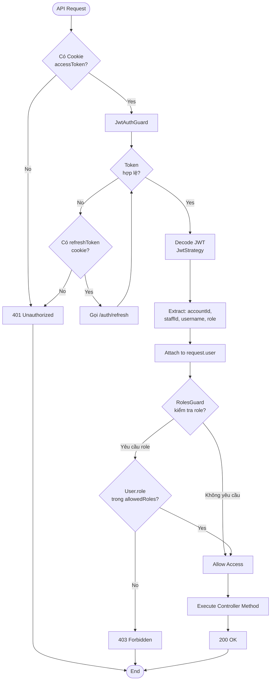

---

## Kết Luận

Các biểu đồ trên mô tả chi tiết hệ thống xác thực **đã được triển khai**:

### Tính năng đã triển khai:
- ✅ Quy trình đăng nhập với JWT (Access Token 15 phút, Refresh Token 7 ngày)
- ✅ Đăng ký tài khoản nhân viên (Account + Staff)
- ✅ Làm mới token tự động qua httpOnly cookie
- ✅ Đăng xuất (thiết bị đơn và tất cả thiết bị)
- ✅ Đổi mật khẩu
- ✅ Cập nhật thông tin cá nhân
- ✅ Phân quyền theo Role (admin, manager, waiter, chef, cashier)
- ✅ Bảo mật token với httpOnly cookie

### Công nghệ sử dụng:
- **Backend**: NestJS, Passport JWT, bcrypt (salt rounds: 12)
- **Frontend**: Next.js, Zustand, httpOnly cookies
- **Database**: PostgreSQL với Prisma ORM

Tất cả biểu đồ sử dụng cú pháp Mermaid để dễ dàng hiển thị trên GitHub/GitLab.
