# Biểu Đồ Quản Lý Xác Thực và Tài Khoản

## 1. Biểu Đồ Tổng Quan Hệ Thống Xác Thực

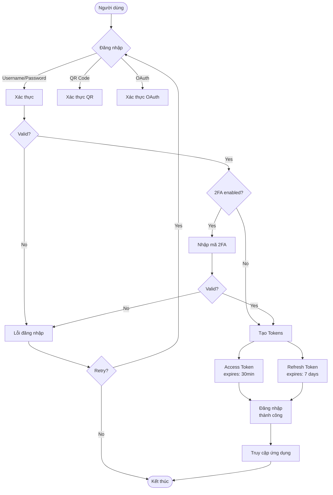

## 2. Biểu Đồ Luồng Đăng Ký Tài Khoản

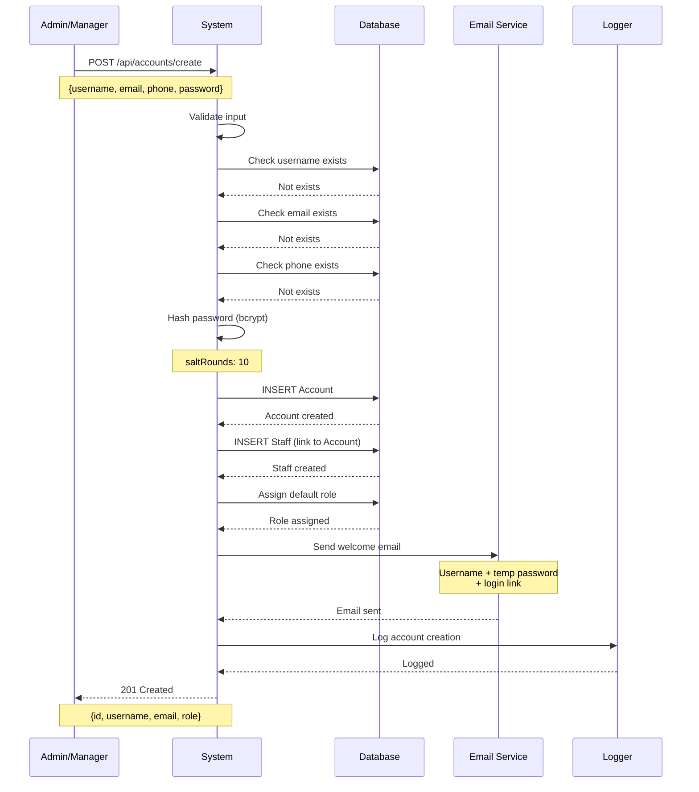

## 3. Biểu Đồ Trạng Thái Tài Khoản

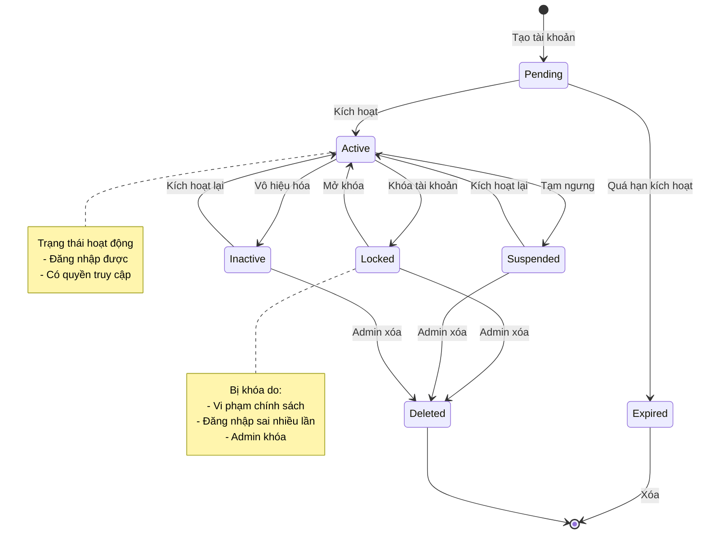

## 4. Biểu Đồ Luồng Đăng Nhập JWT

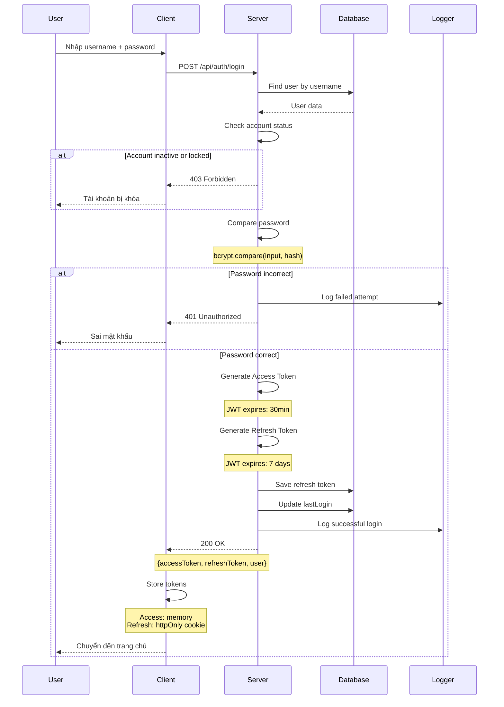

## 5. Biểu Đồ Vòng Đời JWT Token

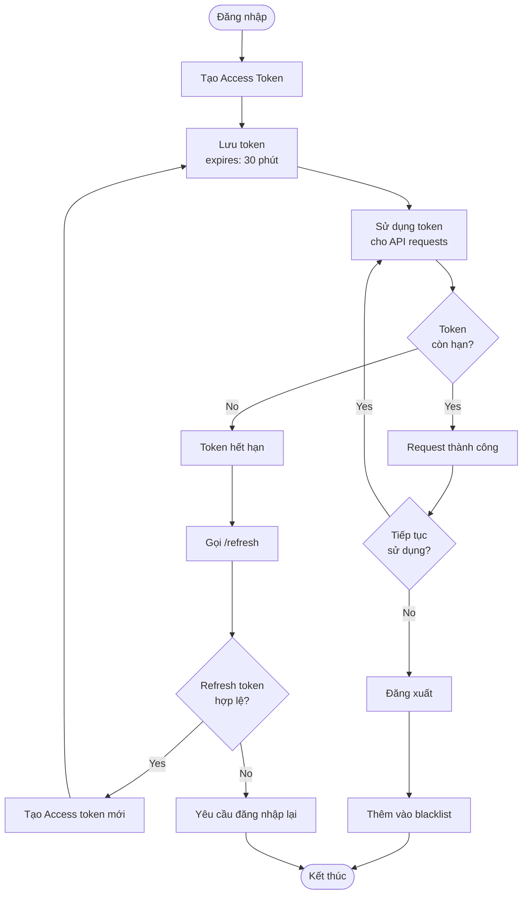

## 6. Biểu Đồ Làm Mới Token

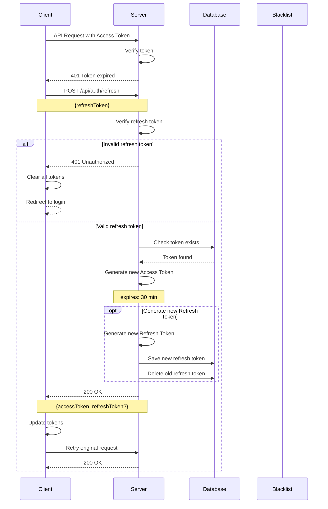

## 7. Biểu Đồ Đăng Xuất

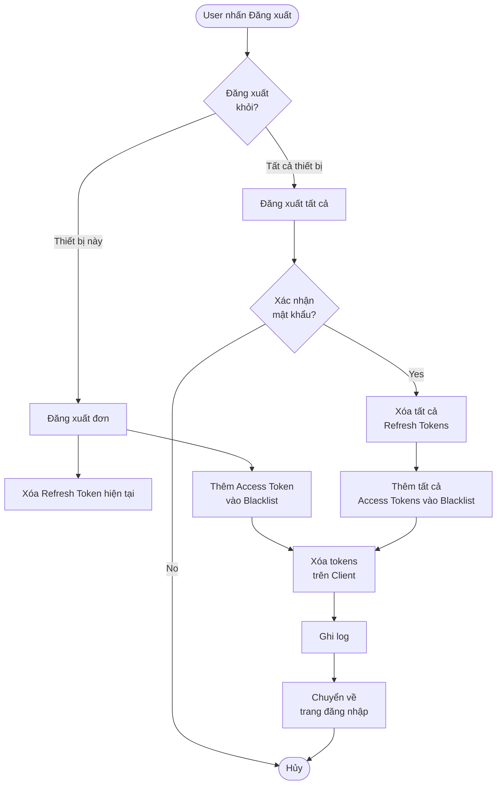

## 8. Biểu Đồ Quên Mật Khẩu

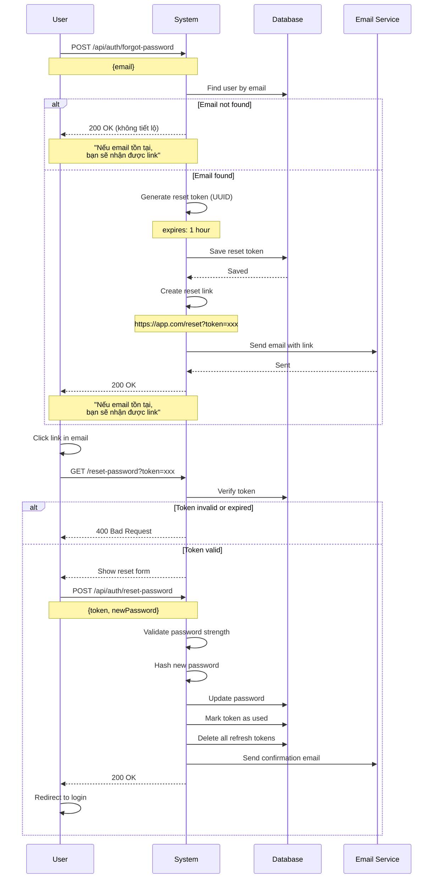

## 9. Biểu Đồ Đổi Mật Khẩu

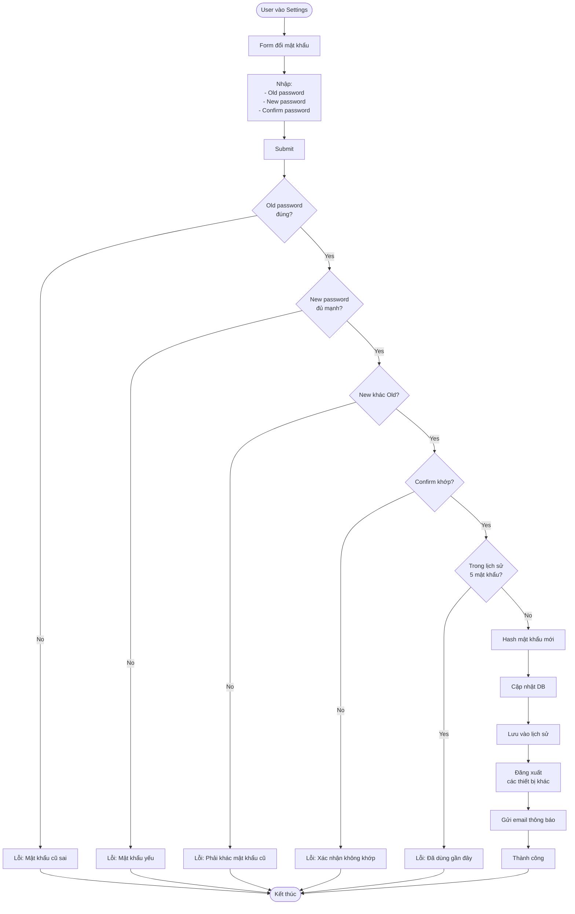

## 10. Biểu Đồ Bật 2FA

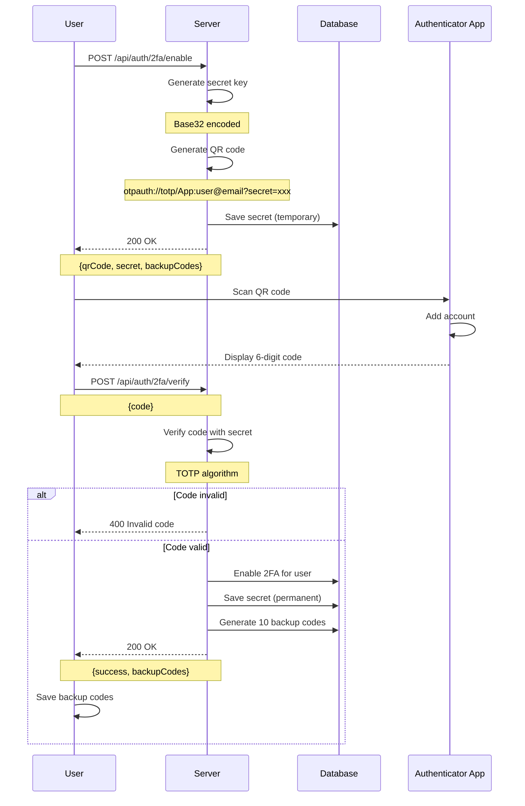

## 11. Biểu Đồ Đăng Nhập Với 2FA

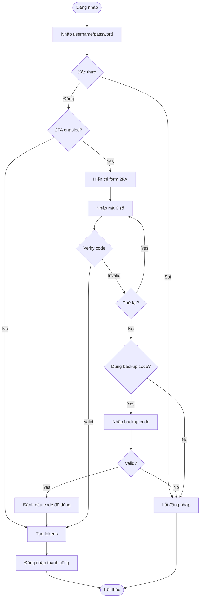

## 12. Biểu Đồ ERD Xác Thực

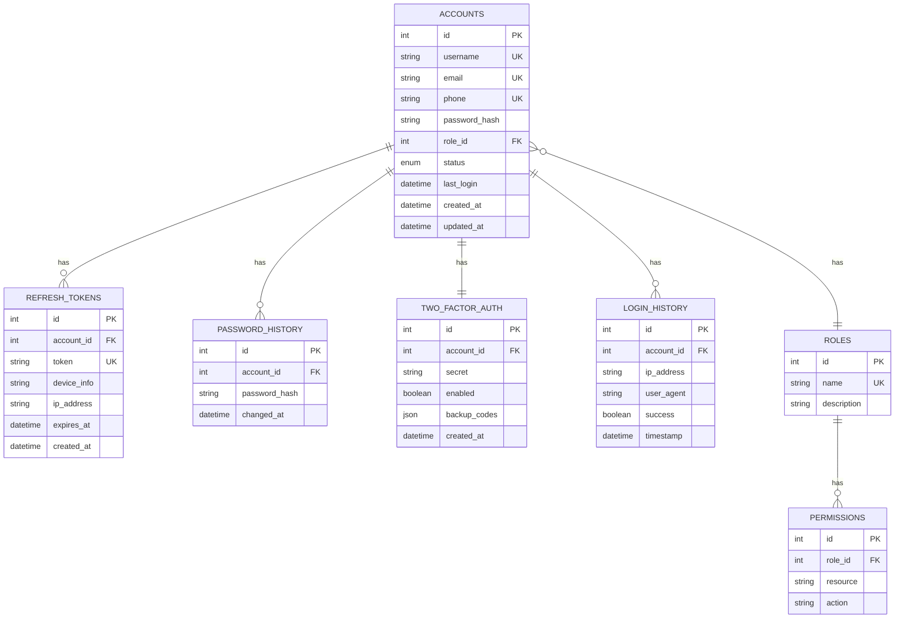

## 13. Biểu Đồ Ma Trận Phân Quyền

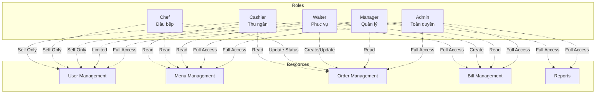

## 14. Biểu Đồ Kiểm Tra Quyền (Authorization)

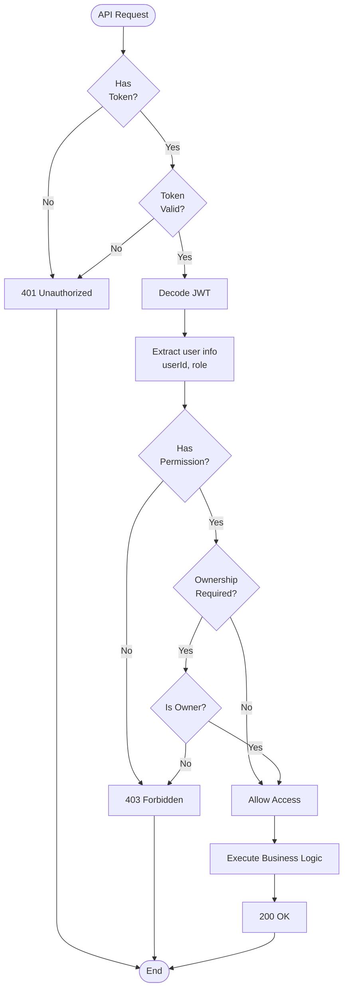

## 15. Biểu Đồ Session Management

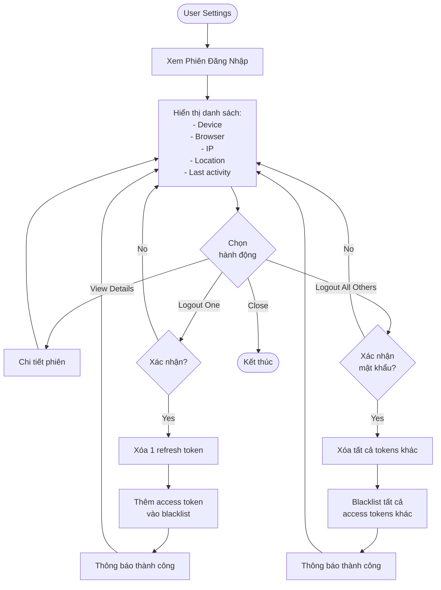

## 16. Biểu Đồ Audit Logging

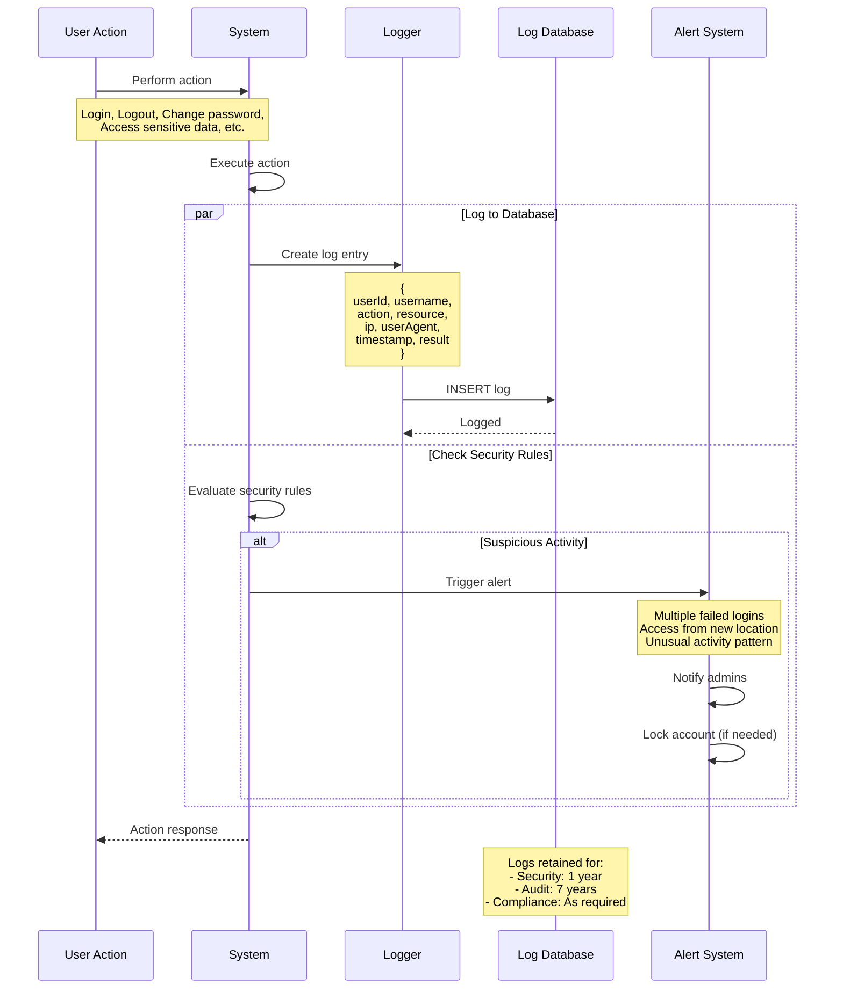

---

## Kết Luận

Các biểu đồ trên mô tả chi tiết:
- Quy trình xác thực và ủy quyền
- Vòng đời JWT tokens
- Quản lý phiên đăng nhập
- Bảo mật 2FA
- Phân quyền và kiểm soát truy cập
- Audit logging và monitoring

Tất cả sử dụng cú pháp Mermaid để dễ dàng hiển thị trên GitHub/GitLab.
