# Biểu Đồ Quản Lý Hóa Đơn và Thanh Toán

## 1. Biểu Đồ Quy Trình Tổng Thể (Flowchart)

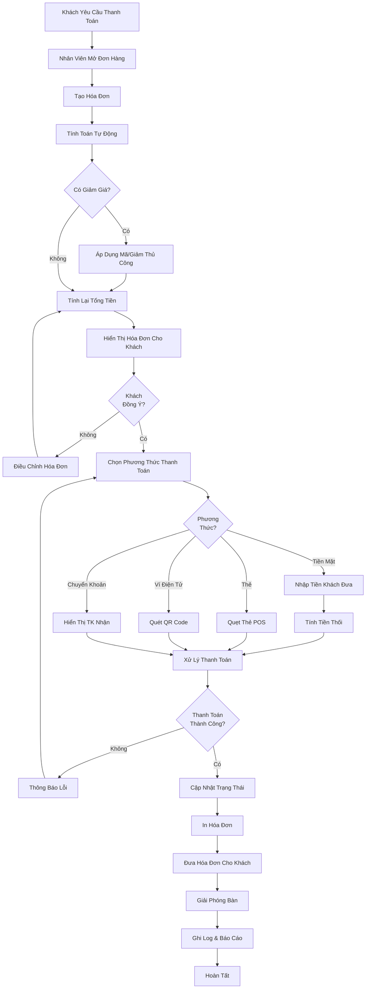

---

## 2. Biểu Đồ Quản Lý Thanh Toán (Sequence Diagram)

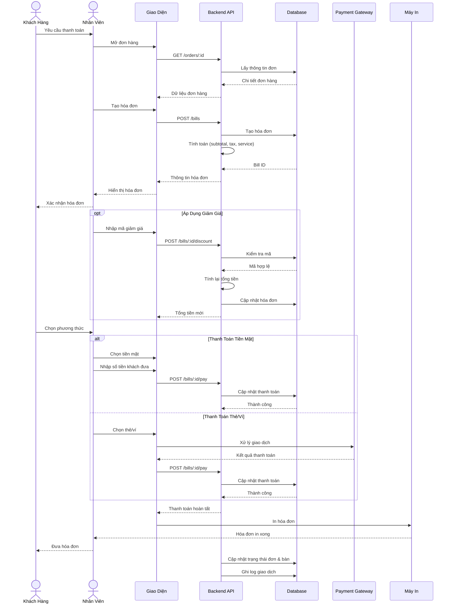

---

## 3. Biểu Đồ Trạng Thái Hóa Đơn (State Diagram)

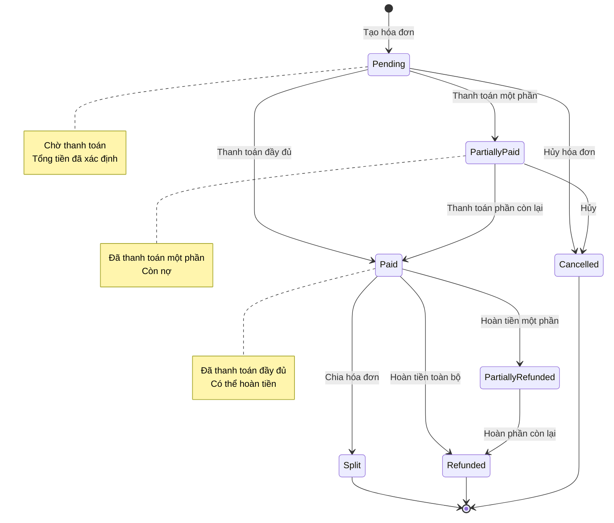

---

## 4. Biểu Đồ Cấu Trúc Dữ Liệu (Entity Relationship)

```mermaid
erDiagram
    BILL ||--|| ORDER : "generated from"
    BILL ||--o{ BILL_ITEM : contains
    BILL ||--o{ PAYMENT : "has"
    BILL }o--|| RESTAURANT_TABLE : "for"
    BILL }o--o| STAFF : "handled by"
    
    BILL_ITEM }o--|| MENU_ITEM : references
    
    BILL {
        int billId PK
        string billNumber UK
        int orderId FK UK
        int tableId FK
        int staffId FK
        decimal subtotal
        decimal taxAmount
        decimal taxRate
        decimal discountAmount
        decimal serviceCharge
        decimal totalAmount
        decimal paidAmount
        decimal changeAmount
        string paymentStatus
        string paymentMethod
        string notes
        timestamp createdAt
        timestamp paidAt
        timestamp updatedAt
    }
    
    BILL_ITEM {
        int billItemId PK
        int billId FK
        int itemId FK
        string itemName
        int quantity
        decimal unitPrice
        decimal subtotal
        decimal discount
        decimal total
        timestamp createdAt
    }
    
    PAYMENT {
        int paymentId PK
        int billId FK
        string paymentMethod
        decimal amount
        string transactionId
        string cardNumber
        string cardHolderName
        string status
        string notes
        timestamp paymentDate
        timestamp createdAt
    }
    
    ORDER {
        int orderId PK
        string orderNumber UK
    }
    
    RESTAURANT_TABLE {
        int tableId PK
        string tableNumber UK
    }
    
    STAFF {
        int staffId PK
        string fullName
    }
    
    MENU_ITEM {
        int itemId PK
        string name
        decimal price
    }
```

---

## 5. Biểu Đồ Tính Toán Hóa Đơn (Activity Diagram)

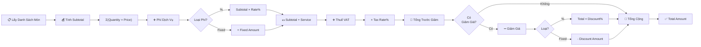

---

## 6. Biểu Đồ Xử Lý Thanh Toán Tiền Mặt (Flow)

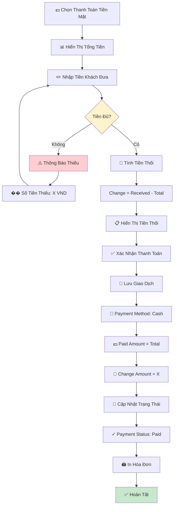

---

## 7. Biểu Đồ Chia Hóa Đơn (Decision Tree)

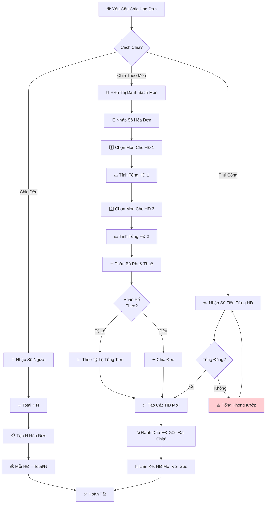

---

## 8. Biểu Đồ Xử Lý Hoàn Tiền (Swimlanes)

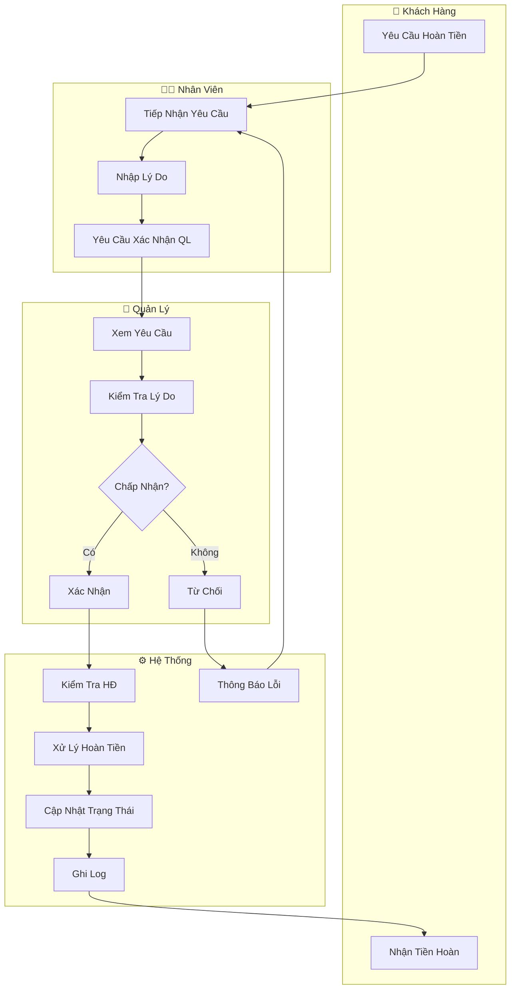

---

## 9. Biểu Đồ Phân Quyền (Permission Matrix)

```mermaid
graph TB
    A["Phân Quyền Hóa Đơn & Thanh Toán"] --> B["👥 Vai Trò"]
    
    B --> C["👤 Khách Hàng"]
    B --> D["👨‍💼 Nhân Viên Phục Vụ"]
    B --> E["💰 Thu Ngân"]
    B --> F["💼 Quản Lý"]
    B --> G["📊 Kế Toán"]
    B --> H["🔐 Admin"]

    C --> C1["✓ Xem hóa đơn của mình"]
    C --> C2["✗ Tất cả thao tác khác"]

    D --> D1["✓ Tạo hóa đơn"]
    D --> D2["✓ Xem hóa đơn"]
    D --> D3["✓ Áp dụng GG < 10%"]
    D --> D4["✓ In hóa đơn"]
    D --> D5["✓ Thanh toán"]
    D --> D6["✗ Hoàn tiền"]

    E --> E1["✓ Tạo hóa đơn"]
    E --> E2["✓ Xem hóa đơn"]
    E --> E3["✓ Áp dụng giảm giá"]
    E --> E4["✓ In hóa đơn"]
    E --> E5["✓ Thanh toán"]
    E --> E6["✓ Chia hóa đơn"]
    E --> E7["✗ Hoàn tiền (cần QL)"]

    F --> F1["✓ Tất cả quyền"]
    F --> F2["✓ Hoàn tiền"]
    F --> F3["✓ Xem báo cáo"]
    F --> F4["✓ Xác nhận GG lớn"]

    G --> G1["✓ Xem hóa đơn"]
    G --> G2["✓ Xem báo cáo"]
    G --> G3["✓ In hóa đơn"]
    G --> G4["✗ Tạo/Sửa/Thanh toán"]

    H --> H1["✓ Tất cả quyền"]
    H --> H2["✓ Cấu hình hệ thống"]
```

---

## 10. Biểu Đồ Thống Kê Thanh Toán (Pie Chart)

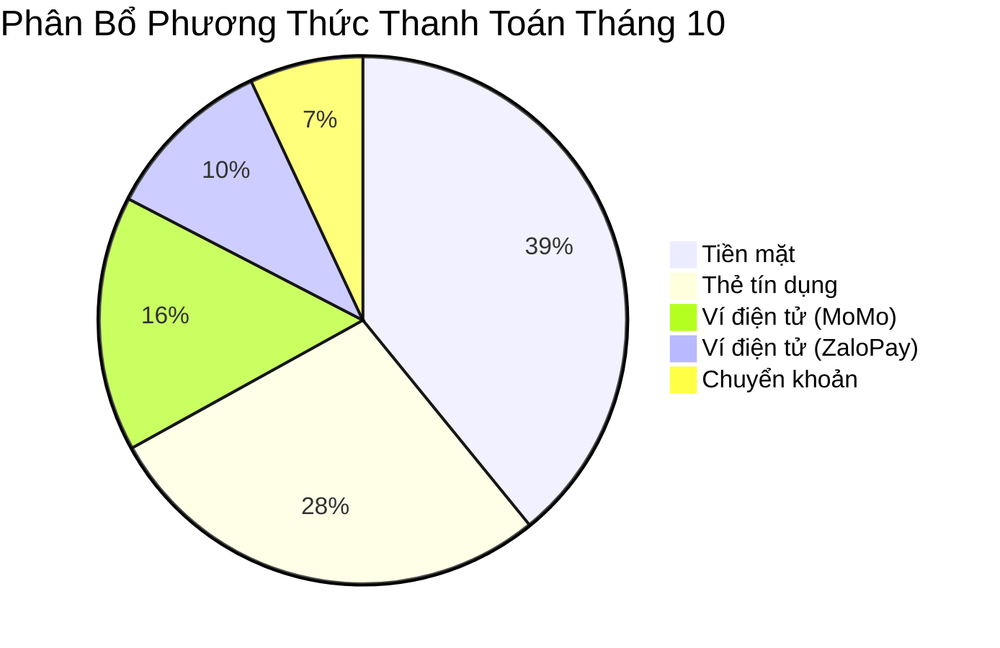

---

## 11. Biểu Đồ Timeline Thanh Toán

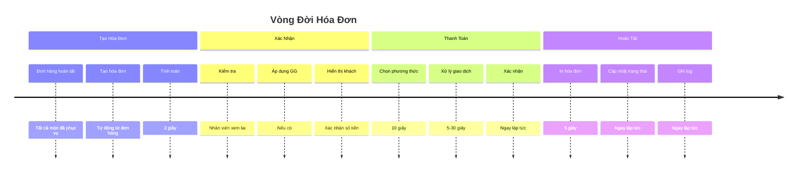

---

## 12. Biểu Đồ Kiến Trúc Hệ Thống (Component)

```mermaid
graph TB
    subgraph Client["📱 Frontend"]
        UI["🎨 Bill UI"]
        Payment UI["💳 Payment UI"]
        Print["🖨️ Print Manager"]
    end

    subgraph API["🔌 Backend"]
        BillAPI["📋 Bill Service"]
        PaymentAPI["💰 Payment Service"]
        DiscountAPI["🎁 Discount Service"]
        TaxAPI["📊 Tax Calculator"]
    end

    subgraph Data["💾 Database"]
        BillDB["💼 Bill Data"]
        PaymentDB["💳 Payment Data"]
        TransactionLog["📝 Transaction Log"]
    end

    subgraph External["🌐 External"]
        POS["💳 POS Terminal"]
        EWallet["📱 E-wallet Gateway"]
        Bank["🏦 Bank API"]
        ThermalPrinter["🖨️ Thermal Printer"]
    end

    UI --> BillAPI
    PaymentUI --> PaymentAPI
    Print --> ThermalPrinter
    
    BillAPI --> DiscountAPI
    BillAPI --> TaxAPI
    BillAPI --> BillDB
    
    PaymentAPI --> PaymentDB
    PaymentAPI --> TransactionLog
    PaymentAPI --> POS
    PaymentAPI --> EWallet
    PaymentAPI --> Bank
    
    style Client fill:#e3f2fd
    style API fill:#f3e5f5
    style Data fill:#e8f5e9
    style External fill:#fff3e0
```

---

## 13. Biểu Đồ Xử Lý Lỗi Thanh Toán

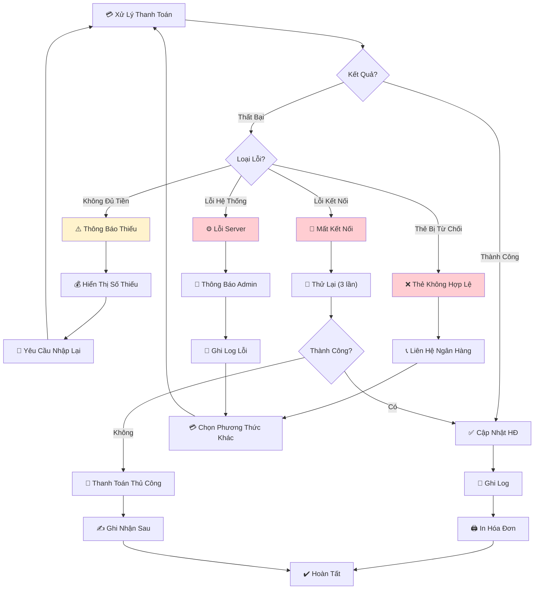

---

## 14. Biểu Đồ Báo Cáo Doanh Thu

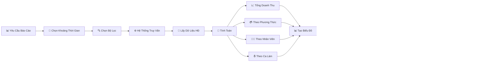

---

## 15. Biểu Đồ Use Case Đầy Đủ

```mermaid
graph TB
    subgraph System["🏪 Quản Lý Hóa Đơn & Thanh Toán"]
        UC1["Tạo Hóa Đơn"]
        UC2["Xem Hóa Đơn"]
        UC3["Áp Dụng Giảm Giá"]
        UC4["In Hóa Đơn"]
        UC5["Thanh Toán Tiền Mặt"]
        UC6["Thanh Toán Thẻ"]
        UC7["Thanh Toán Ví Điện Tử"]
        UC8["Thanh Toán Một Phần"]
        UC9["Chia Hóa Đơn"]
        UC10["Hoàn Tiền"]
        UC11["Xem Báo Cáo"]
    end

    A["👤 Khách Hàng"] -->|Xem| UC2

    B["👨‍💼 Nhân Viên Phục Vụ"] -->|Sử Dụng| UC1
    B -->|Sử Dụng| UC2
    B -->|Sử Dụng| UC3
    B -->|Sử Dụng| UC4
    B -->|Sử Dụng| UC5
    B -->|Sử Dụng| UC6
    B -->|Sử Dụng| UC7

    C["💰 Thu Ngân"] -->|Sử Dụng| UC1
    C -->|Sử Dụng| UC2
    C -->|Sử Dụng| UC3
    C -->|Sử Dụng| UC4
    C -->|Sử Dụng| UC5
    C -->|Sử Dụng| UC6
    C -->|Sử Dụng| UC7
    C -->|Sử Dụng| UC8
    C -->|Sử Dụng| UC9

    D["💼 Quản Lý"] -->|Sử Dụng| UC1
    D -->|Sử Dụng| UC2
    D -->|Sử Dụng| UC3
    D -->|Sử Dụng| UC4
    D -->|Sử Dụng| UC5
    D -->|Sử Dụng| UC6
    D -->|Sử Dụng| UC7
    D -->|Sử Dụng| UC8
    D -->|Sử Dụng| UC9
    D -->|Sử Dụng| UC10
    D -->|Sử Dụng| UC11

    E["📊 Kế Toán"] -->|Sử Dụng| UC2
    E -->|Sử Dụng| UC4
    E -->|Sử Dụng| UC11

    F["🔐 Admin"] -->|Sử Dụng| UC1
    F -->|Sử Dụng| UC10
    F -->|Sử Dụng| UC11

    style System fill:#e3f2fd
```

---

## 16. Biểu Đồ Dòng Dữ Liệu Real-time

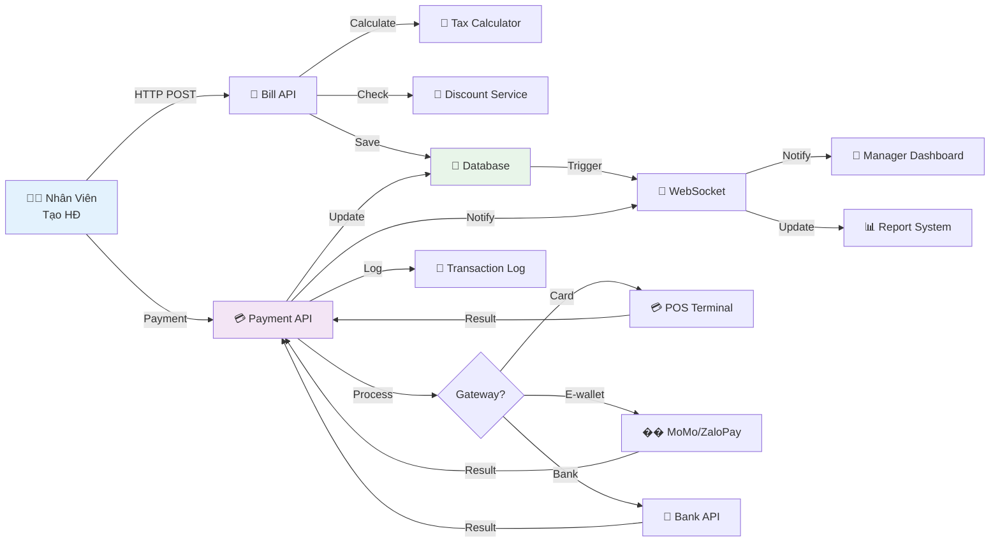

---

## Ghi Chú

Các biểu đồ này được tạo bằng **Mermaid** và có thể được:

-   Chỉnh sửa trực tiếp trong markdown
-   Xuất thành hình ảnh PNG/SVG
-   Nhúng vào tài liệu web hoặc wiki
-   Tích hợp vào các công cụ quản lý dự án

**Để sử dụng Mermaid:**

1. GitHub hỗ trợ mermaid trực tiếp trong markdown
2. GitLab cũng hỗ trợ mermaid native
3. Các công cụ khác có thể cần plugin (Notion, Confluence, v.v.)
4. Online editor: https://mermaid.live

**Ứng dụng thực tế:**

-   Đào tạo nhân viên về quy trình thanh toán
-   Tài liệu hướng dẫn sử dụng hệ thống
-   Phân tích và tối ưu quy trình thanh toán
-   Phát triển và bảo trì hệ thống
-   Giao tiếp với stakeholders về luồng thanh toán
