# Biểu Đồ Quản Lý Menu và Danh Mục

> **Cập nhật**: Tài liệu này đã được cập nhật để phản ánh chính xác hệ thống đã triển khai.

---

## 1. Biểu Đồ Quy Trình Tổng Thể (Flowchart)

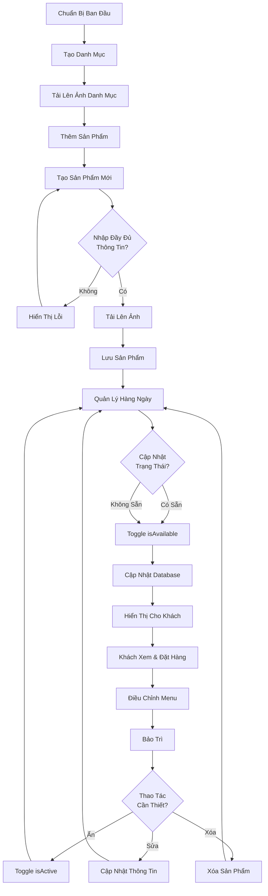

---

## 2. Biểu Đồ Quản Lý Danh Mục (Sequence Diagram)

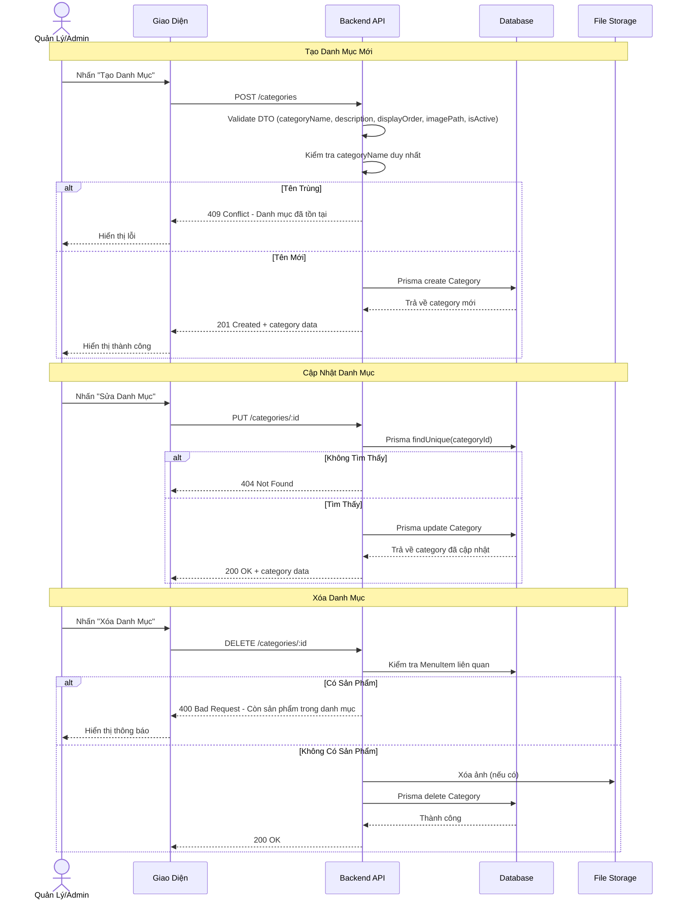

---

## 3. Biểu Đồ Quản Lý Sản Phẩm (State Diagram)

> **Lưu ý**: Hệ thống sử dụng 2 boolean flags đơn giản thay vì state machine phức tạp.

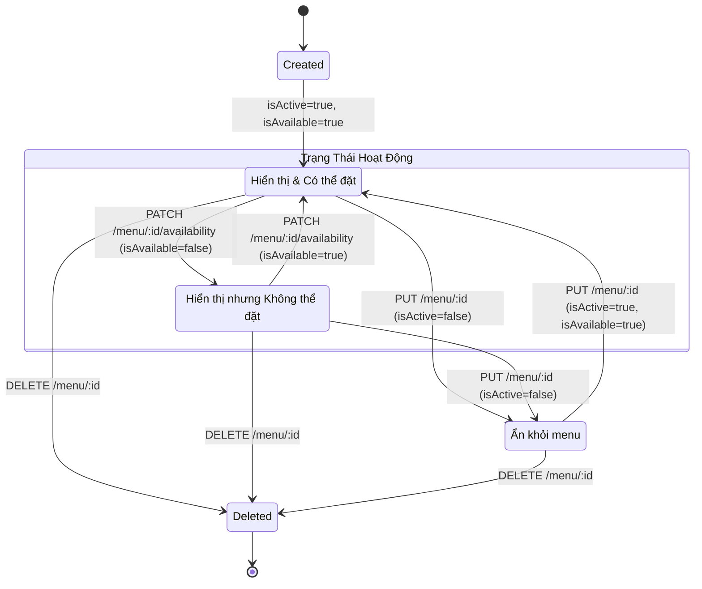

### Giải thích trạng thái:
| isActive | isAvailable | Trạng thái | Mô tả |
|----------|-------------|------------|-------|
| true | true | Có sẵn | Hiển thị trên menu, khách có thể đặt |
| true | false | Hết hàng | Hiển thị trên menu nhưng không thể đặt |
| false | * | Ẩn | Không hiển thị trên menu khách hàng |

---

## 4. Biểu Đồ Quy Trình Tạo Sản Phẩm Chi Tiết (Activity Diagram)

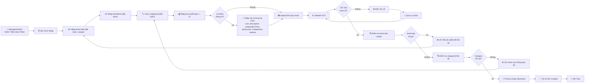

---

## 5. Biểu Đồ Phân Quyền (Permission Matrix)

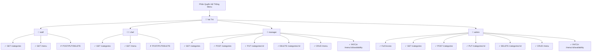

---

## 7. Biểu Đồ Cập Nhật Giá Sản Phẩm (Flow)

> **Lưu ý**: Hệ thống hiện tại **không lưu lịch sử giá**. Giá được cập nhật trực tiếp.

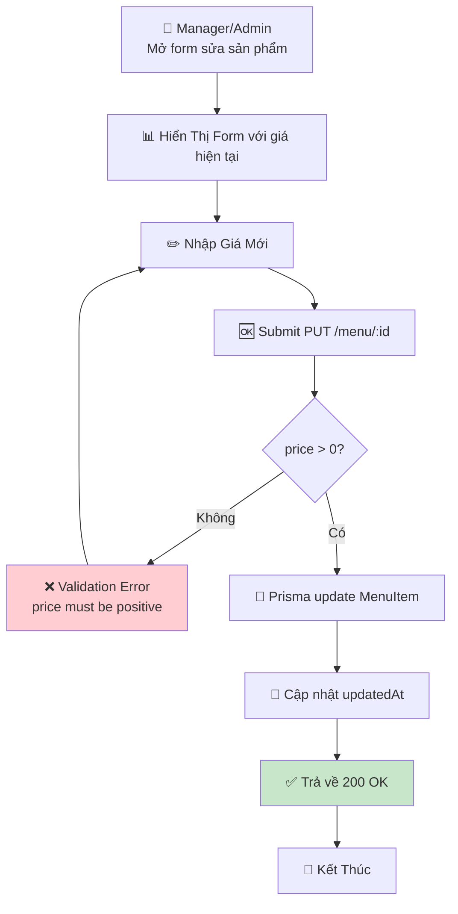

---

## 8. Biểu Đồ Quản Lý Trạng Thái Sẵn Có (Swimlanes)

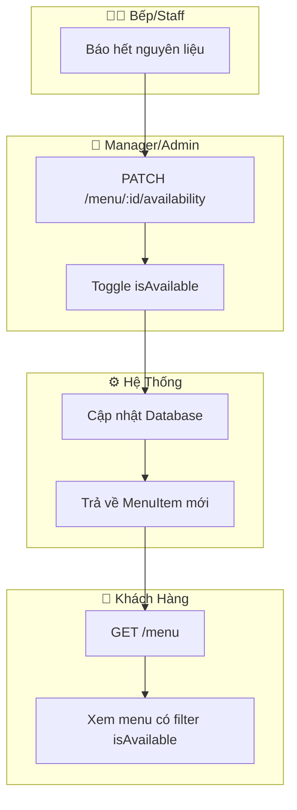

---

## 9. Biểu Đồ Xử Lý Lỗi (Error Handling Tree)

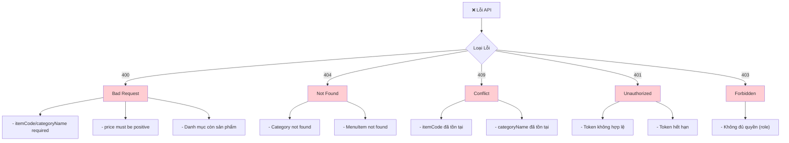

---

## 10. Biểu Đồ Kiến Trúc Thành Phần (Component Diagram)

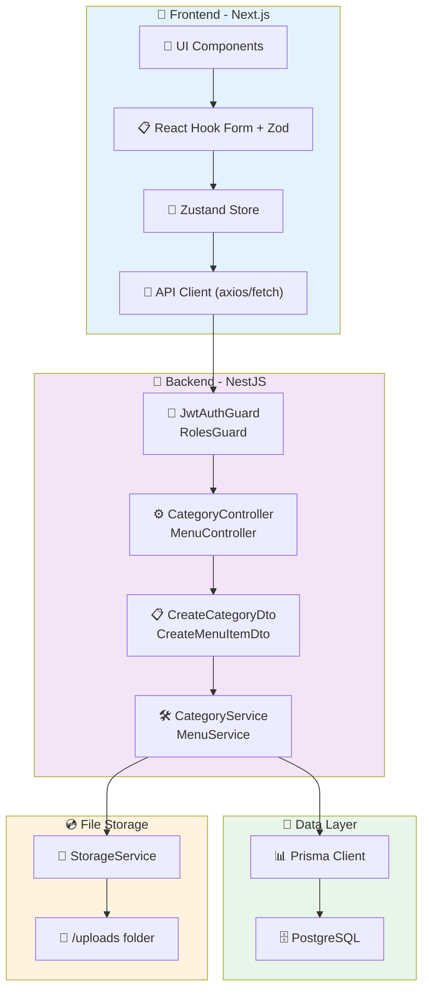

---

## 11. Biểu Đồ Dòng Dữ Liệu (Data Flow)

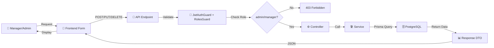

---

## 12. Biểu Đồ Vòng Đời Sản Phẩm (Lifecycle)

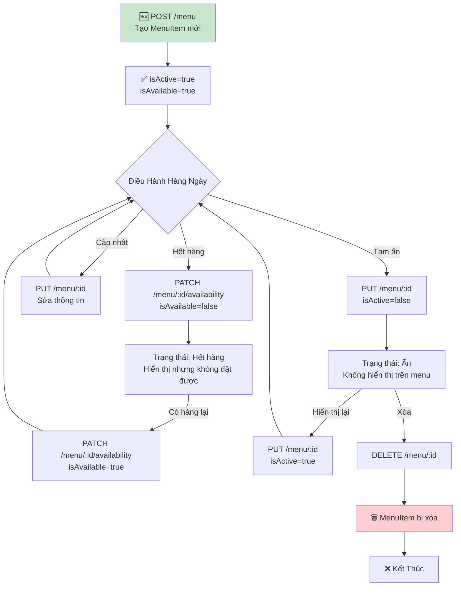

---

## 13. Biểu Đồ API Endpoints

```mermaid
graph TB
    subgraph Categories["📁 /categories"]
        C1["GET /categories<br/>Lấy tất cả danh mục"]
        C2["GET /categories/:id<br/>Lấy chi tiết danh mục"]
        C3["GET /categories/:id/items<br/>Lấy sản phẩm trong danh mục"]
        C4["GET /categories/count<br/>Đếm số danh mục"]
        C5["POST /categories<br/>Tạo danh mục mới"]
        C6["PUT /categories/:id<br/>Cập nhật danh mục"]
        C7["DELETE /categories/:id<br/>Xóa danh mục"]
    end

    subgraph Menu["🍽️ /menu"]
        M1["GET /menu<br/>Lấy tất cả món ăn"]
        M2["GET /menu/:id<br/>Lấy chi tiết món"]
        M3["GET /menu/code/:code<br/>Lấy món theo mã"]
        M4["GET /menu/category/:categoryId<br/>Lấy món theo danh mục"]
        M5["GET /menu/count<br/>Đếm số món"]
        M6["POST /menu<br/>Tạo món mới"]
        M7["PUT /menu/:id<br/>Cập nhật món"]
        M8["PATCH /menu/:id/availability<br/>Toggle trạng thái sẵn có"]
        M9["DELETE /menu/:id<br/>Xóa món"]
    end

    subgraph Auth["🔐 Authorization"]
        A1["Public: GET endpoints"]
        A2["Protected: POST/PUT/PATCH/DELETE"]
        A3["Roles: admin, manager"]
    end

    C1 --> A1
    C2 --> A1
    C3 --> A1
    C4 --> A1
    C5 --> A2
    C6 --> A2
    C7 --> A2

    M1 --> A1
    M2 --> A1
    M3 --> A1
    M4 --> A1
    M5 --> A1
    M6 --> A2
    M7 --> A2
    M8 --> A2
    M9 --> A2

    A2 --> A3

    style Categories fill:#e3f2fd
    style Menu fill:#fff3e0
    style Auth fill:#f3e5f5
```

---

## Ghi Chú

### Các tính năng đã triển khai:
- ✅ CRUD Category với validation unique categoryName
- ✅ CRUD MenuItem với validation unique itemCode
- ✅ Upload/Delete ảnh qua StorageService
- ✅ Toggle availability (isAvailable)
- ✅ Toggle active status (isActive)
- ✅ Role-based access control (admin, manager)
- ✅ Pagination và filtering

### Các tính năng chưa triển khai:
- ❌ Allergens management (thành phần gây dị ứng)
- ❌ Price history tracking (lịch sử giá)
- ❌ Bulk import/export từ Excel/CSV
- ❌ Scheduled menu updates (menu theo giờ)
- ❌ Reports & Analytics (báo cáo phân tích)
- ❌ Activity logging (ghi log hành động)

### Công nghệ sử dụng:
- **Frontend**: Next.js 15, React, TypeScript, Tailwind CSS, Zustand
- **Backend**: NestJS, TypeScript, Prisma ORM
- **Database**: PostgreSQL
- **Authentication**: JWT (Access Token 15 phút, Refresh Token 7 ngày)
- **Storage**: Local filesystem (/uploads)

Các biểu đồ này được tạo bằng **Mermaid** và có thể được:
- Chỉnh sửa trực tiếp trong markdown
- Xuất thành hình ảnh PNG/SVG
- Nhúng vào tài liệu web hoặc wiki

**Để sử dụng Mermaid:**
1. GitHub hỗ trợ mermaid trực tiếp trong markdown
2. Online editor: https://mermaid.live
