# Biểu Đồ Quản Lý Menu và Danh Mục

## 1. Biểu Đồ Quy Trình Tổng Thể (Flowchart)

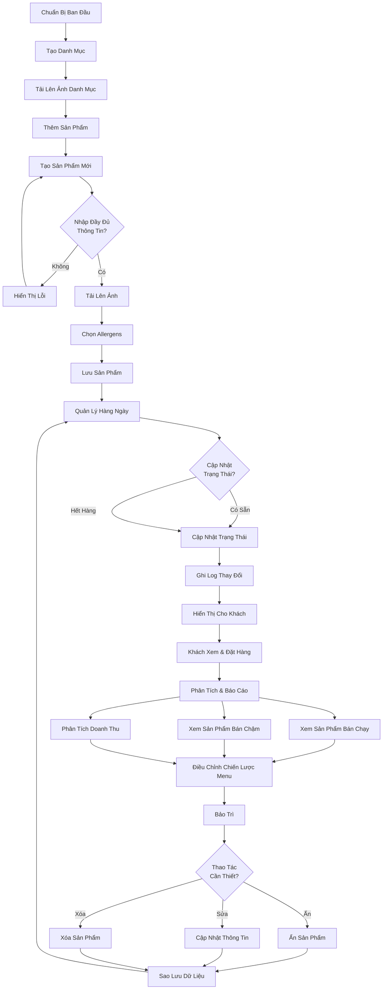

---

## 2. Biểu Đồ Quản Lý Danh Mục (Sequence Diagram)

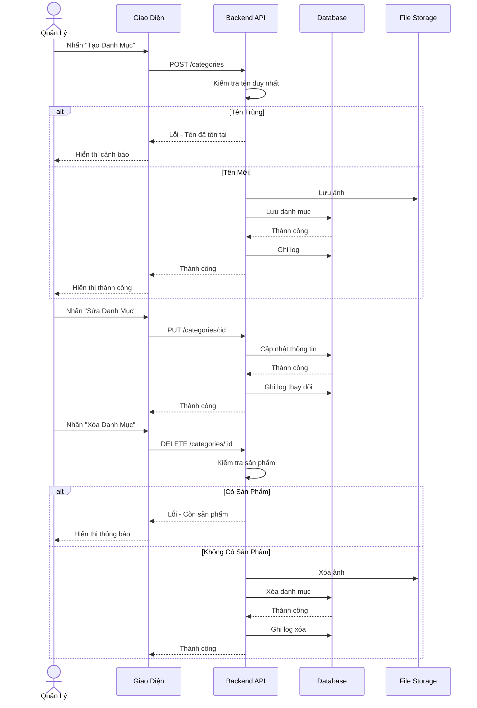

---

## 3. Biểu Đồ Quản Lý Sản Phẩm (State Diagram)

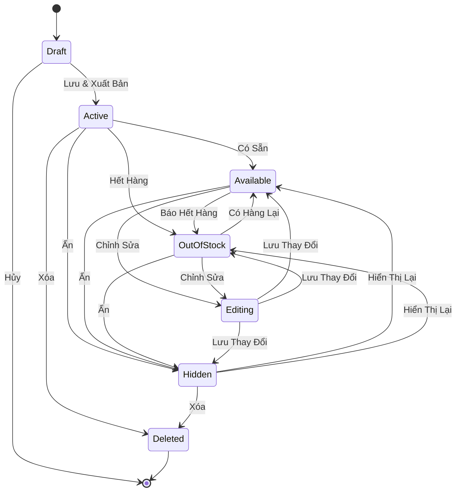

---

## 4. Biểu Đồ Cấu Trúc Dữ Liệu (Entity Relationship)

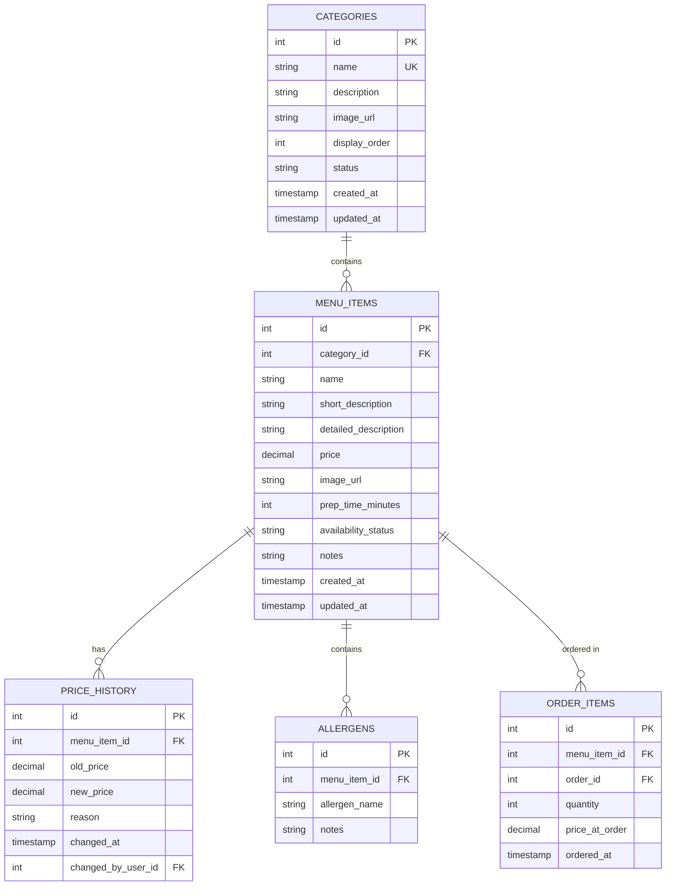

---

## 5. Biểu Đồ Quy Trình Tạo Sản Phẩm Chi Tiết (Activity Diagram)

```mermaid
graph LR
    A["🔵 Người Dùng: Nhấn 'Thêm Sản Phẩm'"] --> B["📋 Mở Form Nhập Thông Tin"]
    B --> C["✏️ Nhập Tên Sản Phẩm"]
    C --> D["✏️ Nhập Mô Tả Ngắn & Chi Tiết"]
    D --> E["💰 Nhập Giá Tiền"]
    E --> F["🏷️ Chọn Danh Mục"]
    F --> G{"Có Tải<br/>Ảnh?"}
    G -->|Có| H["🖼️ Tải Lên Ảnh"]
    G -->|Không| I["🔖 Chọn Allergens"]
    H --> J["⏱️ Nhập Thời Gian Chuẩn Bị"]
    I --> J
    J --> K["📝 Nhập Ghi Chú"]
    K --> L["⚙️ Kiểm Tra Dữ Liệu"]
    L --> M{"Dữ Liệu<br/>Hợp Lệ?"}
    M -->|Không| N["❌ Hiển Thị Lỗi"]
    N --> O["🔄 Quay Lại Bước Sửa"]
    O --> L
    M -->|Có| P["💾 Lưu Sản Phẩm Vào Database"]
    P --> Q["📸 Xử Lý & Lưu Ảnh"]
    Q --> R["📋 Cập Nhật Danh Mục"]
    R --> S["📝 Ghi Log Hành Động"]
    S --> T["✅ Thông Báo Thành Công"]
    T --> U["🔵 Kết Thúc"]
```

---

## 6. Biểu Đồ Phân Quyền (Permission Matrix)

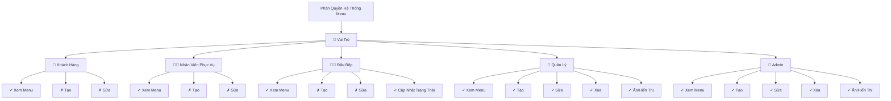

---

## 7. Biểu Đồ Cập Nhật Giá Sản Phẩm (Flow)

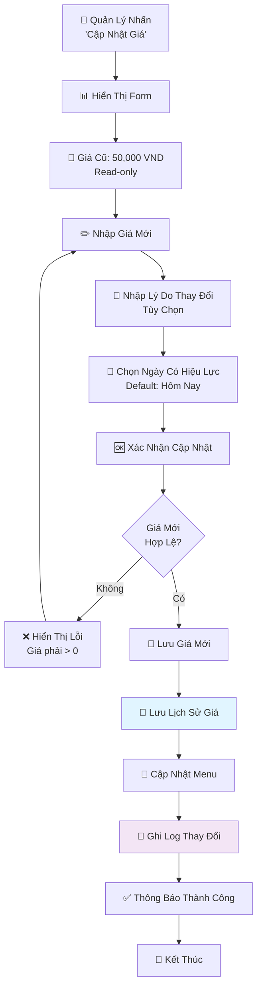

---

## 8. Biểu Đồ Quản Lý Trạng Thái Sẵn Có (Swimlanes)

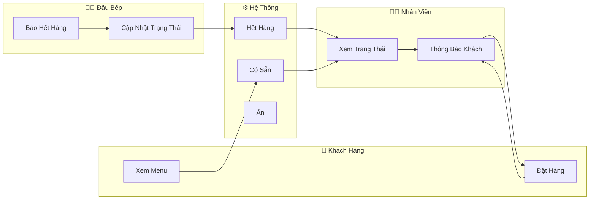

---

## 9. Biểu Đồ Xử Lý Lỗi (Error Handling Tree)

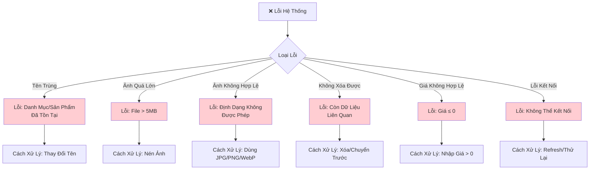

---

## 10. Biểu Đồ Báo Cáo & Phân Tích (Pie Chart Concept)

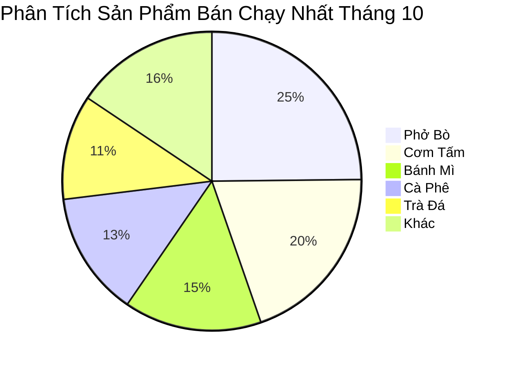

---

## 11. Biểu Đồ Dòng Thời Gian (Timeline)

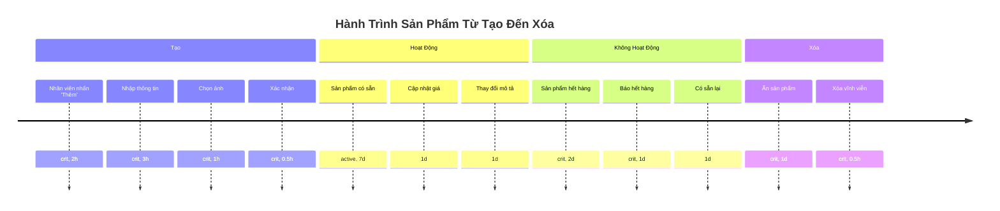

---

## 12. Biểu Đồ Kiến Trúc Thành Phần (Component Diagram)

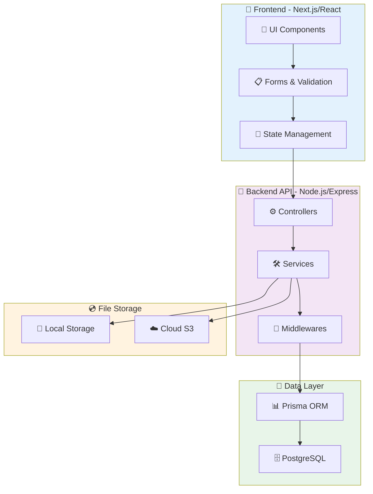

---

## 13. Biểu Đồ Dòng Dữ Liệu (Data Flow)

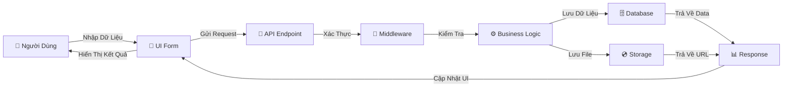

---

## 14. Biểu Đồ Vòng Đời Sản Phẩm (Lifecycle)

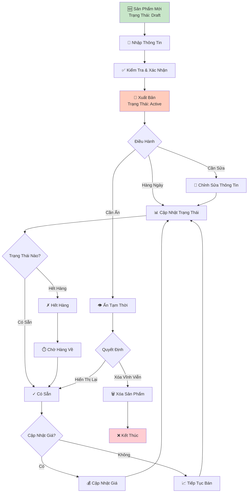

---

## 15. Biểu Đồ Tương Tác Người Dùng (Use Case Diagram)

```mermaid
graph TB
    subgraph System["🏪 Hệ Thống Quản Lý Menu"]
        UC1["Tạo Danh Mục"]
        UC2["Xem Danh Mục"]
        UC3["Chỉnh Sửa Danh Mục"]
        UC4["Xóa Danh Mục"]
        UC5["Tạo Sản Phẩm"]
        UC6["Xem Sản Phẩm"]
        UC7["Chỉnh Sửa Sản Phẩm"]
        UC8["Xóa Sản Phẩm"]
        UC9["Cập Nhật Giá"]
        UC10["Cập Nhật Trạng Thái"]
        UC11["Báo Cáo & Phân Tích"]
    end

    A["👤 Khách Hàng"] -->|Sử Dụng| UC2
    A -->|Sử Dụng| UC6
    A -->|Sử Dụng| UC11

    B["👨‍💼 Nhân Viên Phục Vụ"] -->|Sử Dụng| UC2
    B -->|Sử Dụng| UC6

    C["👨‍🍳 Đầu Bếp"] -->|Sử Dụng| UC2
    C -->|Sử Dụng| UC6
    C -->|Sử Dụng| UC10

    D["💼 Quản Lý"] -->|Sử Dụng| UC1
    D -->|Sử Dụng| UC2
    D -->|Sử Dụng| UC3
    D -->|Sử Dụng| UC4
    D -->|Sử Dụng| UC5
    D -->|Sử Dụng| UC6
    D -->|Sử Dụng| UC7
    D -->|Sử Dụng| UC8
    D -->|Sử Dụng| UC9
    D -->|Sử Dụng| UC10
    D -->|Sử Dụng| UC11

    E["🔐 Admin"] -->|Sử Dụng| UC1
    E -->|Sử Dụng| UC3
    E -->|Sử Dụng| UC4
    E -->|Sử Dụng| UC5
    E -->|Sử Dụng| UC7
    E -->|Sử Dụng| UC8
    E -->|Sử Dụng| UC9
    E -->|Sử Dụng| UC10
    E -->|Sử Dụng| UC11

    style System fill:#e3f2fd
```

---

## 16. Biểu Đồ Quy Trình Xóa Sản Phẩm (Decision Tree)

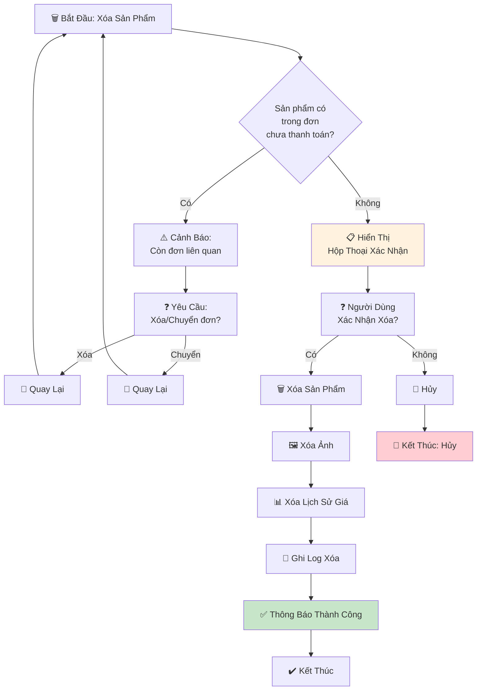

---

## Ghi Chú

Các biểu đồ này được tạo bằng **Mermaid** và có thể được:

-   Chỉnh sửa trực tiếp trong markdown
-   Xuất thành hình ảnh PNG/SVG
-   Nhúng vào tài liệu web hoặc wiki
-   Tích hợp vào các công cụ quản lý dự án

**Để sử dụng Mermaid:**

1. GitHub hỗ trợ mermaid trực tiếp trong markdown
2. Các công cụ khác có thể cần plugin (Notion, Confluence, v.v.)
3. Online editor: https://mermaid.live
