# Biểu Đồ Quản Lý Đơn Hàng

> **Lưu ý**: Tài liệu này đã được cập nhật để phản ánh chính xác hệ thống đã triển khai thực tế (Tháng 6/2025).

## Mục lục

1. [Biểu Đồ Quy Trình Tổng Thể (Flowchart)](#1-biểu-đồ-quy-trình-tổng-thể-flowchart)
2. [Biểu Đồ Use Case](#2-biểu-đồ-use-case)
3. [Biểu Đồ Tuần Tự (Sequence Diagram)](#3-biểu-đồ-tuần-tự-sequence-diagram)
4. [Biểu Đồ Trạng Thái (State Diagram)](#4-biểu-đồ-trạng-thái-state-diagram)
5. [Biểu Đồ Hoạt Động (Activity Diagram)](#5-biểu-đồ-hoạt-động-activity-diagram)
6. [Biểu Đồ Thành Phần (Component Diagram)](#6-biểu-đồ-thành-phần-component-diagram)

---

## 1. Biểu Đồ Quy Trình Tổng Thể (Flowchart)

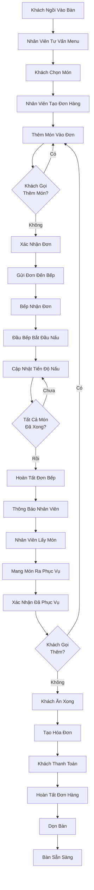

---

## 2. Biểu Đồ Quản Lý Đơn Hàng (Sequence Diagram)

### 2.1 Tạo Đơn Hàng và Xử Lý Bếp

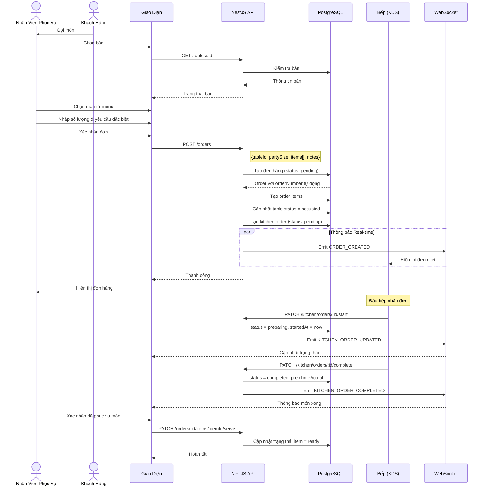

---

## 3. Biểu Đồ Trạng Thái (State Diagram)

### 3.1 Trạng Thái Đơn Hàng (OrderStatus)

> **Lưu ý**: Hệ thống sử dụng 4 trạng thái đơn hàng chính. Trạng thái "Preparing" và "Ready" được quản lý riêng trong KitchenOrder.

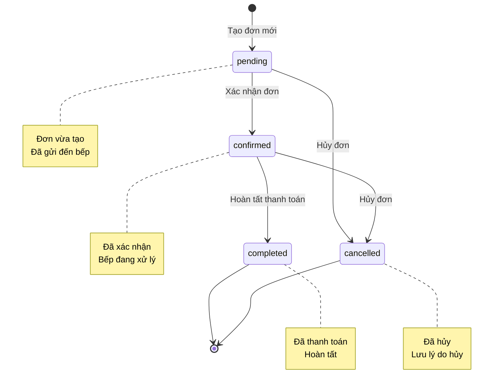

### 3.2 Trạng Thái Đơn Bếp (KitchenOrderStatus)

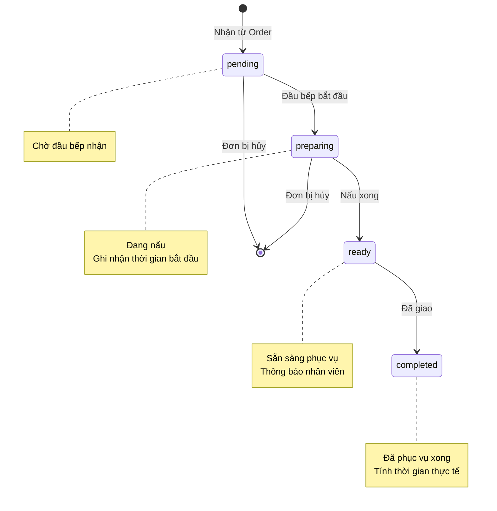

### 3.3 Trạng Thái Món (OrderItemStatus)

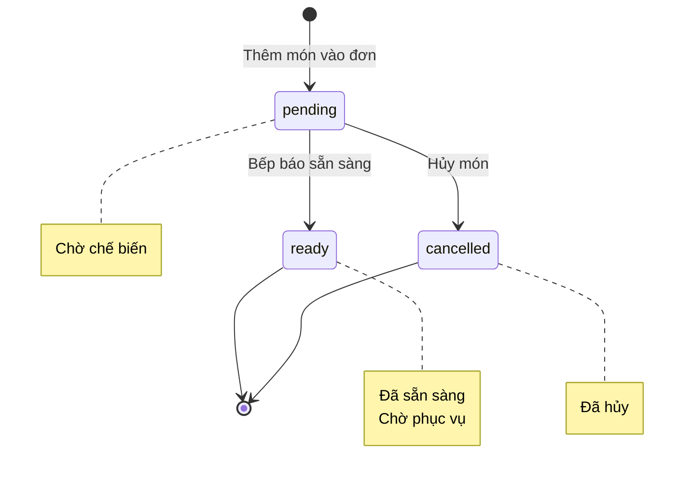

---

## 5. Biểu Đồ Quy Trình Tạo Đơn Chi Tiết (Activity Diagram)

```mermaid
graph LR
    A["🔵 Nhân viên: Chọn bàn"] --> B["📋 Mở menu"]
    B --> C["🔍 Duyệt danh mục"]
    C --> D["🍽️ Chọn món"]
    D --> E["🔢 Nhập số lượng"]
    E --> F{"Yêu cầu<br/>đặc biệt?"}
    F -->|Có| G["✍️ Nhập yêu cầu"]
    F -->|Không| H["➕ Thêm vào giỏ"]
    G --> H
    H --> I{"Gọi<br/>thêm món?"}
    I -->|Có| C
    I -->|Không| J["👥 Nhập số khách"]
    J --> K["📝 Nhập ghi chú (tùy chọn)"]
    K --> L["📋 Xem lại giỏ hàng"]
    L --> M{"Chính xác?"}
    M -->|Không| N["✏️ Chỉnh sửa"]
    N --> L
    M -->|Có| O["✅ Xác nhận đơn"]
    O --> P["💾 Lưu đơn hàng"]
    P --> Q["🔢 Tạo số đơn"]
    Q --> R["🍳 Tạo đơn bếp"]
    R --> S["📡 Gửi thông báo bếp"]
    S --> T["🖨️ In phiếu order"]
    T --> U["🔄 Cập nhật trạng thái bàn"]
    U --> V["📝 Ghi log"]
    V --> W["✅ Hoàn tất"]
    W --> X["🔵 Kết thúc"]
```

---

## 5. Biểu Đồ Quy Trình Bếp (Kitchen Flow)

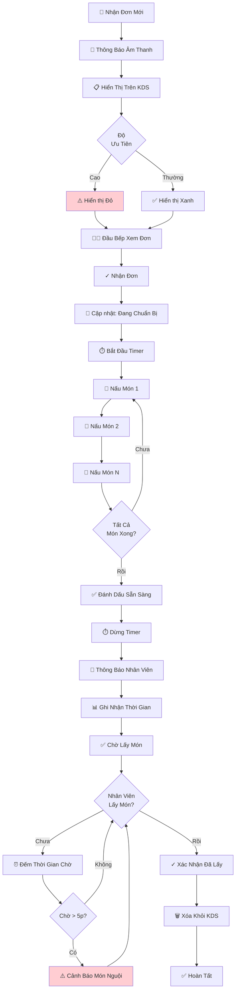

---

## 7. Biểu Đồ Phân Quyền (Permission Matrix)

```mermaid
graph TB
    A["Phân Quyền Quản Lý Đơn Hàng"] --> B["👥 Vai Trò"]
    
    B --> C["👤 Khách Hàng"]
    B --> D["👨‍💼 Nhân Viên Phục Vụ"]
    B --> E["👨‍🍳 Đầu Bếp"]
    B --> F["💰 Thu Ngân"]
    B --> G["💼 Quản Lý"]
    B --> H["🔐 Admin"]

    C --> C1["✗ Tất cả chức năng"]
    C --> C2["(Hoặc tự đặt qua QR)"]

    D --> D1["✓ Tạo đơn hàng"]
    D --> D2["✓ Xem đơn hàng"]
    D --> D3["✓ Sửa đơn (thêm/hủy món)"]
    D --> D4["✓ Gửi đơn đến bếp"]
    D --> D5["✓ Xác nhận phục vụ"]
    D --> D6["✗ Hủy toàn bộ đơn"]

    E --> E1["✓ Xem đơn bếp"]
    E --> E2["✓ Nhận đơn"]
    E --> E3["✓ Cập nhật tiến độ"]
    E --> E4["✓ Hoàn tất đơn bếp"]
    E --> E5["✗ Sửa/Hủy đơn"]

    F --> F1["✓ Xem đơn hàng"]
    F --> F2["✓ Tạo hóa đơn"]
    F --> F3["✗ Sửa/Hủy đơn"]

    G --> G1["✓ Tất cả quyền"]
    G --> G2["✓ Hủy đơn hàng"]
    G --> G3["✓ Xem báo cáo"]
    G --> G4["✓ Phân tích dữ liệu"]

    H --> H1["✓ Tất cả quyền"]
    H --> H2["✓ Cấu hình hệ thống"]
    H --> H3["✓ Quản lý quyền hạn"]
```

---

## 8. Biểu Đồ Xử Lý Hủy Món (Decision Tree)

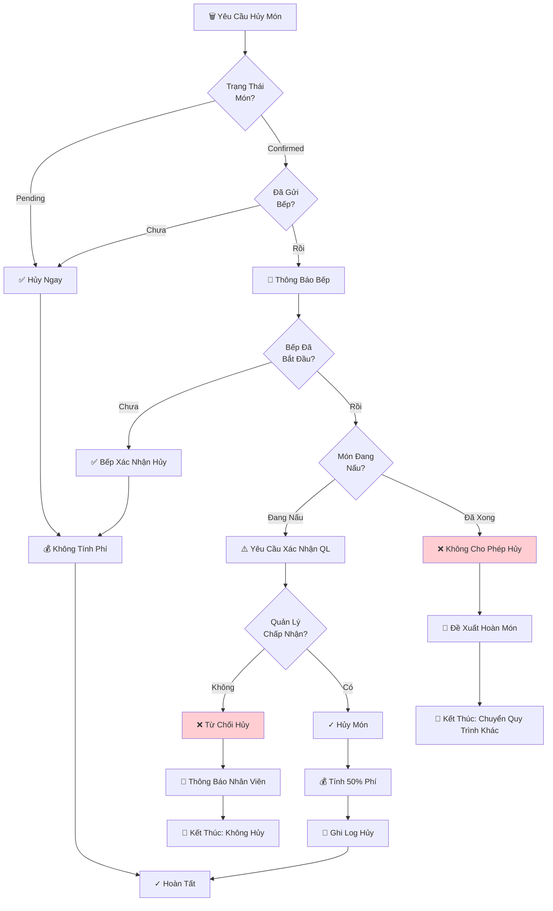

---

## 9. Biểu Đồ Thống Kê Đơn Hàng (Pie Chart)

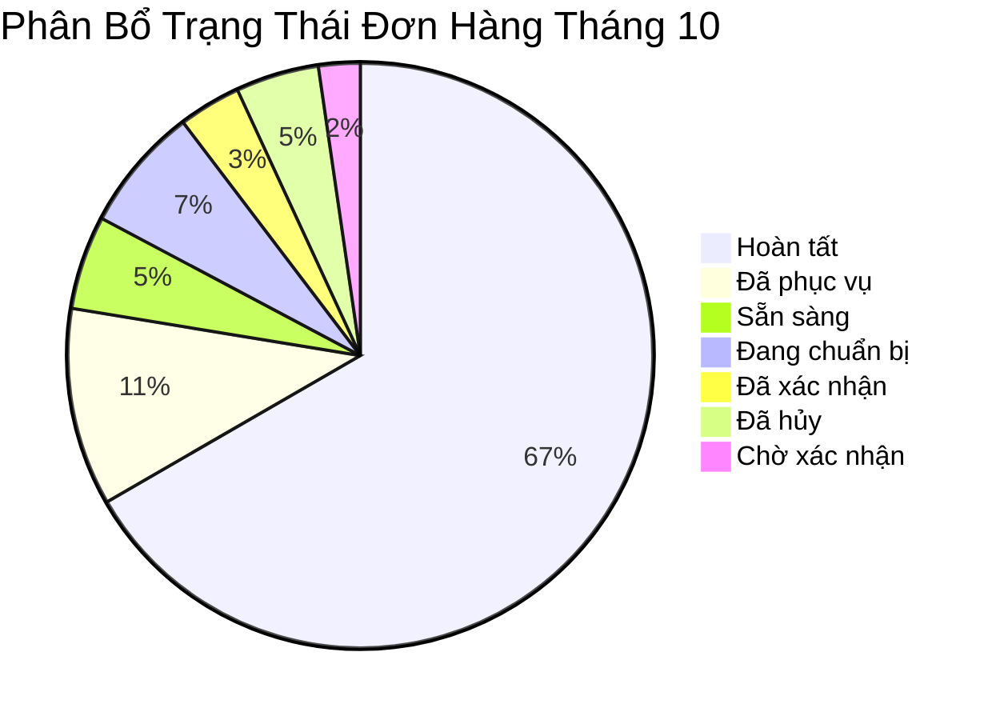

---

## 10. Biểu Đồ Timeline Xử Lý Đơn

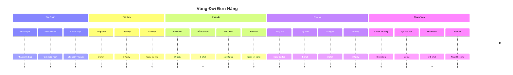

---

## 11. Biểu Đồ Kiến Trúc Hệ Thống (Component Diagram)

> **Lưu ý**: Kiến trúc thực tế sử dụng NestJS (Backend) và Next.js (Frontend)

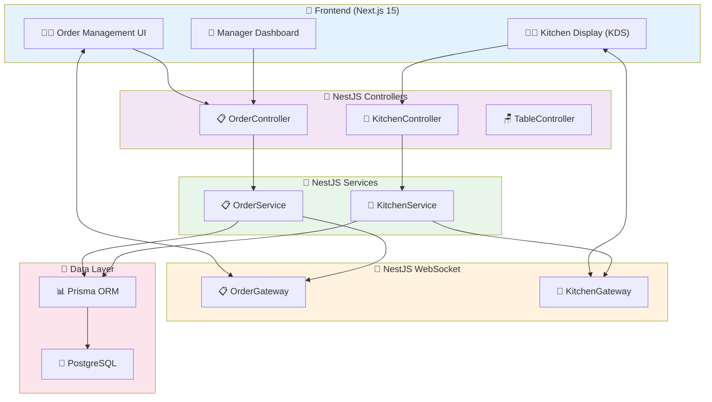

---

## 12. Biểu Đồ Xử Lý Lỗi (Error Handling)

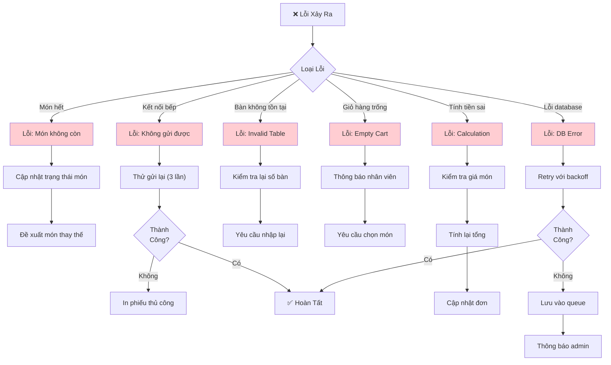

---

## 13. Biểu Đồ Phân Tích Thời Gian (Performance Analysis)

```mermaid
gantt
    title Phân Tích Thời Gian Xử Lý Đơn Hàng
    dateFormat HH:mm
    axisFormat %H:%M
    
    section Nhân Viên
    Tư vấn khách       :a1, 12:00, 3m
    Nhập đơn           :a2, after a1, 2m
    Xác nhận đơn       :a3, after a2, 1m
    
    section Hệ Thống
    Xử lý đơn          :b1, after a3, 10s
    Gửi thông báo bếp  :b2, after b1, 5s
    
    section Bếp
    Nhận đơn           :c1, after b2, 30s
    Chuẩn bị nguyên liệu:c2, after c1, 2m
    Nấu món            :c3, after c2, 20m
    Hoàn tất           :c4, after c3, 1m
    
    section Phục Vụ
    Nhận thông báo     :d1, after c4, 10s
    Lấy món từ bếp     :d2, after d1, 1m
    Mang ra phục vụ    :d3, after d2, 2m
```

---

## 14. Biểu Đồ Use Case Đầy Đủ

```mermaid
graph TB
    subgraph System["🏪 Hệ Thống Quản Lý Đơn Hàng"]
        UC1["Tạo Đơn Hàng"]
        UC2["Xem Đơn Hàng"]
        UC3["Thêm Món"]
        UC4["Hủy Món"]
        UC5["Hủy Đơn"]
        UC6["Gửi Đơn Bếp"]
        UC7["Nhận Đơn Bếp"]
        UC8["Cập Nhật Tiến Độ"]
        UC9["Hoàn Tất Nấu"]
        UC10["Xác Nhận Phục Vụ"]
        UC11["Tạo Hóa Đơn"]
        UC12["Xem Báo Cáo"]
    end

    A["👤 Khách Hàng"] -.->|Tự đặt| UC1

    B["👨‍💼 Nhân Viên Phục Vụ"] -->|Sử Dụng| UC1
    B -->|Sử Dụng| UC2
    B -->|Sử Dụng| UC3
    B -->|Sử Dụng| UC4
    B -->|Sử Dụng| UC6
    B -->|Sử Dụng| UC10

    C["��‍🍳 Đầu Bếp"] -->|Sử Dụng| UC7
    C -->|Sử Dụng| UC8
    C -->|Sử Dụng| UC9

    D["💰 Thu Ngân"] -->|Sử Dụng| UC2
    D -->|Sử Dụng| UC11

    E["💼 Quản Lý"] -->|Sử Dụng| UC1
    E -->|Sử Dụng| UC2
    E -->|Sử Dụng| UC3
    E -->|Sử Dụng| UC4
    E -->|Sử Dụng| UC5
    E -->|Sử Dụng| UC12

    F["🔐 Admin"] -->|Sử Dụng| UC1
    F -->|Sử Dụng| UC2
    F -->|Sử Dụng| UC5
    F -->|Sử Dụng| UC12

    style System fill:#e3f2fd
```

---

## 15. Biểu Đồ Dòng Dữ Liệu Real-time

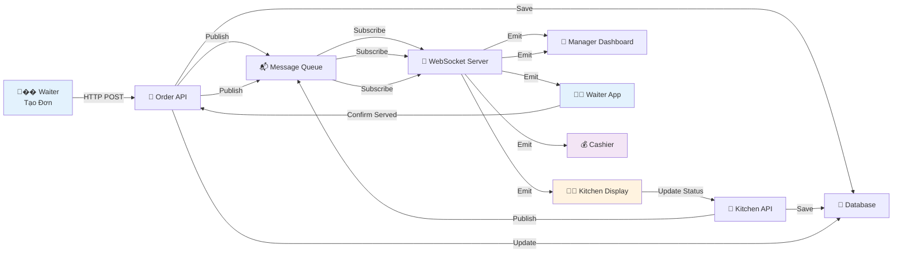

---

## 16. Biểu Đồ Quy Trình Self-Ordering (Tương Lai)

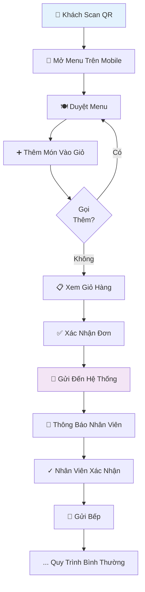

---

## 17. API Reference (Đã triển khai thực tế)

### 17.1 Order Controller (`/orders`)

| Method | Endpoint | Mô tả | Roles |
|--------|----------|-------|-------|
| GET | `/orders/count` | Đếm số đơn theo filter | admin, manager, waiter |
| GET | `/orders` | Lấy danh sách đơn (pagination) | admin, manager, waiter |
| GET | `/orders/:id` | Lấy chi tiết đơn | admin, manager, waiter |
| POST | `/orders` | Tạo đơn hàng mới | admin, manager, waiter |
| PATCH | `/orders/:id/items` | Thêm món vào đơn | admin, manager, waiter |
| DELETE | `/orders/:id/items/:itemId` | Hủy món trong đơn | admin, manager, waiter |
| DELETE | `/orders/:id` | Hủy toàn bộ đơn | admin, manager |
| PATCH | `/orders/:id/status` | Cập nhật trạng thái đơn | admin, manager |
| PATCH | `/orders/:id/items/:itemId/serve` | Đánh dấu món đã phục vụ | admin, manager, waiter |

### 17.2 Kitchen Controller (`/kitchen`)

| Method | Endpoint | Mô tả | Roles |
|--------|----------|-------|-------|
| GET | `/kitchen/orders` | Lấy danh sách đơn bếp | admin, manager, chef, waiter |
| GET | `/kitchen/orders/:id` | Lấy chi tiết đơn bếp | admin, manager, chef, waiter |
| PATCH | `/kitchen/orders/:id/start` | Bắt đầu chuẩn bị | admin, manager, chef |
| PATCH | `/kitchen/orders/:id/complete` | Hoàn tất đơn bếp | admin, manager, chef |
| PATCH | `/kitchen/orders/:id/cancel` | Hủy đơn bếp | admin, manager, chef |

### 17.3 WebSocket Events

| Namespace | Event | Mô tả |
|-----------|-------|-------|
| `/orders` | `ORDER_CREATED` | Đơn mới được tạo |
| `/orders` | `ORDER_UPDATED` | Đơn được cập nhật |
| `/orders` | `ORDER_CANCELLED` | Đơn bị hủy |
| `/orders` | `ITEM_ADDED` | Món mới được thêm |
| `/orders` | `ITEM_CANCELLED` | Món bị hủy |
| `/orders` | `KITCHEN_ORDER_UPDATED` | Trạng thái bếp thay đổi |
| `/orders` | `KITCHEN_ORDER_COMPLETED` | Bếp hoàn tất |

### 17.4 Request/Response Examples

**Tạo đơn hàng mới:**
```json
POST /orders
{
  "tableId": 5,
  "partySize": 4,
  "customerName": "Nguyễn Văn A",
  "customerPhone": "0901234567",
  "notes": "Bàn cửa sổ",
  "items": [
    { "itemId": 1, "quantity": 2, "specialRequest": "Ít cay" },
    { "itemId": 3, "quantity": 1 }
  ]
}
```

**Response thành công:**
```json
{
  "orderId": 123,
  "orderNumber": "ORD-20250610-001",
  "status": "pending",
  "table": { "tableId": 5, "tableNumber": "A5" },
  "partySize": 4,
  "items": [...],
  "totalAmount": 350000,
  "createdAt": "2025-06-10T10:30:00Z"
}
```

---

## Ghi Chú

Các biểu đồ này được tạo bằng **Mermaid** và có thể được:

-   Chỉnh sửa trực tiếp trong markdown
-   Xuất thành hình ảnh PNG/SVG
-   Nhúng vào tài liệu web hoặc wiki
-   Tích hợp vào các công cụ quản lý dự án

**Để sử dụng Mermaid:**

1. GitHub hỗ trợ mermaid trực tiếp trong markdown
2. GitLab cũng hỗ trợ mermaid native
3. Các công cụ khác có thể cần plugin (Notion, Confluence, v.v.)
4. Online editor: https://mermaid.live

**Ứng dụng thực tế:**

-   Đào tạo nhân viên mới về quy trình đơn hàng
-   Tài liệu hướng dẫn sử dụng hệ thống
-   Phân tích và tối ưu quy trình
-   Phát triển và bảo trì hệ thống
-   Giao tiếp với stakeholders về cách thức hoạt động
