# Biểu Đồ Quản Lý Đơn Hàng

## 1. Biểu Đồ Quy Trình Tổng Thể (Flowchart)

```mermaid
flowchart TD
    A[Khách Ngồi Vào Bàn] --> B[Nhân Viên Tư Vấn Menu]
    B --> C[Khách Chọn Món]
    C --> D[Nhân Viên Tạo Đơn Hàng]
    D --> E[Thêm Món Vào Đơn]
    E --> F{Khách Gọi<br/>Thêm Món?}
    F -->|Có| E
    F -->|Không| G[Xác Nhận Đơn]
    G --> H[Gửi Đơn Đến Bếp]
    H --> I[Bếp Nhận Đơn]
    I --> J[Đầu Bếp Bắt Đầu Nấu]
    J --> K[Cập Nhật Tiến Độ Nấu]
    K --> L{Tất Cả Món<br/>Đã Xong?}
    L -->|Chưa| K
    L -->|Rồi| M[Hoàn Tất Đơn Bếp]
    M --> N[Thông Báo Nhân Viên]
    N --> O[Nhân Viên Lấy Món]
    O --> P[Mang Món Ra Phục Vụ]
    P --> Q[Xác Nhận Đã Phục Vụ]
    Q --> R{Khách Gọi<br/>Thêm?}
    R -->|Có| E
    R -->|Không| S[Khách Ăn Xong]
    S --> T[Tạo Hóa Đơn]
    T --> U[Khách Thanh Toán]
    U --> V[Hoàn Tất Đơn Hàng]
    V --> W[Dọn Bàn]
    W --> X[Bàn Sẵn Sàng]
```

---

## 2. Biểu Đồ Quản Lý Đơn Hàng (Sequence Diagram)

```mermaid
sequenceDiagram
    actor Waiter as Nhân Viên Phục Vụ
    actor Customer as Khách Hàng
    participant UI as Giao Diện
    participant API as Backend API
    participant DB as Database
    participant Kitchen as Bếp (KDS)
    participant Socket as WebSocket

    Customer ->> Waiter: Gọi món
    Waiter ->> UI: Chọn bàn
    UI ->> API: GET /tables/:id
    API ->> DB: Kiểm tra bàn
    DB -->> API: Thông tin bàn
    API -->> UI: Trạng thái bàn
    
    Waiter ->> UI: Chọn món từ menu
    Waiter ->> UI: Nhập số lượng & yêu cầu
    Waiter ->> UI: Xác nhận đơn
    UI ->> API: POST /orders
    
    API ->> DB: Tạo đơn hàng
    DB -->> API: Order ID
    API ->> DB: Tạo order items
    API ->> DB: Cập nhật trạng thái bàn
    
    par Gửi đến Bếp
        API ->> DB: Tạo kitchen order
        API ->> Socket: Emit new order
        Socket -->> Kitchen: Thông báo đơn mới
    end
    
    API -->> UI: Thành công
    UI -->> Waiter: Hiển thị đơn hàng
    
    Note over Kitchen: Bếp xử lý đơn
    Kitchen ->> API: PUT /kitchen-orders/:id/start
    API ->> DB: Cập nhật trạng thái
    API ->> Socket: Emit order preparing
    Socket -->> UI: Cập nhật trạng thái
    
    Kitchen ->> API: PUT /kitchen-orders/:id/complete
    API ->> DB: Cập nhật hoàn tất
    API ->> Socket: Emit order ready
    Socket -->> UI: Thông báo món xong
    
    Waiter ->> UI: Xác nhận lấy món
    UI ->> API: PUT /orders/:id/pickup
    API ->> DB: Cập nhật trạng thái
    
    Waiter ->> Customer: Phục vụ món ăn
    Waiter ->> UI: Xác nhận đã phục vụ
    UI ->> API: PUT /orders/:id/served
    API ->> DB: Cập nhật trạng thái
    API -->> UI: Hoàn tất
```

---

## 3. Biểu Đồ Trạng Thái Đơn Hàng (State Diagram)

```mermaid
stateDiagram-v2
    [*] --> Pending: Tạo đơn mới
    
    Pending --> Confirmed: Xác nhận đơn
    Pending --> Cancelled: Hủy đơn
    
    Confirmed --> Preparing: Bếp bắt đầu nấu
    Confirmed --> Cancelled: Hủy đơn
    
    Preparing --> Ready: Nấu xong
    Preparing --> Cancelled: Hủy đơn (phí phát sinh)
    
    Ready --> Served: Đã phục vụ khách
    
    Served --> Completed: Hoàn tất & thanh toán
    
    Completed --> [*]
    Cancelled --> [*]
    
    note right of Pending
        Đơn vừa tạo
        Chờ xác nhận
    end note
    
    note right of Confirmed
        Đã xác nhận
        Chờ gửi bếp
    end note
    
    note right of Preparing
        Bếp đang nấu
        Cập nhật tiến độ
    end note
    
    note right of Ready
        Món đã xong
        Chờ nhân viên lấy
    end note
    
    note right of Served
        Đã phục vụ khách
        Chờ thanh toán
    end note
```

---

## 4. Biểu Đồ Cấu Trúc Dữ Liệu (Entity Relationship)

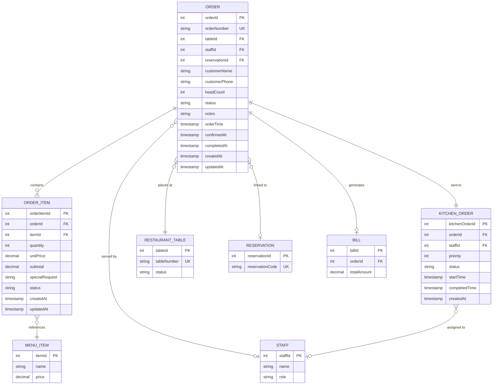

---

## 5. Biểu Đồ Quy Trình Tạo Đơn Chi Tiết (Activity Diagram)

```mermaid
graph LR
    A["🔵 Nhân viên: Chọn bàn"] --> B["📋 Mở menu"]
    B --> C["🔍 Duyệt danh mục"]
    C --> D["🍽️ Chọn món"]
    D --> E["🔢 Nhập số lượng"]
    E --> F{"Yêu cầu<br/>đặc biệt?"}
    F -->|Có| G["✍️ Nhập yêu cầu"]
    F -->|Không| H["➕ Thêm vào giỏ"]
    G --> H
    H --> I{"Gọi<br/>thêm món?"}
    I -->|Có| C
    I -->|Không| J["👥 Nhập số khách"]
    J --> K["📝 Nhập ghi chú (tùy chọn)"]
    K --> L["📋 Xem lại giỏ hàng"]
    L --> M{"Chính xác?"}
    M -->|Không| N["✏️ Chỉnh sửa"]
    N --> L
    M -->|Có| O["✅ Xác nhận đơn"]
    O --> P["💾 Lưu đơn hàng"]
    P --> Q["🔢 Tạo số đơn"]
    Q --> R["🍳 Tạo đơn bếp"]
    R --> S["📡 Gửi thông báo bếp"]
    S --> T["🖨️ In phiếu order"]
    T --> U["🔄 Cập nhật trạng thái bàn"]
    U --> V["📝 Ghi log"]
    V --> W["✅ Hoàn tất"]
    W --> X["🔵 Kết thúc"]
```

---

## 6. Biểu Đồ Quy Trình Bếp (Kitchen Flow)

```mermaid
flowchart TD
    A["📨 Nhận Đơn Mới"] --> B["🔔 Thông Báo Âm Thanh"]
    B --> C["📋 Hiển Thị Trên KDS"]
    C --> D{Độ<br/>Ưu Tiên}
    D -->|Cao| E["⚠️ Hiển thị Đỏ"]
    D -->|Thường| F["✅ Hiển thị Xanh"]
    E --> G["👨‍🍳 Đầu Bếp Xem Đơn"]
    F --> G
    G --> H["✓ Nhận Đơn"]
    H --> I["🔄 Cập nhật: Đang Chuẩn Bị"]
    I --> J["⏱️ Bắt Đầu Timer"]
    J --> K["🍳 Nấu Món 1"]
    K --> L["🍳 Nấu Món 2"]
    L --> M["🍳 Nấu Món N"]
    M --> N{Tất Cả<br/>Món Xong?}
    N -->|Chưa| K
    N -->|Rồi| O["✅ Đánh Dấu Sẵn Sàng"]
    O --> P["⏱️ Dừng Timer"]
    P --> Q["📡 Thông Báo Nhân Viên"]
    Q --> R["📊 Ghi Nhận Thời Gian"]
    R --> S["✅ Chờ Lấy Món"]
    S --> T{Nhân Viên<br/>Lấy Món?}
    T -->|Chưa| U["⏰ Đếm Thời Gian Chờ"]
    U --> V{Chờ > 5p?}
    V -->|Có| W["⚠️ Cảnh Báo Món Nguội"]
    V -->|Không| T
    W --> T
    T -->|Rồi| X["✓ Xác Nhận Đã Lấy"]
    X --> Y["🗑️ Xóa Khỏi KDS"]
    Y --> Z["✅ Hoàn Tất"]
    
    style E fill:#ffcdd2
    style W fill:#ffcdd2
```

---

## 7. Biểu Đồ Phân Quyền (Permission Matrix)

```mermaid
graph TB
    A["Phân Quyền Quản Lý Đơn Hàng"] --> B["👥 Vai Trò"]
    
    B --> C["👤 Khách Hàng"]
    B --> D["👨‍💼 Nhân Viên Phục Vụ"]
    B --> E["👨‍🍳 Đầu Bếp"]
    B --> F["💰 Thu Ngân"]
    B --> G["💼 Quản Lý"]
    B --> H["🔐 Admin"]

    C --> C1["✗ Tất cả chức năng"]
    C --> C2["(Hoặc tự đặt qua QR)"]

    D --> D1["✓ Tạo đơn hàng"]
    D --> D2["✓ Xem đơn hàng"]
    D --> D3["✓ Sửa đơn (thêm/hủy món)"]
    D --> D4["✓ Gửi đơn đến bếp"]
    D --> D5["✓ Xác nhận phục vụ"]
    D --> D6["✗ Hủy toàn bộ đơn"]

    E --> E1["✓ Xem đơn bếp"]
    E --> E2["✓ Nhận đơn"]
    E --> E3["✓ Cập nhật tiến độ"]
    E --> E4["✓ Hoàn tất đơn bếp"]
    E --> E5["✗ Sửa/Hủy đơn"]

    F --> F1["✓ Xem đơn hàng"]
    F --> F2["✓ Tạo hóa đơn"]
    F --> F3["✗ Sửa/Hủy đơn"]

    G --> G1["✓ Tất cả quyền"]
    G --> G2["✓ Hủy đơn hàng"]
    G --> G3["✓ Xem báo cáo"]
    G --> G4["✓ Phân tích dữ liệu"]

    H --> H1["✓ Tất cả quyền"]
    H --> H2["✓ Cấu hình hệ thống"]
    H --> H3["✓ Quản lý quyền hạn"]
```

---

## 8. Biểu Đồ Xử Lý Hủy Món (Decision Tree)

```mermaid
graph TD
    A["🗑️ Yêu Cầu Hủy Món"] --> B{"Trạng Thái<br/>Món?"}
    
    B -->|Pending| C["✅ Hủy Ngay"]
    C --> D["💰 Không Tính Phí"]
    D --> Z["✓ Hoàn Tất"]
    
    B -->|Confirmed| E{"Đã Gửi<br/>Bếp?"}
    E -->|Chưa| C
    E -->|Rồi| F["📡 Thông Báo Bếp"]
    F --> G{"Bếp Đã<br/>Bắt Đầu?"}
    
    G -->|Chưa| H["✅ Bếp Xác Nhận Hủy"]
    H --> D
    
    G -->|Rồi| I{"Món Đang<br/>Nấu?"}
    I -->|Đang Nấu| J["⚠️ Yêu Cầu Xác Nhận QL"]
    J --> K{"Quản Lý<br/>Chấp Nhận?"}
    K -->|Không| L["❌ Từ Chối Hủy"]
    L --> M["💬 Thông Báo Nhân Viên"]
    M --> N["🔴 Kết Thúc: Không Hủy"]
    
    K -->|Có| O["✓ Hủy Món"]
    O --> P["💰 Tính 50% Phí"]
    P --> Q["📝 Ghi Log Hủy"]
    Q --> Z
    
    I -->|Đã Xong| R["❌ Không Cho Phép Hủy"]
    R --> S["💬 Đề Xuất Hoàn Món"]
    S --> T["🔴 Kết Thúc: Chuyển Quy Trình Khác"]
    
    style L fill:#ffcdd2
    style R fill:#ffcdd2
```

---

## 9. Biểu Đồ Thống Kê Đơn Hàng (Pie Chart)

```mermaid
pie title Phân Bổ Trạng Thái Đơn Hàng Tháng 10
    "Hoàn tất" : 580
    "Đã phục vụ" : 95
    "Sẵn sàng" : 45
    "Đang chuẩn bị" : 60
    "Đã xác nhận" : 30
    "Đã hủy" : 40
    "Chờ xác nhận" : 20
```

---

## 10. Biểu Đồ Timeline Xử Lý Đơn

```mermaid
timeline
    title Vòng Đời Đơn Hàng
    
    section Tiếp Nhận
        Khách ngồi : Nhân viên chào
        Tư vấn menu : Giới thiệu món
        Khách chọn : Ghi nhận yêu cầu
    
    section Tạo Đơn
        Nhập đơn : 2 phút
        Xác nhận : 30 giây
        Gửi bếp : Ngay lập tức
    
    section Chuẩn Bị
        Bếp nhận : 10 giây
        Bắt đầu nấu : 1 phút
        Nấu món : 15-30 phút
        Hoàn tất : Ngay khi xong
    
    section Phục Vụ
        Thông báo : Ngay lập tức
        Lấy món : 1 phút
        Mang ra : 2 phút
        Phục vụ : 30 giây
    
    section Thanh Toán
        Khách ăn xong : Biến động
        Tạo hóa đơn : 1 phút
        Thanh toán : 2-5 phút
        Hoàn tất : Ngay khi xong
```

---

## 11. Biểu Đồ Kiến Trúc Hệ Thống (Component Diagram)

```mermaid
graph TB
    subgraph Client["📱 Frontend Apps"]
        WaiterApp["👨‍💼 Waiter App"]
        KitchenApp["👨‍🍳 Kitchen Display"]
        CustomerApp["👤 Customer App"]
        ManagerApp["💼 Manager Dashboard"]
    end

    subgraph API["🔌 Backend Services"]
        OrderAPI["📋 Order Service"]
        KitchenAPI["🍳 Kitchen Service"]
        MenuAPI["🍽️ Menu Service"]
        NotificationAPI["🔔 Notification Service"]
    end

    subgraph Data["💾 Data Layer"]
        OrderDB["📊 Order Database"]
        Cache["⚡ Redis Cache"]
        Queue["📬 Message Queue"]
    end

    subgraph External["🌐 External"]
        Printer["🖨️ Thermal Printer"]
        Socket["📡 WebSocket Server"]
        Push["📱 Push Notification"]
    end

    WaiterApp --> OrderAPI
    KitchenApp --> KitchenAPI
    CustomerApp --> OrderAPI
    ManagerApp --> OrderAPI
    
    OrderAPI --> OrderDB
    OrderAPI --> Cache
    OrderAPI --> Queue
    OrderAPI --> Socket
    
    KitchenAPI --> OrderDB
    KitchenAPI --> Socket
    KitchenAPI --> Queue
    
    NotificationAPI --> Push
    NotificationAPI --> Socket
    
    OrderAPI --> Printer
    OrderAPI --> MenuAPI
    
    style Client fill:#e3f2fd
    style API fill:#f3e5f5
    style Data fill:#e8f5e9
    style External fill:#fff3e0
```

---

## 12. Biểu Đồ Xử Lý Lỗi (Error Handling)

```mermaid
graph TD
    A["❌ Lỗi Xảy Ra"] --> B{Loại Lỗi}
    
    B -->|Món hết| C["Lỗi: Món không còn"]
    C --> C1["Cập nhật trạng thái món"]
    C1 --> C2["Đề xuất món thay thế"]
    
    B -->|Kết nối bếp| D["Lỗi: Không gửi được"]
    D --> D1["Thử gửi lại (3 lần)"]
    D1 --> D2{Thành<br/>Công?}
    D2 -->|Không| D3["In phiếu thủ công"]
    D2 -->|Có| OK["✅ Hoàn Tất"]
    
    B -->|Bàn không tồn tại| E["Lỗi: Invalid Table"]
    E --> E1["Kiểm tra lại số bàn"]
    E1 --> E2["Yêu cầu nhập lại"]
    
    B -->|Giỏ hàng trống| F["Lỗi: Empty Cart"]
    F --> F1["Thông báo nhân viên"]
    F1 --> F2["Yêu cầu chọn món"]
    
    B -->|Tính tiền sai| G["Lỗi: Calculation"]
    G --> G1["Kiểm tra giá món"]
    G1 --> G2["Tính lại tổng"]
    G2 --> G3["Cập nhật đơn"]
    
    B -->|Lỗi database| H["Lỗi: DB Error"]
    H --> H1["Retry với backoff"]
    H1 --> H2{Thành<br/>Công?}
    H2 -->|Không| H3["Lưu vào queue"]
    H3 --> H4["Thông báo admin"]
    H2 -->|Có| OK
    
    style C fill:#ffcdd2
    style D fill:#ffcdd2
    style E fill:#ffcdd2
    style F fill:#ffcdd2
    style G fill:#ffcdd2
    style H fill:#ffcdd2
```

---

## 13. Biểu Đồ Phân Tích Thời Gian (Performance Analysis)

---

## 14. Biểu Đồ Use Case Đầy Đủ

```mermaid
graph TB
    subgraph System["🏪 Hệ Thống Quản Lý Đơn Hàng"]
        UC1["Tạo Đơn Hàng"]
        UC2["Xem Đơn Hàng"]
        UC3["Thêm Món"]
        UC4["Hủy Món"]
        UC5["Hủy Đơn"]
        UC6["Gửi Đơn Bếp"]
        UC7["Nhận Đơn Bếp"]
        UC8["Cập Nhật Tiến Độ"]
        UC9["Hoàn Tất Nấu"]
        UC10["Xác Nhận Phục Vụ"]
        UC11["Tạo Hóa Đơn"]
        UC12["Xem Báo Cáo"]
    end

    A["👤 Khách Hàng"] -.->|Tự đặt| UC1

    B["👨‍💼 Nhân Viên Phục Vụ"] -->|Sử Dụng| UC1
    B -->|Sử Dụng| UC2
    B -->|Sử Dụng| UC3
    B -->|Sử Dụng| UC4
    B -->|Sử Dụng| UC6
    B -->|Sử Dụng| UC10

    C["��‍🍳 Đầu Bếp"] -->|Sử Dụng| UC7
    C -->|Sử Dụng| UC8
    C -->|Sử Dụng| UC9

    D["💰 Thu Ngân"] -->|Sử Dụng| UC2
    D -->|Sử Dụng| UC11

    E["💼 Quản Lý"] -->|Sử Dụng| UC1
    E -->|Sử Dụng| UC2
    E -->|Sử Dụng| UC3
    E -->|Sử Dụng| UC4
    E -->|Sử Dụng| UC5
    E -->|Sử Dụng| UC12

    F["🔐 Admin"] -->|Sử Dụng| UC1
    F -->|Sử Dụng| UC2
    F -->|Sử Dụng| UC5
    F -->|Sử Dụng| UC12

    style System fill:#e3f2fd
```

---

## 15. Biểu Đồ Dòng Dữ Liệu Real-time

```mermaid
graph LR
    A["👨‍�� Waiter<br/>Tạo Đơn"] -->|HTTP POST| B["🔌 Order API"]
    B -->|Save| C["💾 Database"]
    B -->|Publish| D["📬 Message Queue"]
    D -->|Subscribe| E["📡 WebSocket Server"]
    E -->|Emit| F["👨‍🍳 Kitchen Display"]
    E -->|Emit| G["💼 Manager Dashboard"]
    
    F -->|Update Status| H["🔌 Kitchen API"]
    H -->|Save| C
    H -->|Publish| D
    D -->|Subscribe| E
    E -->|Emit| I["👨‍💼 Waiter App"]
    E -->|Emit| G
    
    I -->|Confirm Served| B
    B -->|Update| C
    B -->|Publish| D
    D -->|Subscribe| E
    E -->|Emit| J["💰 Cashier"]
    
    style A fill:#e3f2fd
    style F fill:#fff3e0
    style I fill:#e3f2fd
    style J fill:#f3e5f5
```

---

## 16. Biểu Đồ Quy Trình Self-Ordering (Tương Lai)

```mermaid
flowchart TD
    A["👤 Khách Scan QR"] --> B["📱 Mở Menu Trên Mobile"]
    B --> C["🍽️ Duyệt Menu"]
    C --> D["➕ Thêm Món Vào Giỏ"]
    D --> E{Gọi<br/>Thêm?}
    E -->|Có| C
    E -->|Không| F["📋 Xem Giỏ Hàng"]
    F --> G["✅ Xác Nhận Đơn"]
    G --> H["📡 Gửi Đến Hệ Thống"]
    H --> I["🔔 Thông Báo Nhân Viên"]
    I --> J["✓ Nhân Viên Xác Nhận"]
    J --> K["🍳 Gửi Bếp"]
    K --> L["... Quy Trình Bình Thường"]
    
    style A fill:#e3f2fd
    style H fill:#f3e5f5
```

---

## Ghi Chú

Các biểu đồ này được tạo bằng **Mermaid** và có thể được:

-   Chỉnh sửa trực tiếp trong markdown
-   Xuất thành hình ảnh PNG/SVG
-   Nhúng vào tài liệu web hoặc wiki
-   Tích hợp vào các công cụ quản lý dự án

**Để sử dụng Mermaid:**

1. GitHub hỗ trợ mermaid trực tiếp trong markdown
2. GitLab cũng hỗ trợ mermaid native
3. Các công cụ khác có thể cần plugin (Notion, Confluence, v.v.)
4. Online editor: https://mermaid.live

**Ứng dụng thực tế:**

-   Đào tạo nhân viên mới về quy trình đơn hàng
-   Tài liệu hướng dẫn sử dụng hệ thống
-   Phân tích và tối ưu quy trình
-   Phát triển và bảo trì hệ thống
-   Giao tiếp với stakeholders về cách thức hoạt động
