# Biểu Đồ Quản Lý Đặt Bàn

## 1. Biểu Đồ Quy Trình Tổng Thể (Flowchart)

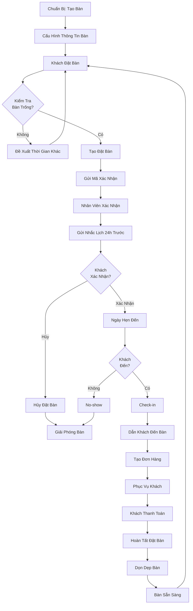

---

## 2. Biểu Đồ Quản Lý Đặt Bàn (Sequence Diagram)

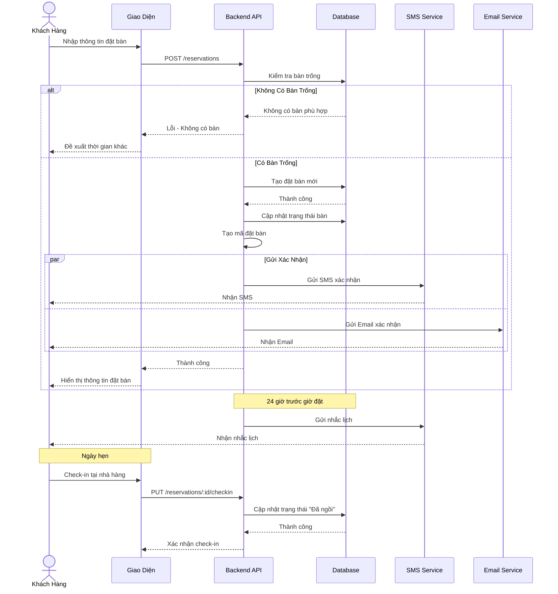

---

## 3. Biểu Đồ Trạng Thái Đặt Bàn (State Diagram)

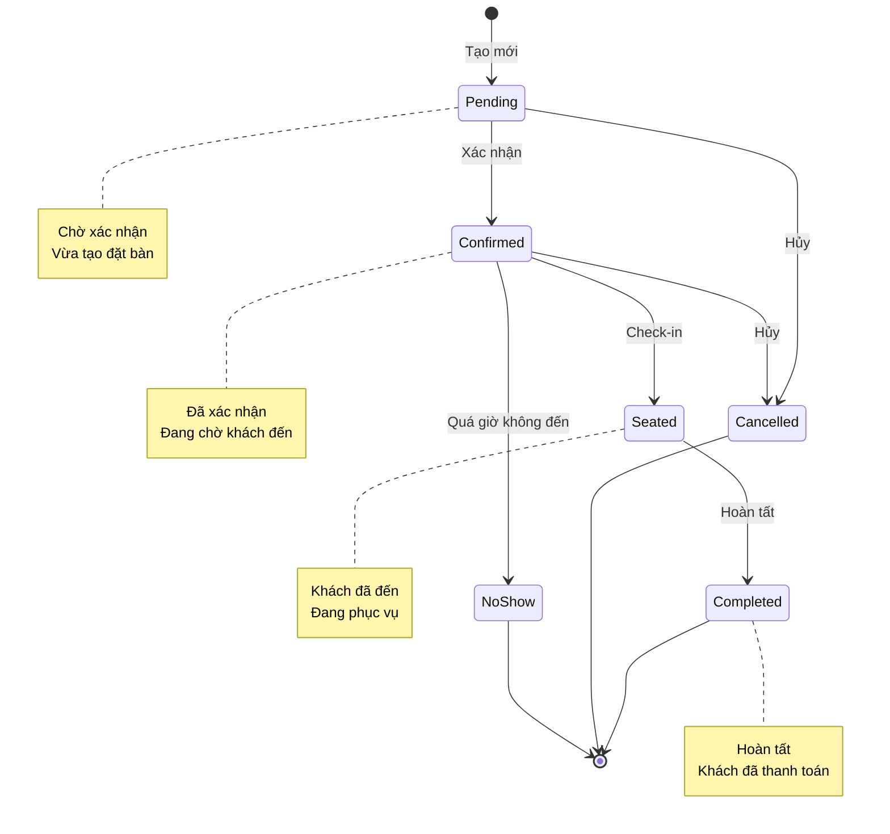

---

## 4. Biểu Đồ Trạng Thái Bàn (State Diagram)

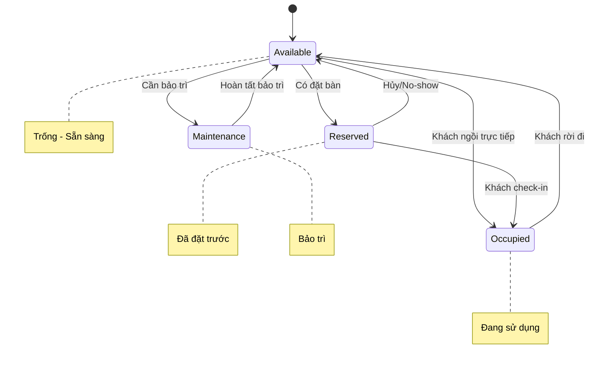

---

## 5. Biểu Đồ Cấu Trúc Dữ Liệu (Entity Relationship)

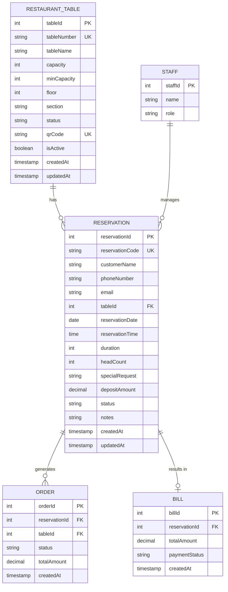

---

## 6. Biểu Đồ Quy Trình Tạo Đặt Bàn Chi Tiết (Activity Diagram)

```mermaid
graph LR
    A["🔵 Khách: Truy cập đặt bàn"] --> B["📋 Chọn ngày & giờ"]
    B --> C["👥 Nhập số lượng khách"]
    C --> D["🔍 Hệ thống tìm bàn"]
    D --> E{"Có bàn<br/>phù hợp?"}
    E -->|Không| F["💡 Đề xuất thời gian khác"]
    F --> B
    E -->|Có| G["📝 Nhập thông tin khách"]
    G --> H["📋 Tên khách hàng"]
    H --> I["📞 Số điện thoại"]
    I --> J["📧 Email (tùy chọn)"]
    J --> K["✍️ Yêu cầu đặc biệt"]
    K --> L["🏦 Đặt cọc (nếu cần)"]
    L --> M["⚙️ Kiểm tra dữ liệu"]
    M --> N{"Dữ liệu<br/>hợp lệ?"}
    N -->|Không| O["❌ Hiển thị lỗi"]
    O --> G
    N -->|Có| P["💾 Lưu đặt bàn"]
    P --> Q["🔢 Tạo mã đặt bàn"]
    Q --> R["📱 Gửi SMS xác nhận"]
    R --> S["📧 Gửi Email xác nhận"]
    S --> T["🔄 Cập nhật trạng thái bàn"]
    T --> U["📝 Ghi log"]
    U --> V["✅ Thành công"]
    V --> W["🔵 Kết thúc"]
```

---

## 7. Biểu Đồ Quy Trình Check-in (Flow)

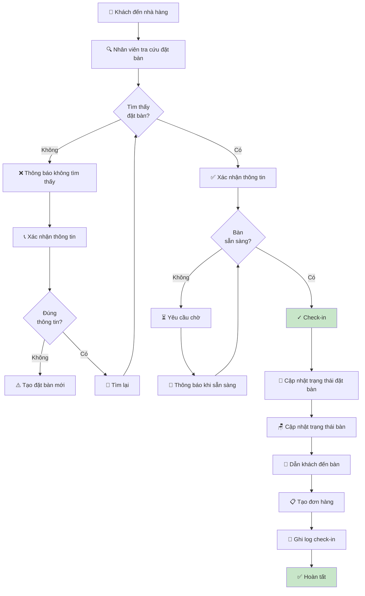

---

## 8. Biểu Đồ Phân Quyền (Permission Matrix)

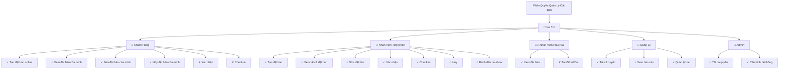

---

## 9. Biểu Đồ Nhắc Lịch Tự Động (Timeline)

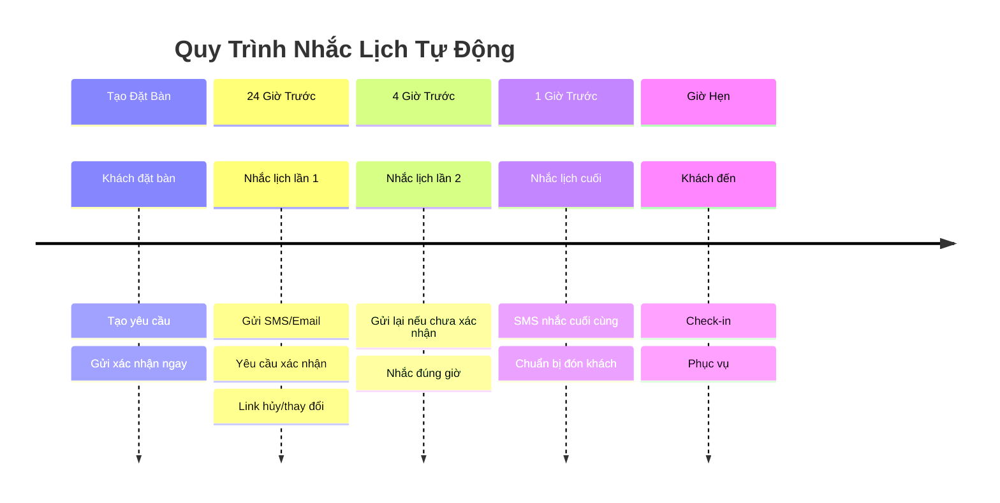

---

## 10. Biểu Đồ Xử Lý Lỗi (Error Handling Tree)

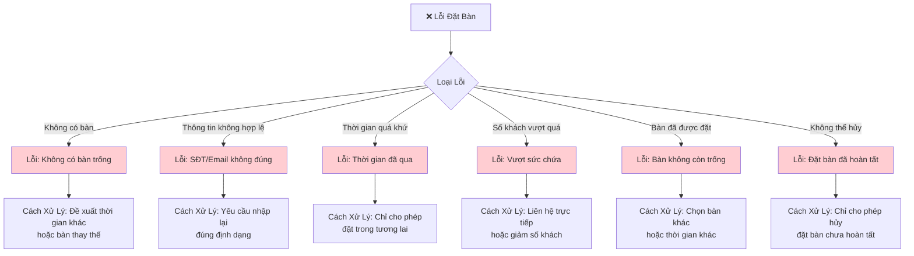

---

## 11. Biểu Đồ Thống Kê Đặt Bàn (Pie Chart)

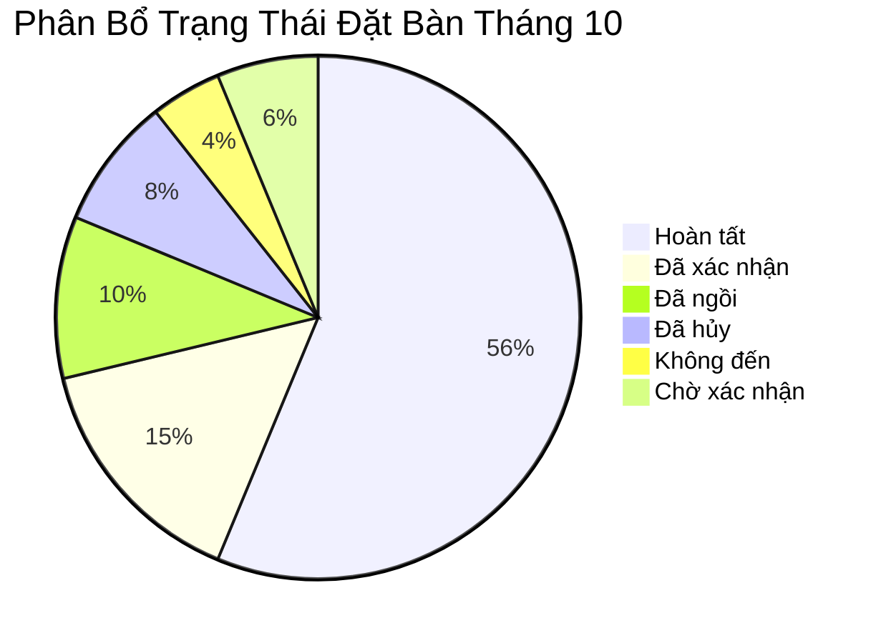

---

## 12. Biểu Đồ Kiến Trúc Hệ Thống (Component Diagram)

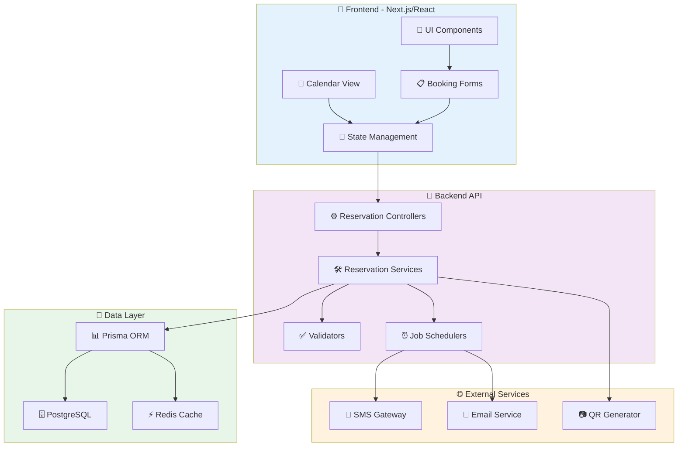

---

## 13. Biểu Đồ Quy Trình No-show (Decision Tree)

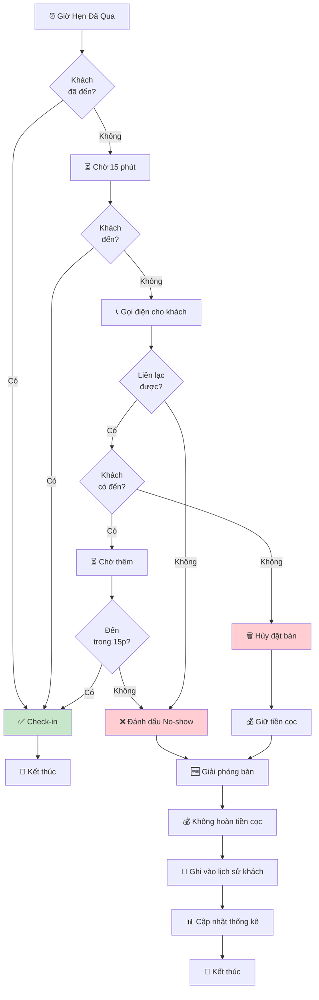

---

## 14. Biểu Đồ Gợi Ý Bàn Thông Minh (Flow)

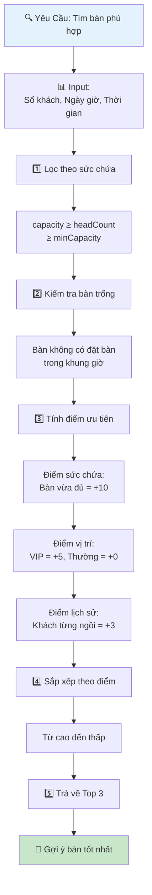

---

## 15. Biểu Đồ Use Case (Tương tác người dùng)

```mermaid
graph TB
    subgraph System["🏪 Hệ Thống Quản Lý Đặt Bàn"]
        UC1["Tạo Bàn"]
        UC2["Xem Danh Sách Bàn"]
        UC3["Chỉnh Sửa Bàn"]
        UC4["Xóa Bàn"]
        UC5["Tạo Đặt Bàn"]
        UC6["Xem Đặt Bàn"]
        UC7["Chỉnh Sửa Đặt Bàn"]
        UC8["Xác Nhận Đặt Bàn"]
        UC9["Check-in Khách"]
        UC10["Hủy Đặt Bàn"]
        UC11["Đánh Dấu No-show"]
        UC12["Báo Cáo & Phân Tích"]
    end

    A["👤 Khách Hàng"] -->|Sử Dụng| UC5
    A -->|Sử Dụng| UC6
    A -->|Sử Dụng| UC7
    A -->|Sử Dụng| UC10

    B["🎫 Nhân Viên Tiếp Nhận"] -->|Sử Dụng| UC2
    B -->|Sử Dụng| UC5
    B -->|Sử Dụng| UC6
    B -->|Sử Dụng| UC7
    B -->|Sử Dụng| UC8
    B -->|Sử Dụng| UC9
    B -->|Sử Dụng| UC10
    B -->|Sử Dụng| UC11

    C["👨‍💼 Nhân Viên Phục Vụ"] -->|Sử Dụng| UC2
    C -->|Sử Dụng| UC6

    D["💼 Quản Lý"] -->|Sử Dụng| UC1
    D -->|Sử Dụng| UC2
    D -->|Sử Dụng| UC3
    D -->|Sử Dụng| UC4
    D -->|Sử Dụng| UC5
    D -->|Sử Dụng| UC6
    D -->|Sử Dụng| UC7
    D -->|Sử Dụng| UC8
    D -->|Sử Dụng| UC9
    D -->|Sử Dụng| UC10
    D -->|Sử Dụng| UC11
    D -->|Sử Dụng| UC12

    E["🔐 Admin"] -->|Sử Dụng| UC1
    E -->|Sử Dụng| UC3
    E -->|Sử Dụng| UC4
    E -->|Sử Dụng| UC8
    E -->|Sử Dụng| UC12

    style System fill:#e3f2fd
```

---

## 16. Biểu Đồ Dòng Dữ Liệu (Data Flow)

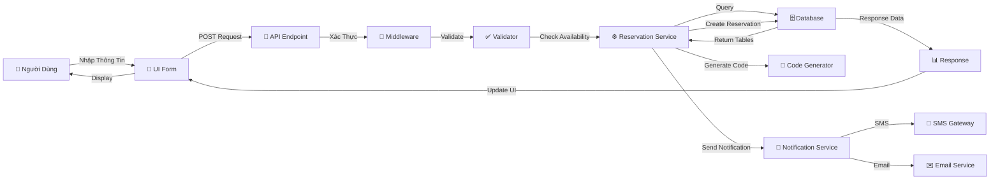

---

## Ghi Chú

Các biểu đồ này được tạo bằng **Mermaid** và có thể được:

-   Chỉnh sửa trực tiếp trong markdown
-   Xuất thành hình ảnh PNG/SVG
-   Nhúng vào tài liệu web hoặc wiki
-   Tích hợp vào các công cụ quản lý dự án

**Để sử dụng Mermaid:**

1. GitHub hỗ trợ mermaid trực tiếp trong markdown
2. GitLab cũng hỗ trợ mermaid native
3. Các công cụ khác có thể cần plugin (Notion, Confluence, v.v.)
4. Online editor: https://mermaid.live

**Lợi ích của việc sử dụng Mermaid:**

-   Dễ dàng cập nhật và bảo trì
-   Không cần công cụ vẽ đồ họa
-   Có thể version control cùng với code
-   Hiển thị trực tiếp trên GitHub/GitLab
-   Tự động render trong các nền tảng hỗ trợ
