# Biểu Đồ Quản Lý Nhân Sự

## 1. Biểu Đồ Quy Trình Tổng Thể (Flowchart)

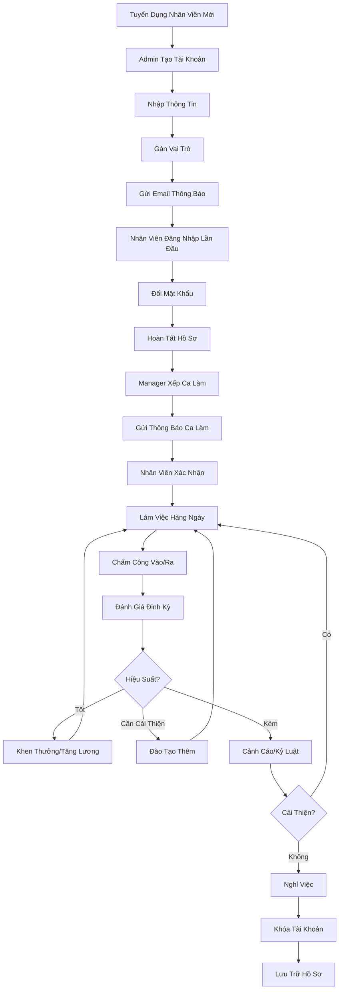

---

## 2. Biểu Đồ Quản Lý Tài Khoản (Sequence Diagram)

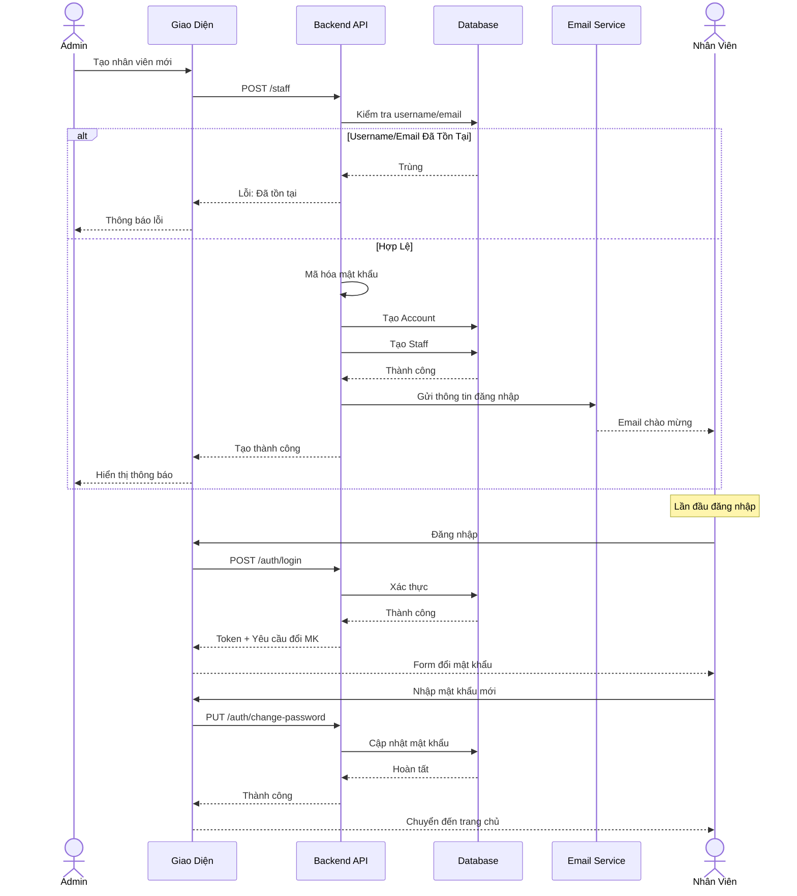

---

## 3. Biểu Đồ Trạng Thái Nhân Viên (State Diagram)

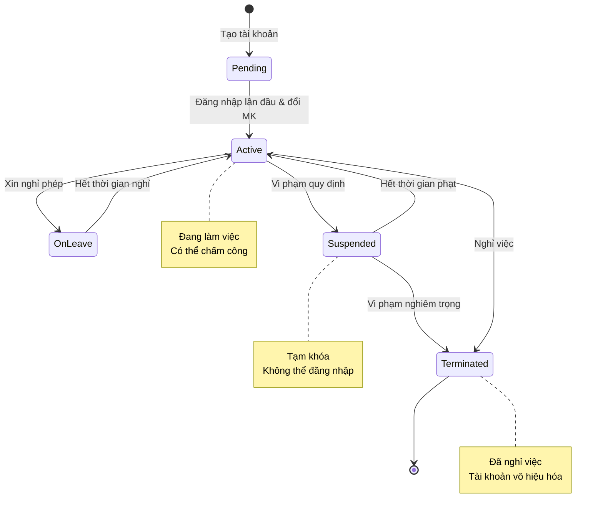

---

## 4. Biểu Đồ Cấu Trúc Dữ Liệu (Entity Relationship)

```mermaid
erDiagram
    ACCOUNT ||--|| STAFF : has
    STAFF ||--o{ ORDER : creates
    STAFF ||--o{ BILL : processes
    STAFF ||--o{ KITCHEN_ORDER : handles
    STAFF ||--o{ PURCHASE_ORDER : manages
    STAFF ||--o{ STOCK_TRANSACTION : performs
    STAFF ||--o{ TIMESHEET : has
    STAFF ||--o{ PERFORMANCE_REVIEW : receives

    ACCOUNT {
        int accountId PK
        string username UK
        string email UK
        string phoneNumber UK
        string password
        boolean isActive
        timestamp lastLogin
        timestamp createdAt
    }

    STAFF {
        int staffId PK
        int accountId FK UK
        string fullName
        string address
        date dateOfBirth
        date hireDate
        decimal salary
        string role
        boolean isActive
        timestamp createdAt
    }

    TIMESHEET {
        int timesheetId PK
        int staffId FK
        date workDate
        time checkIn
        time checkOut
        decimal totalHours
        string shift
        string status
    }

    PERFORMANCE_REVIEW {
        int reviewId PK
        int staffId FK
        int reviewerId FK
        string period
        int rating
        string comments
        timestamp reviewDate
    }
```

---

## 5. Biểu Đồ Xếp Ca Làm Việc (Activity Diagram)

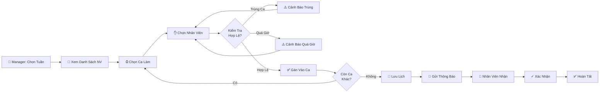

---

## 6. Biểu Đồ Chấm Công (Flow)

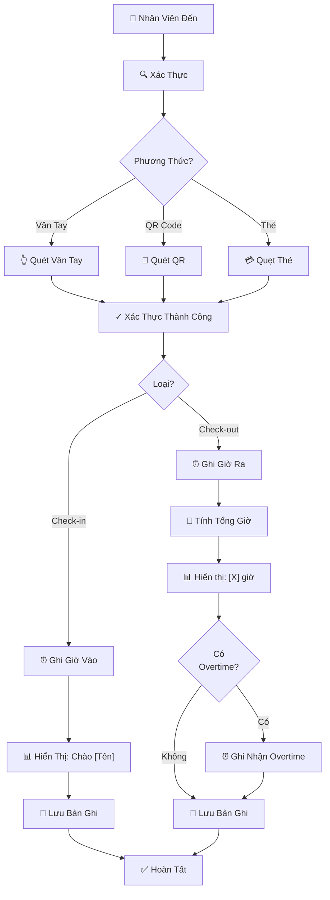

---

## 7. Biểu Đồ Phân Quyền (Permission Matrix)

```mermaid
graph TB
    A["Phân Quyền Hệ Thống"] --> B["👥 Vai Trò"]
    
    B --> C["🔐 Admin"]
    B --> D["💼 Manager"]
    B --> E["👨‍💼 Waiter"]
    B --> F["👨‍ Chef"]
    B --> H["💰 Cashier"]

    C --> C1["✓ Toàn quyền hệ thống"]
    C --> C2["✓ Quản lý nhân viên"]
    C --> C3["✓ Đổi vai trò"]
    C --> C4["✓ Xem tất cả báo cáo"]
    C --> C5["✓ Cấu hình hệ thống"]

    D --> D1["✓ Quản lý nhân viên (giới hạn)"]
    D --> D2["✓ Xếp ca làm việc"]
    D --> D3["✓ Chấm công"]
    D --> D4["✓ Đánh giá hiệu suất"]
    D --> D5["✓ Xem báo cáo"]
    D --> D6["✗ Đổi vai trò"]
    D --> D7["✗ Xóa nhân viên"]

    E --> E1["✓ Xem thông tin cá nhân"]
    E --> E2["✓ Đổi mật khẩu"]
    E --> E3["✓ Xem lịch ca của mình"]
    E --> E4["✓ Chấm công"]
    E --> E5["✓ Tạo đơn hàng"]
    E --> E6["✗ Quản lý nhân viên khác"]

    F --> F1["✓ Xem thông tin cá nhân"]
    F --> F2["✓ Chấm công"]
    F --> F3["✓ Xem đơn bếp"]
    F --> F4["✓ Cập nhật tiến độ nấu"]
    F --> F5["✗ Tạo đơn hàng"]

    G --> G1["✓ Tương tự Waiter"]
    G --> G2["✓ Quản lý đồ uống"]

    H --> H1["✓ Xem thông tin cá nhân"]
    H --> H2["✓ Chấm công"]
    H --> H3["✓ Xử lý thanh toán"]
    H --> H4["✓ Xem hóa đơn"]
    H --> H5["✗ Tạo đơn hàng"]
```

---

## 8. Biểu Đồ Đánh Giá Hiệu Suất (Process Flow)

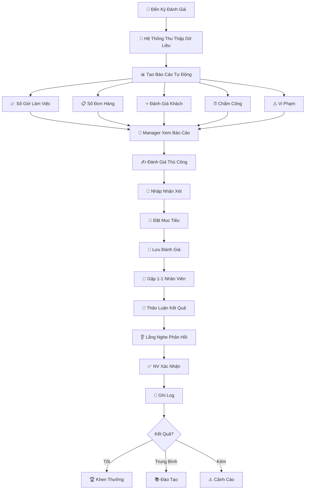

---

## 9. Biểu Đồ Timeline Chu Kỳ Nhân Viên

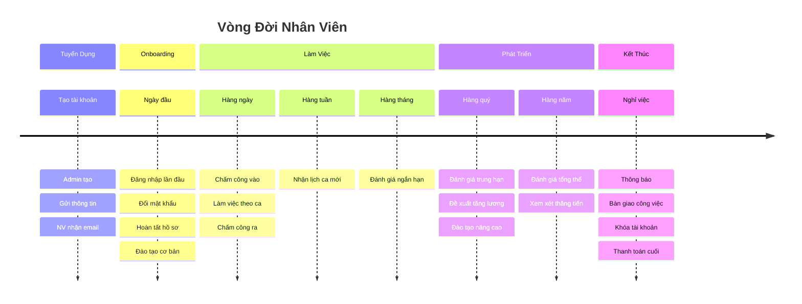

---

## 10. Biểu Đồ Kiến Trúc Hệ Thống (Component)

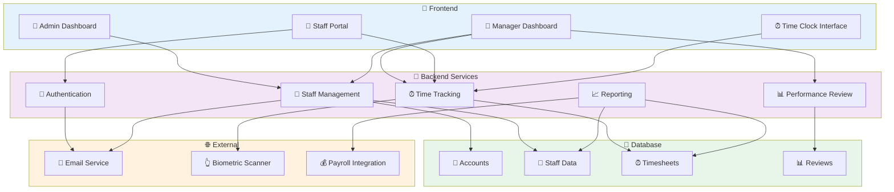

---

## 11. Biểu Đồ Use Case

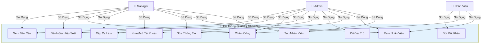

---

## 12. Biểu Đồ Xử Lý Lỗi

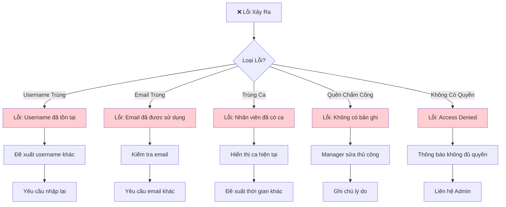

---

## 13. Biểu Đồ Báo Cáo Nhân Sự

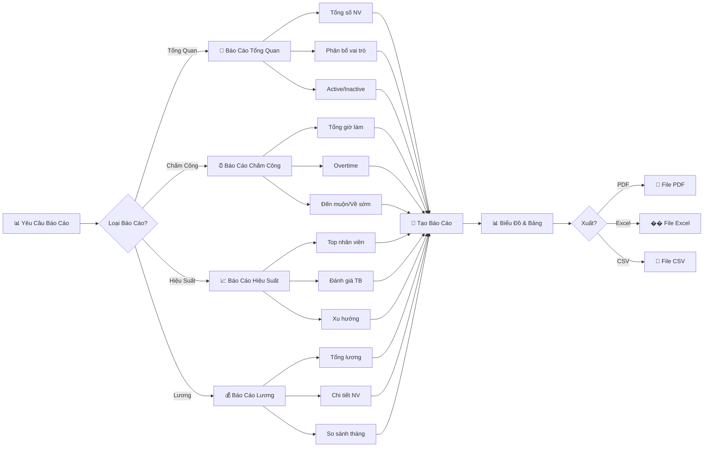

---

## 14. Biểu Đồ Dòng Dữ Liệu

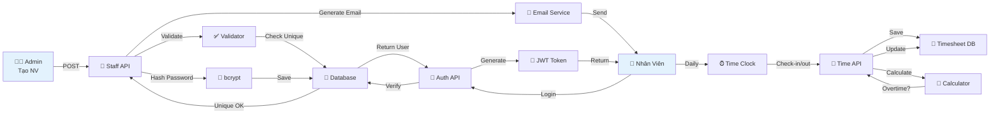

---

## 15. Biểu Đồ So Sánh Vai Trò

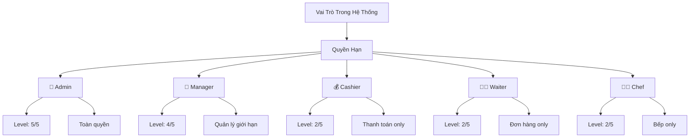

---

## 16. Biểu Đồ Quy Trình Nghỉ Việc

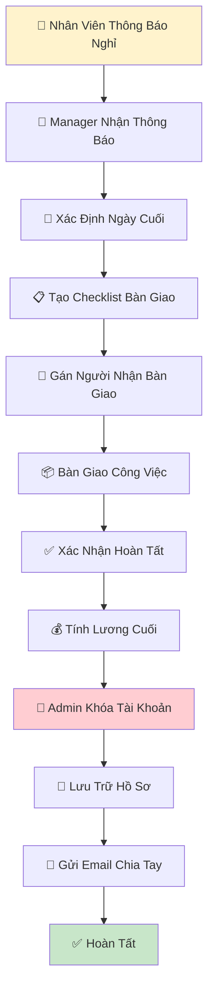

---

## Ghi Chú

Các biểu đồ này được tạo bằng **Mermaid** và có thể được:

-   Chỉnh sửa trực tiếp trong markdown
-   Xuất thành hình ảnh PNG/SVG
-   Nhúng vào tài liệu web hoặc wiki
-   Tích hợp vào các công cụ quản lý dự án

**Để sử dụng Mermaid:**

1. GitHub hỗ trợ mermaid trực tiếp trong markdown
2. GitLab cũng hỗ trợ mermaid native
3. Các công cụ khác có thể cần plugin
4. Online editor: https://mermaid.live

**Ứng dụng thực tế:**

-   Đào tạo nhân viên mới về quy trình làm việc
-   Tài liệu hướng dẫn cho quản lý nhân sự
-   Phân tích và tối ưu quy trình quản lý
-   Phát triển và bảo trì hệ thống
