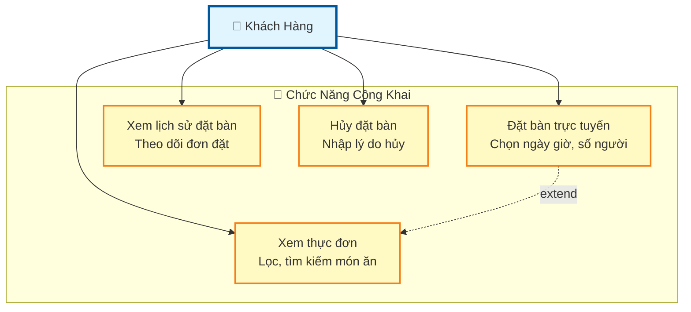
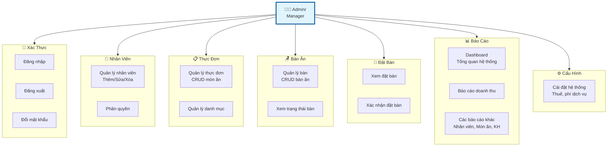
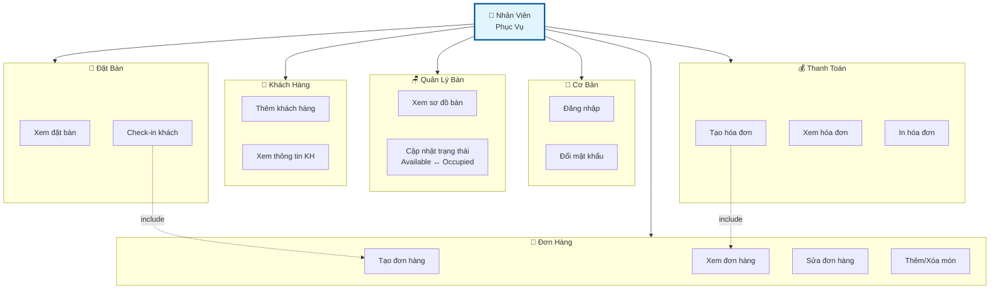
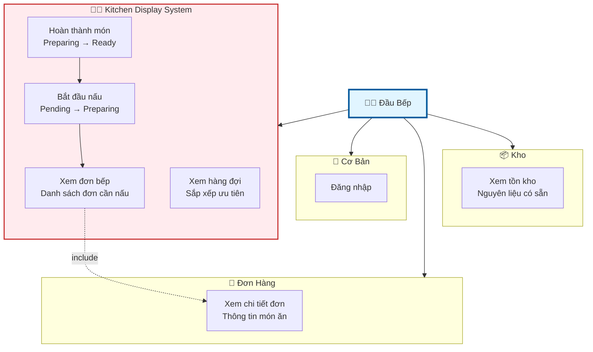
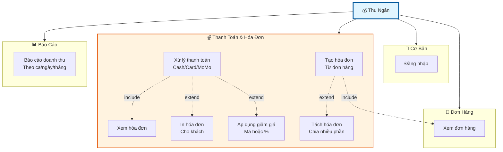
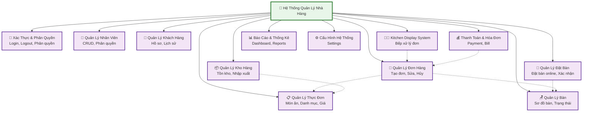
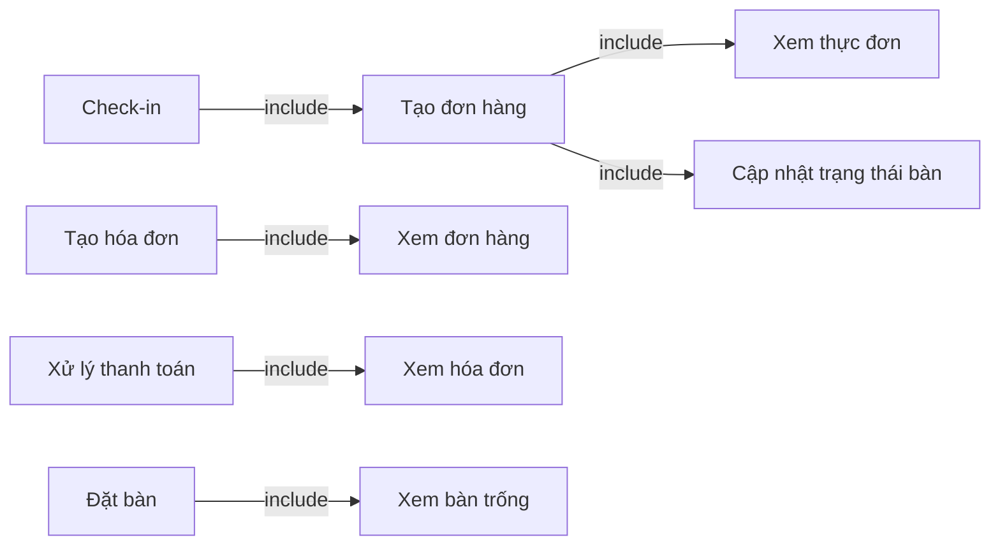
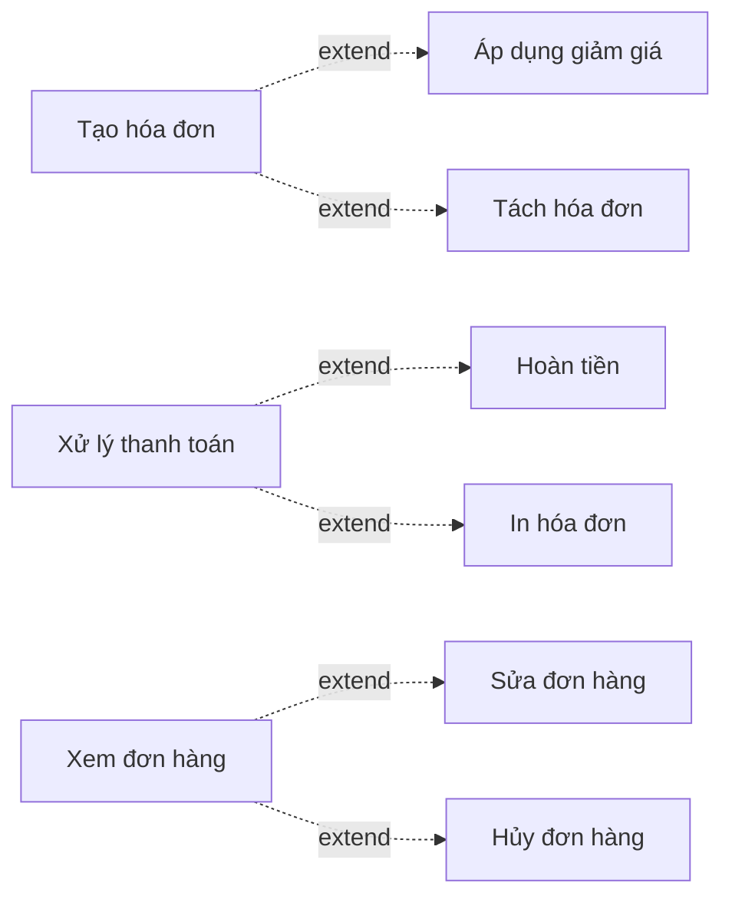
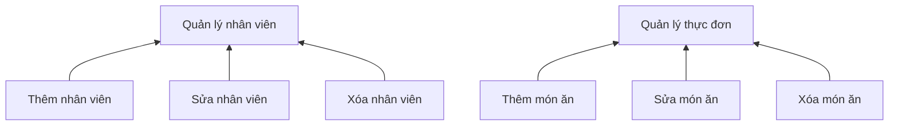

# Sơ Đồ Use Case Tổng Quát - Hệ Thống Quản Lý Nhà Hàng

> **Dự án tốt nghiệp** - Hệ thống quản lý nhà hàng toàn diện

## Mục lục

- [1. Tổng quan](#1-tổng-quan)
- [2. Các Actor (Tác nhân)](#2-các-actor-tác-nhân)
- [3. Sơ đồ Use Case Tổng Quát](#3-sơ-đồ-use-case-tổng-quát)
- [4. Mô tả chi tiết các Use Case theo Module](#4-mô-tả-chi-tiết-các-use-case-theo-module)

---

## 1. Tổng quan

Sơ đồ Use Case tổng quát mô tả toàn bộ các chức năng chính của hệ thống quản lý nhà hàng và mối quan hệ giữa các tác nhân (Actor) với các chức năng đó.

### Mục đích
- Hiển thị toàn cảnh các chức năng của hệ thống
- Xác định vai trò và quyền hạn của từng Actor
- Làm cơ sở cho việc phát triển chi tiết các module

---

## 2. Các Actor (Tác nhân)

### 2.1. Actor Chính

| Actor | Vai trò | Mô tả |
|-------|---------|-------|
| 👤 **Khách Hàng** | Customer | Người dùng cuối, đặt bàn và xem thực đơn trực tuyến |
| 👨‍💼 **Quản Trị Viên** | Admin | Toàn quyền quản lý hệ thống, cấu hình và báo cáo |
| 👨‍💼 **Quản Lý** | Manager | Quản lý nhân viên, giám sát hoạt động, xem báo cáo |
| 👔 **Nhân Viên Phục Vụ** | Waiter | Nhận đơn, phục vụ khách hàng, quản lý bàn |
| 👨‍🍳 **Đầu Bếp** | Chef | Xử lý đơn hàng từ bếp, cập nhật trạng thái món |
| 💰 **Thu Ngân** | Cashier | Xử lý thanh toán, in hóa đơn |

### 2.2. Actor Hệ Thống

| Actor | Mô tả |
|-------|-------|
| ⏰ **Hệ Thống Tự Động** | Xử lý các tác vụ tự động (nhắc nhở, cập nhật trạng thái) |
| 📧 **Email Service** | Gửi email xác nhận, thông báo |
| 🔔 **Notification Service** | Gửi thông báo real-time qua WebSocket |

---

## 3. Sơ đồ Use Case Tổng Quát

> **Lưu ý**: Do số lượng chức năng lớn, sơ đồ được chia thành 3 phần theo vai trò để dễ xem

### 3.1. Sơ đồ Use Case - Khách Hàng



### 3.2. Sơ đồ Use Case - Nhân Viên Quản Lý (Admin & Manager)



### 3.3. Sơ đồ Use Case - Nhân Viên Phục Vụ (Waiter)



### 3.4. Sơ đồ Use Case - Đầu Bếp (Chef)



### 3.5. Sơ đồ Use Case - Thu Ngân (Cashier)



### 3.6. Sơ đồ Tổng Quan Các Module Chính



---

## 4. Mô tả chi tiết các Use Case theo Module

### 4.1. 🔐 Module Xác Thực & Phân Quyền

#### UC_Login: Đăng nhập hệ thống
- **Actor**: Tất cả nhân viên (Admin, Manager, Waiter, Chef, Cashier)
- **Mô tả**: Nhân viên đăng nhập vào hệ thống bằng username/email và mật khẩu
- **Luồng chính**:
  1. Nhập thông tin đăng nhập
  2. Hệ thống xác thực
  3. Cấp quyền truy cập theo vai trò
  4. Chuyển đến trang chủ tương ứng
- **Tài liệu**: [AUTHENTICATION_MANAGEMENT.md](../use_case/AUTHENTICATION_MANAGEMENT.md)

#### UC_Logout: Đăng xuất
- **Actor**: Tất cả nhân viên đã đăng nhập
- **Mô tả**: Kết thúc phiên làm việc và thoát khỏi hệ thống

#### UC_ChangePass: Đổi mật khẩu
- **Actor**: Tất cả nhân viên
- **Mô tả**: Thay đổi mật khẩu đăng nhập

#### UC_ResetPass: Khôi phục mật khẩu
- **Actor**: Tất cả nhân viên
- **Mô tả**: Lấy lại mật khẩu qua email khi quên

---

### 4.2. 👥 Module Quản Lý Nhân Viên

#### UC_AddStaff: Thêm nhân viên
- **Actor**: Admin, Manager
- **Mô tả**: Tạo tài khoản mới cho nhân viên
- **Dữ liệu**: Họ tên, email, số điện thoại, vai trò, lương, ngày bắt đầu

#### UC_EditStaff: Sửa thông tin nhân viên
- **Actor**: Admin, Manager
- **Mô tả**: Cập nhật thông tin nhân viên hiện có

#### UC_DeleteStaff: Xóa nhân viên
- **Actor**: Admin
- **Mô tả**: Vô hiệu hóa tài khoản nhân viên (soft delete)

#### UC_ViewStaff: Xem danh sách nhân viên
- **Actor**: Admin, Manager
- **Mô tả**: Xem thông tin tất cả nhân viên

#### UC_AssignRole: Phân quyền nhân viên
- **Actor**: Admin, Manager
- **Mô tả**: Gán vai trò (Admin, Manager, Waiter, Chef, Cashier) cho nhân viên
- **Tài liệu**: [STAFF_MANAGEMENT.md](../use_case/STAFF_MANAGEMENT.md)

---

### 4.3. 📋 Module Quản Lý Thực Đơn

#### UC_ViewMenu: Xem thực đơn
- **Actor**: Khách hàng, Tất cả nhân viên
- **Mô tả**: Xem danh sách món ăn, giá, mô tả, hình ảnh
- **Chức năng**: Lọc theo danh mục, tìm kiếm, sắp xếp

#### UC_AddMenuItem: Thêm món ăn
- **Actor**: Admin, Manager
- **Mô tả**: Thêm món ăn mới vào thực đơn
- **Dữ liệu**: Tên món, giá, danh mục, mô tả, hình ảnh

#### UC_EditMenuItem: Sửa món ăn
- **Actor**: Admin, Manager
- **Mô tả**: Cập nhật thông tin món ăn

#### UC_DeleteMenuItem: Xóa món ăn
- **Actor**: Admin, Manager
- **Mô tả**: Xóa món ăn khỏi thực đơn

#### UC_ManageCategory: Quản lý danh mục
- **Actor**: Admin, Manager
- **Mô tả**: Thêm/sửa/xóa danh mục món ăn

#### UC_UpdatePrice: Cập nhật giá
- **Actor**: Admin, Manager
- **Mô tả**: Thay đổi giá món ăn
- **Tài liệu**: [MENU_MANAGEMENT.md](../use_case/MENU_MANAGEMENT.md)

---

### 4.4. 🪑 Module Quản Lý Bàn

#### UC_ViewTable: Xem sơ đồ bàn
- **Actor**: Admin, Manager, Waiter
- **Mô tả**: Xem trạng thái tất cả các bàn (Available/Occupied/Reserved/Maintenance)

#### UC_AddTable: Thêm bàn
- **Actor**: Admin, Manager
- **Mô tả**: Thêm bàn mới
- **Dữ liệu**: Số bàn, sức chứa, vị trí (toạ độ x, y)

#### UC_EditTable: Sửa thông tin bàn
- **Actor**: Admin, Manager
- **Mô tả**: Cập nhật thông tin bàn

#### UC_DeleteTable: Xóa bàn
- **Actor**: Admin, Manager
- **Mô tả**: Xóa bàn khỏi hệ thống

#### UC_UpdateTableStatus: Cập nhật trạng thái bàn
- **Actor**: Waiter
- **Mô tả**: Thay đổi trạng thái bàn khi có khách hoặc dọn xong

---

### 4.5. 📅 Module Quản Lý Đặt Bàn

#### UC_BookTable: Đặt bàn trực tuyến
- **Actor**: Khách hàng
- **Mô tả**: Khách hàng đặt bàn qua website
- **Dữ liệu**: Ngày giờ, số lượng khách, thông tin liên hệ, yêu cầu đặc biệt
- **Luồng**: Chọn ngày giờ → Chọn số khách → Điền thông tin → Xác nhận

#### UC_ViewReservation: Xem danh sách đặt bàn
- **Actor**: Admin, Manager, Waiter
- **Mô tả**: Xem tất cả đơn đặt bàn

#### UC_ConfirmReservation: Xác nhận đặt bàn
- **Actor**: Admin, Manager, Waiter
- **Mô tả**: Duyệt đơn đặt bàn, gửi email xác nhận

#### UC_CancelReservation: Hủy đặt bàn
- **Actor**: Khách hàng, Admin, Manager, Waiter
- **Mô tả**: Hủy đơn đặt bàn với lý do

#### UC_CheckIn: Check-in khách đặt bàn
- **Actor**: Waiter
- **Mô tả**: Xác nhận khách đã đến, cập nhật trạng thái bàn

#### UC_ViewHistory: Xem lịch sử đặt bàn
- **Actor**: Khách hàng (của mình), Admin, Manager (tất cả)
- **Mô tả**: Xem các lần đặt bàn trước đó
- **Tài liệu**: [RESERVATION_MANAGEMENT.md](../use_case/RESERVATION_MANAGEMENT.md)

---

### 4.6. 👥 Module Quản Lý Khách Hàng

#### UC_AddCustomer: Thêm khách hàng
- **Actor**: Waiter
- **Mô tả**: Tạo hồ sơ khách hàng mới

#### UC_EditCustomer: Sửa thông tin khách hàng
- **Actor**: Waiter, Admin, Manager
- **Mô tả**: Cập nhật thông tin khách hàng

#### UC_ViewCustomer: Xem thông tin khách hàng
- **Actor**: Waiter, Admin, Manager
- **Mô tả**: Tra cứu thông tin khách hàng

#### UC_CustomerHistory: Xem lịch sử khách hàng
- **Actor**: Waiter, Admin, Manager
- **Mô tả**: Xem lịch sử đặt bàn và đơn hàng của khách

---

### 4.7. 📝 Module Quản Lý Đơn Hàng

#### UC_CreateOrder: Tạo đơn hàng
- **Actor**: Waiter
- **Mô tả**: Tạo đơn hàng mới khi khách gọi món
- **Dữ liệu**: Bàn, nhân viên phục vụ, danh sách món, số lượng, yêu cầu đặc biệt

#### UC_ViewOrder: Xem đơn hàng
- **Actor**: Waiter, Chef, Cashier, Manager, Admin
- **Mô tả**: Xem chi tiết đơn hàng

#### UC_EditOrder: Sửa đơn hàng
- **Actor**: Waiter
- **Mô tả**: Chỉnh sửa đơn hàng (trước khi xác nhận)

#### UC_CancelOrder: Hủy đơn hàng
- **Actor**: Waiter, Manager, Admin
- **Mô tả**: Hủy đơn hàng với lý do

#### UC_ConfirmOrder: Xác nhận đơn hàng
- **Actor**: Waiter
- **Mô tả**: Gửi đơn hàng đến bếp

#### UC_AddOrderItem: Thêm món vào đơn
- **Actor**: Waiter
- **Mô tả**: Thêm món mới vào đơn hàng đang xử lý

#### UC_RemoveOrderItem: Xóa món khỏi đơn
- **Actor**: Waiter
- **Mô tả**: Xóa món khỏi đơn hàng (trước khi nấu)
- **Tài liệu**: [ORDER_MANAGEMENT.md](../use_case/ORDER_MANAGEMENT.md)

---

### 4.8. 👨‍🍳 Module Quản Lý Bếp (Kitchen Display System)

#### UC_ViewKitchenOrder: Xem đơn bếp
- **Actor**: Chef
- **Mô tả**: Xem danh sách đơn hàng cần chuẩn bị

#### UC_StartCooking: Bắt đầu nấu
- **Actor**: Chef
- **Mô tả**: Đánh dấu bắt đầu chuẩn bị món

#### UC_FinishCooking: Hoàn thành món
- **Actor**: Chef
- **Mô tả**: Đánh dấu món đã hoàn thành, sẵn sàng phục vụ

#### UC_UpdateKitchenStatus: Cập nhật trạng thái món
- **Actor**: Chef
- **Mô tả**: Thay đổi trạng thái món trong quá trình nấu

#### UC_ViewKitchenQueue: Xem hàng đợi bếp
- **Actor**: Chef, Manager
- **Mô tả**: Xem thứ tự ưu tiên các món cần nấu

---

### 4.9. 💰 Module Thanh Toán & Hóa Đơn

#### UC_CreateBill: Tạo hóa đơn
- **Actor**: Waiter, Cashier
- **Mô tả**: Tạo hóa đơn từ đơn hàng đã hoàn thành

#### UC_ViewBill: Xem hóa đơn
- **Actor**: Waiter, Cashier, Manager, Admin
- **Mô tả**: Xem chi tiết hóa đơn

#### UC_ProcessPayment: Xử lý thanh toán
- **Actor**: Cashier
- **Mô tả**: Nhận thanh toán từ khách hàng
- **Phương thức**: Tiền mặt, thẻ, MoMo, chuyển khoản

#### UC_PrintBill: In hóa đơn
- **Actor**: Cashier, Waiter
- **Mô tả**: In hóa đơn cho khách hàng

#### UC_ApplyDiscount: Áp dụng giảm giá
- **Actor**: Cashier, Manager, Admin
- **Mô tả**: Áp dụng mã giảm giá hoặc % giảm giá

#### UC_SplitBill: Tách hóa đơn
- **Actor**: Cashier, Waiter
- **Mô tả**: Chia hóa đơn thành nhiều phần (khách ăn riêng)

#### UC_RefundBill: Hoàn tiền
- **Actor**: Manager, Admin
- **Mô tả**: Hoàn tiền cho khách hàng
- **Tài liệu**: [BILL_PAYMENT_MANAGEMENT.md](../use_case/BILL_PAYMENT_MANAGEMENT.md)

---

### 4.10. 📦 Module Quản Lý Kho Hàng

#### UC_ViewInventory: Xem tồn kho
- **Actor**: Admin, Manager, Chef
- **Mô tả**: Xem số lượng nguyên liệu trong kho

#### UC_AddInventory: Thêm hàng vào kho
- **Actor**: Admin, Manager
- **Mô tả**: Nhập hàng mới vào kho

#### UC_UpdateInventory: Cập nhật tồn kho
- **Actor**: Admin, Manager, Chef
- **Mô tả**: Điều chỉnh số lượng tồn kho

#### UC_ViewLowStock: Xem hàng sắp hết
- **Actor**: Admin, Manager, Chef
- **Mô tả**: Xem danh sách nguyên liệu cần nhập thêm

#### UC_InventoryReport: Báo cáo xuất nhập kho
- **Actor**: Admin, Manager
- **Mô tả**: Báo cáo chi tiết xuất nhập kho
- **Tài liệu**: [INVENTORY_MANAGEMENT.md](../use_case/INVENTORY_MANAGEMENT.md)

---

### 4.11. 📊 Module Báo Cáo & Thống Kê

#### UC_SalesReport: Báo cáo doanh thu
- **Actor**: Admin, Manager, Cashier
- **Mô tả**: Báo cáo doanh thu theo ngày/tuần/tháng

#### UC_StaffReport: Báo cáo nhân viên
- **Actor**: Admin, Manager
- **Mô tả**: Báo cáo hiệu suất làm việc của nhân viên

#### UC_MenuReport: Báo cáo món ăn
- **Actor**: Admin, Manager
- **Mô tả**: Báo cáo món bán chạy/ít bán

#### UC_CustomerReport: Báo cáo khách hàng
- **Actor**: Admin, Manager
- **Mô tả**: Báo cáo khách hàng thường xuyên

#### UC_Dashboard: Xem dashboard
- **Actor**: Admin, Manager
- **Mô tả**: Xem tổng quan hệ thống real-time

#### UC_ExportReport: Xuất báo cáo
- **Actor**: Admin, Manager
- **Mô tả**: Xuất báo cáo ra Excel/PDF

---

### 4.12. ⚙️ Module Cấu Hình Hệ Thống

#### UC_RestaurantInfo: Cấu hình thông tin nhà hàng
- **Actor**: Admin
- **Mô tả**: Cập nhật tên, địa chỉ, logo, thông tin liên hệ

#### UC_TaxSettings: Cấu hình thuế
- **Actor**: Admin
- **Mô tả**: Thiết lập % thuế VAT

#### UC_ServiceCharge: Cấu hình phí phục vụ
- **Actor**: Admin
- **Mô tả**: Thiết lập % phí phục vụ

#### UC_EmailSettings: Cấu hình email
- **Actor**: Admin
- **Mô tả**: Thiết lập SMTP, mẫu email

#### UC_SystemSettings: Cài đặt hệ thống
- **Actor**: Admin
- **Mô tả**: Cấu hình chung của hệ thống

---

## 5. Quan Hệ Giữa Các Use Case

### 5.1. Include (Bao gồm)

Các use case phụ thuộc bắt buộc:



### 5.2. Extend (Mở rộng)

Các use case tùy chọn:



### 5.3. Generalization (Kế thừa)



---

## 6. Luồng Nghiệp Vụ Chính

### 6.1. Luồng Khách Hàng Đặt Bàn Trực Tuyến

```
1. Khách hàng → Xem thực đơn
2. Khách hàng → Đặt bàn trực tuyến
3. Hệ thống → Gửi email xác nhận tạm thời
4. Waiter → Xác nhận đặt bàn
5. Hệ thống → Gửi email xác nhận cuối cùng
6. Khách hàng → Đến nhà hàng đúng giờ
7. Waiter → Check-in khách
8. [Tiếp tục luồng Phục vụ tại chỗ]
```

### 6.2. Luồng Phục Vụ Tại Chỗ

```
1. Waiter → Cập nhật trạng thái bàn (Available → Occupied)
2. Waiter → Tạo đơn hàng
3. Waiter → Thêm món vào đơn
4. Waiter → Xác nhận đơn (gửi bếp)
5. Chef → Xem đơn bếp
6. Chef → Bắt đầu nấu
7. Chef → Hoàn thành món
8. Waiter → Phục vụ món
9. Waiter → Tạo hóa đơn
10. Cashier → Xử lý thanh toán
11. Cashier → In hóa đơn
12. Waiter → Cập nhật trạng thái bàn (Occupied → Available)
```

### 6.3. Luồng Quản Lý Hàng Ngày

```
1. Manager → Đăng nhập
2. Manager → Xem dashboard
3. Manager → Kiểm tra đơn đặt bàn hôm nay
4. Manager → Xác nhận các đơn đặt bàn
5. Manager → Kiểm tra tồn kho
6. Manager → Xem báo cáo doanh thu hôm qua
7. Manager → Phân công nhiệm vụ nhân viên
```

---

## 7. Ma Trận Quyền Hạn (Access Control Matrix)

| Use Case | Customer | Admin | Manager | Waiter | Chef | Cashier |
|----------|----------|-------|---------|--------|------|---------|
| **Xác thực** |
| Đăng nhập | ❌ | ✅ | ✅ | ✅ | ✅ | ✅ |
| Đăng xuất | ❌ | ✅ | ✅ | ✅ | ✅ | ✅ |
| Đổi mật khẩu | ❌ | ✅ | ✅ | ✅ | ✅ | ✅ |
| **Nhân viên** |
| Quản lý nhân viên | ❌ | ✅ | ✅ | ❌ | ❌ | ❌ |
| Phân quyền | ❌ | ✅ | ✅ | ❌ | ❌ | ❌ |
| **Thực đơn** |
| Xem thực đơn | ✅ | ✅ | ✅ | ✅ | ✅ | ✅ |
| Quản lý thực đơn | ❌ | ✅ | ✅ | ❌ | ❌ | ❌ |
| **Bàn** |
| Xem sơ đồ bàn | ❌ | ✅ | ✅ | ✅ | ❌ | ❌ |
| Quản lý bàn | ❌ | ✅ | ✅ | ❌ | ❌ | ❌ |
| Cập nhật trạng thái | ❌ | ✅ | ✅ | ✅ | ❌ | ❌ |
| **Đặt bàn** |
| Đặt bàn | ✅ | ✅ | ✅ | ✅ | ❌ | ❌ |
| Xác nhận đặt bàn | ❌ | ✅ | ✅ | ✅ | ❌ | ❌ |
| Hủy đặt bàn | ✅ | ✅ | ✅ | ✅ | ❌ | ❌ |
| Check-in | ❌ | ✅ | ✅ | ✅ | ❌ | ❌ |
| **Đơn hàng** |
| Tạo đơn hàng | ❌ | ✅ | ✅ | ✅ | ❌ | ❌ |
| Xem đơn hàng | ❌ | ✅ | ✅ | ✅ | ✅ | ✅ |
| Sửa đơn hàng | ❌ | ✅ | ✅ | ✅ | ❌ | ❌ |
| Hủy đơn hàng | ❌ | ✅ | ✅ | ✅ | ❌ | ❌ |
| **Bếp** |
| Xem đơn bếp | ❌ | ✅ | ✅ | ❌ | ✅ | ❌ |
| Cập nhật trạng thái món | ❌ | ✅ | ✅ | ❌ | ✅ | ❌ |
| **Thanh toán** |
| Tạo hóa đơn | ❌ | ✅ | ✅ | ✅ | ❌ | ✅ |
| Xử lý thanh toán | ❌ | ✅ | ✅ | ❌ | ❌ | ✅ |
| Áp dụng giảm giá | ❌ | ✅ | ✅ | ❌ | ❌ | ✅ |
| Hoàn tiền | ❌ | ✅ | ✅ | ❌ | ❌ | ❌ |
| **Kho hàng** |
| Xem tồn kho | ❌ | ✅ | ✅ | ❌ | ✅ | ❌ |
| Quản lý kho | ❌ | ✅ | ✅ | ❌ | ❌ | ❌ |
| **Báo cáo** |
| Xem dashboard | ❌ | ✅ | ✅ | ❌ | ❌ | ❌ |
| Báo cáo doanh thu | ❌ | ✅ | ✅ | ❌ | ❌ | ✅ |
| Báo cáo tổng hợp | ❌ | ✅ | ✅ | ❌ | ❌ | ❌ |
| **Cấu hình** |
| Cài đặt hệ thống | ❌ | ✅ | ❌ | ❌ | ❌ | ❌ |

**Chú thích:**
- ✅ Có quyền truy cập
- ❌ Không có quyền truy cập

---

## 8. Tổng Kết

### 8.1. Thống Kê

- **Tổng số Actor**: 6 (Customer + 5 vai trò nhân viên)
- **Tổng số Module**: 12
- **Tổng số Use Case**: 70+
- **Use Case phức tạp nhất**: Quản lý Đơn Hàng (7 UC) và Thanh Toán (7 UC)

### 8.2. Ưu Điểm Thiết Kế

✅ **Phân quyền rõ ràng**: Mỗi actor có vai trò và quyền hạn cụ thể  
✅ **Module hóa**: Các chức năng được tổ chức thành module độc lập  
✅ **Tái sử dụng**: Nhiều use case được tái sử dụng bởi nhiều actor  
✅ **Mở rộng dễ dàng**: Có thể thêm use case mới mà không ảnh hưởng hệ thống cũ  
✅ **Bảo mật**: Kiểm soát quyền truy cập chặt chẽ theo vai trò  

### 8.3. Tài Liệu Liên Quan

- [DATABASE.md](../architecture/DATABASE.md) - Thiết kế cơ sở dữ liệu
- [ERD.mmd](../architecture/ERD.mmd) - Sơ đồ quan hệ thực thể
- [Use Case chi tiết các module](../use_case/) - Tài liệu chi tiết từng module
- [Sơ đồ chi tiết các module](../diagrams/) - Sơ đồ luồng và trạng thái

---

**Tài liệu được tạo**: Tháng 12/2025  
**Phiên bản**: 1.0  
**Trạng thái**: ✅ Hoàn chỉnh
