# Sơ Đồ và Biểu Đồ Quản Lý Tồn Kho

## 1. Giới Thiệu

Tài liệu này cung cấp các sơ đồ trực quan để hiểu rõ hơn về quy trình và nghiệp vụ quản lý tồn kho trong hệ thống nhà hàng.

---

## 2. Sơ Đồ Use Case

### 2.1 Tổng Quan Use Case Quản Lý Tồn Kho

```mermaid
graph TB
    subgraph "Actors"
        Manager[Quản lý kho]
        Staff[Nhân viên kho]
        Chef[Đầu bếp]
        Admin[Quản lý nhà hàng]
        Buyer[Nhân viên mua hàng]
    end
    
    subgraph "Quản lý nguyên liệu"
        UC1[Tạo nguyên liệu]
        UC2[Xem danh sách nguyên liệu]
        UC3[Cập nhật nguyên liệu]
        UC4[Vô hiệu hóa nguyên liệu]
    end
    
    subgraph "Quản lý nhà cung cấp"
        UC5[Thêm nhà cung cấp]
        UC6[Cập nhật nhà cung cấp]
        UC7[Xem lịch sử đơn hàng]
    end
    
    subgraph "Quản lý đơn đặt hàng"
        UC8[Tạo đơn đặt hàng]
        UC9[Xác nhận gửi đơn]
        UC10[Nhận hàng và nhập kho]
        UC11[Hủy đơn hàng]
    end
    
    subgraph "Giao dịch kho"
        UC12[Nhập kho thủ công]
        UC13[Xuất kho]
        UC14[Điều chỉnh tồn kho]
        UC15[Ghi nhận hao hụt]
        UC16[Xem lịch sử giao dịch]
    end
    
    subgraph "Lô hàng và hạn sử dụng"
        UC17[Theo dõi lô hàng]
        UC18[Kiểm tra hàng hết hạn]
        UC19[Cảnh báo sắp hết hạn]
    end
    
    subgraph "Công thức"
        UC20[Thiết lập công thức]
        UC21[Tính chi phí món ăn]
        UC22[Kiểm tra khả dụng món]
    end
    
    subgraph "Báo cáo"
        UC23[Báo cáo tồn kho]
        UC24[Báo cáo nhập-xuất-tồn]
        UC25[Báo cáo hao hụt]
        UC26[Báo cáo hiệu suất]
    end
    
    Manager --> UC1
    Manager --> UC3
    Manager --> UC4
    Manager --> UC5
    Manager --> UC6
    Manager --> UC8
    Manager --> UC9
    Manager --> UC10
    Manager --> UC14
    
    Staff --> UC2
    Staff --> UC12
    Staff --> UC13
    Staff --> UC15
    Staff --> UC16
    Staff --> UC17
    
    Chef --> UC2
    Chef --> UC20
    Chef --> UC21
    Chef --> UC22
    
    Admin --> UC2
    Admin --> UC7
    Admin --> UC23
    Admin --> UC24
    Admin --> UC25
    Admin --> UC26
    
    Buyer --> UC8
    Buyer --> UC9
    Buyer --> UC11
```

---

## 3. Sơ Đồ Luồng Nghiệp Vụ (Business Process Flow)

### 3.1 Quy Trình Tạo và Quản Lý Nguyên Liệu

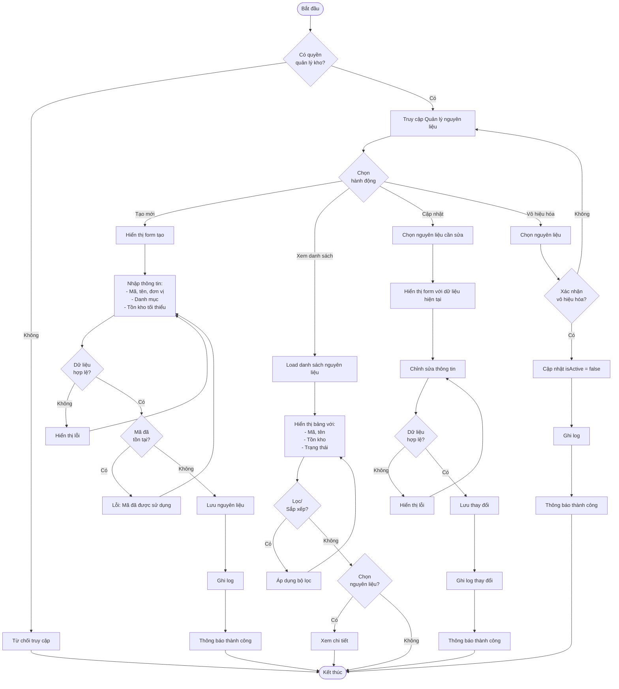

---

### 3.2 Quy Trình Tạo và Xử Lý Đơn Đặt Hàng

```mermaid
flowchart TD
    Start([Bắt đầu]) --> SelectSupplier[Chọn nhà cung cấp]
    SelectSupplier --> CreatePO[Tạo đơn đặt hàng mới]
    CreatePO --> InputInfo[Nhập thông tin:<br>- Ngày dự kiến nhận<br>- Ghi chú]
    
    InputInfo --> AddItems[Thêm nguyên liệu]
    AddItems --> SelectIngredient[Chọn nguyên liệu]
    SelectIngredient --> InputQuantity[Nhập số lượng và đơn giá]
    InputQuantity --> CalcSubtotal[Tính thành tiền]
    CalcSubtotal --> MoreItems{Thêm<br>nguyên liệu khác?}
    MoreItems -->|Có| SelectIngredient
    MoreItems -->|Không| CalcTotal[Tính tổng:<br>- Subtotal<br>- Tax (10%)<br>- Total Amount]
    
    CalcTotal --> Preview[Xem trước đơn hàng]
    Preview --> ValidatePO{Dữ liệu<br>hợp lệ?}
    ValidatePO -->|Không| Error[Hiển thị lỗi]
    Error --> AddItems
    ValidatePO -->|Có| SaveDraft[Lưu đơn<br>Status: pending]
    
    SaveDraft --> Action{Chọn<br>hành động}
    Action -->|Gửi đơn| ConfirmSend{Xác nhận<br>gửi?}
    ConfirmSend -->|Không| SaveDraft
    ConfirmSend -->|Có| SendOrder[Cập nhật Status: ordered<br>Ghi nhận thời gian gửi]
    SendOrder --> NotifySupplier[Thông báo nhà cung cấp<br>Email/Print]
    NotifySupplier --> WaitReceive[Chờ nhận hàng]
    
    Action -->|Hủy đơn| ConfirmCancel{Xác nhận<br>hủy?}
    ConfirmCancel -->|Không| SaveDraft
    ConfirmCancel -->|Có| InputReason[Nhập lý do hủy]
    InputReason --> CancelOrder[Cập nhật Status: cancelled]
    CancelOrder --> LogCancel[Ghi log]
    LogCancel --> End([Kết thúc])
    
    WaitReceive --> ReceiveGoods[Nhận hàng]
    ReceiveGoods --> CheckQuality[Kiểm tra chất lượng]
    CheckQuality --> InputReceived[Nhập số lượng thực tế nhận]
    InputReceived --> HasExpiry{Nguyên liệu<br>có hạn SD?}
    
    HasExpiry -->|Có| InputBatch[Nhập thông tin lô:<br>- Số lô<br>- Hạn sử dụng<br>- Đơn giá]
    InputBatch --> CreateBatch[Tạo IngredientBatch]
    
    HasExpiry -->|Không| CreateTransaction[Tạo StockTransaction<br>Type: in]
    CreateBatch --> CreateTransaction
    
    CreateTransaction --> UpdateStock[Cập nhật currentStock<br>+= quantity received]
    UpdateStock --> UpdateUnitCost[Cập nhật unitCost<br>trung bình]
    UpdateUnitCost --> CheckComplete{Nhận đủ<br>hàng?}
    
    CheckComplete -->|Có| SetReceived[Status: received<br>Ghi nhận receivedDate]
    CheckComplete -->|Không| NoteShortage[Ghi chú số lượng thiếu]
    NoteShortage --> SetReceived
    
    SetReceived --> PrintReceipt[In phiếu nhập kho]
    PrintReceipt --> CheckStockAlert{Kiểm tra<br>cảnh báo}
    CheckStockAlert --> CheckLowStock{Tồn kho<br>thấp?}
    CheckLowStock -->|Không| End
    CheckLowStock -->|Có| ResolveAlert[Đánh dấu cảnh báo<br>đã xử lý]
    ResolveAlert --> End
```

---

### 3.3 Quy Trình Xuất Kho Tự Động Khi Đơn Hàng

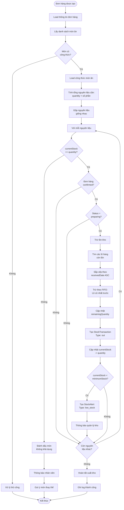

---

### 3.4 Quy Trình Cảnh Báo Tồn Kho và Xử Lý

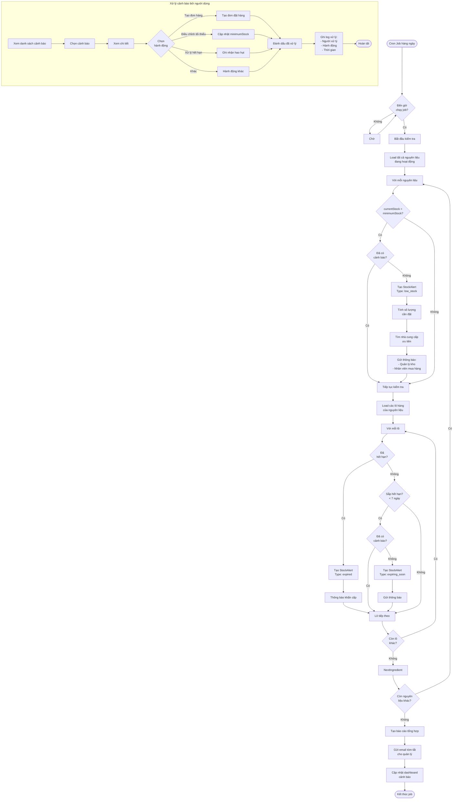

---

### 3.5 Quy Trình Kiểm Kê và Điều Chỉnh Tồn Kho

```mermaid
flowchart TD
    Start([Bắt đầu kiểm kê]) --> Plan[Lập kế hoạch kiểm kê]
    Plan --> Schedule[Xác định thời gian]
    Schedule --> AssignStaff[Phân công nhân sự]
    AssignStaff --> PrintList[In danh sách nguyên liệu]
    
    PrintList --> CountPhysical[Đếm thực tế từng nguyên liệu]
    CountPhysical --> RecordSheet[Ghi vào phiếu kiểm kê]
    RecordSheet --> CheckExpiry[Kiểm tra hạn sử dụng]
    CheckExpiry --> CheckQuality[Kiểm tra chất lượng]
    
    CheckQuality --> MoreItems{Còn nguyên<br>liệu khác?}
    MoreItems -->|Có| CountPhysical
    MoreItems -->|Không| InputSystem[Nhập số liệu vào hệ thống]
    
    InputSystem --> Compare[So sánh với tồn kho hệ thống]
    Compare --> ForEachItem[Với mỗi nguyên liệu]
    ForEachItem --> CalcDiff[Tính chênh lệch:<br>actual - system]
    
    CalcDiff --> HasDiff{Có<br>chênh lệch?}
    HasDiff -->|Không| NextItem
    HasDiff -->|Có| InvestigateReason[Điều tra nguyên nhân]
    
    InvestigateReason --> ReasonFound{Tìm ra<br>nguyên nhân?}
    ReasonFound -->|Có| DocumentReason[Ghi nhận nguyên nhân]
    ReasonFound -->|Không| MarkUnknown[Đánh dấu chưa rõ]
    
    DocumentReason --> NeedAdjust{Cần điều<br>chỉnh?}
    MarkUnknown --> NeedAdjust
    
    NeedAdjust -->|Có| CreateAdjustment[Tạo giao dịch điều chỉnh]
    CreateAdjustment --> SelectType{Chênh lệch<br>dương/âm?}
    
    SelectType -->|Dương| AdjustIn[Type: adjustment<br>Quantity: + diff]
    SelectType -->|Âm| AdjustOut[Type: adjustment<br>Quantity: - diff]
    
    AdjustIn --> UpdateStock[Cập nhật currentStock]
    AdjustOut --> UpdateStock
    
    UpdateStock --> LogAdjust[Ghi log chi tiết:<br>- Người thực hiện<br>- Lý do<br>- Số lượng]
    LogAdjust --> NextItem
    
    NeedAdjust -->|Không| NextItem[Nguyên liệu tiếp theo]
    NextItem --> MoreToCheck{Còn nguyên<br>liệu khác?}
    MoreToCheck -->|Có| ForEachItem
    MoreToCheck -->|Không| ProcessExpired[Xử lý hàng hết hạn]
    
    ProcessExpired --> ForEachExpired[Với mỗi hàng hết hạn]
    ForEachExpired --> CreateWaste[Tạo giao dịch hao hụt<br>Type: waste]
    CreateWaste --> DeductExpired[Trừ tồn kho]
    DeductExpired --> MoreExpired{Còn hàng<br>hết hạn khác?}
    MoreExpired -->|Có| ForEachExpired
    MoreExpired -->|Không| GenerateReport[Tạo báo cáo kiểm kê]
    
    GenerateReport --> CalcAccuracy[Tính độ chính xác:<br>accuracy %]
    CalcAccuracy --> CalcLoss[Tính giá trị hao hụt]
    CalcLoss --> Recommendations[Đề xuất cải tiến]
    Recommendations --> ApproveReport{Phê duyệt<br>báo cáo?}
    
    ApproveReport -->|Không| ReviseReport[Xem xét lại]
    ReviseReport --> GenerateReport
    ApproveReport -->|Có| FinalizeReport[Hoàn tất báo cáo]
    FinalizeReport --> SendToManagement[Gửi báo cáo<br>cho ban quản lý]
    SendToManagement --> ArchiveReport[Lưu trữ hồ sơ]
    ArchiveReport --> End([Kết thúc])
```

---

## 4. Sơ Đồ Sequence (Trình Tự)

### 4.1 Sequence: Tạo Đơn Đặt Hàng

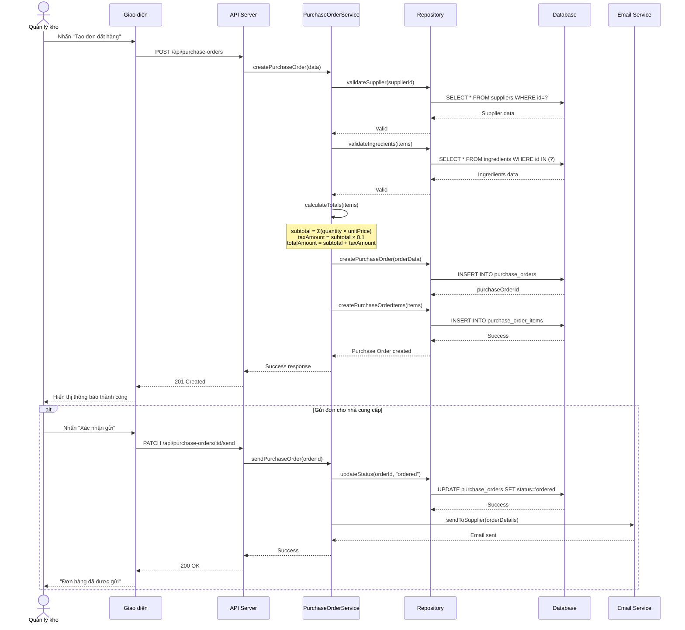

---

### 4.2 Sequence: Nhận Hàng và Nhập Kho

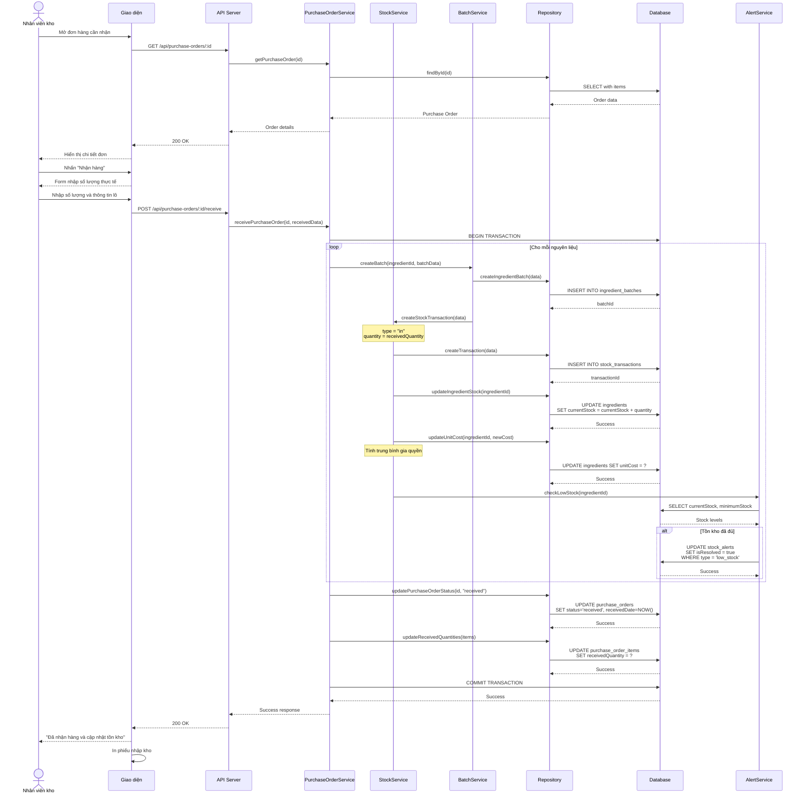

---

### 4.3 Sequence: Xuất Kho Tự Động Khi Đơn Hàng

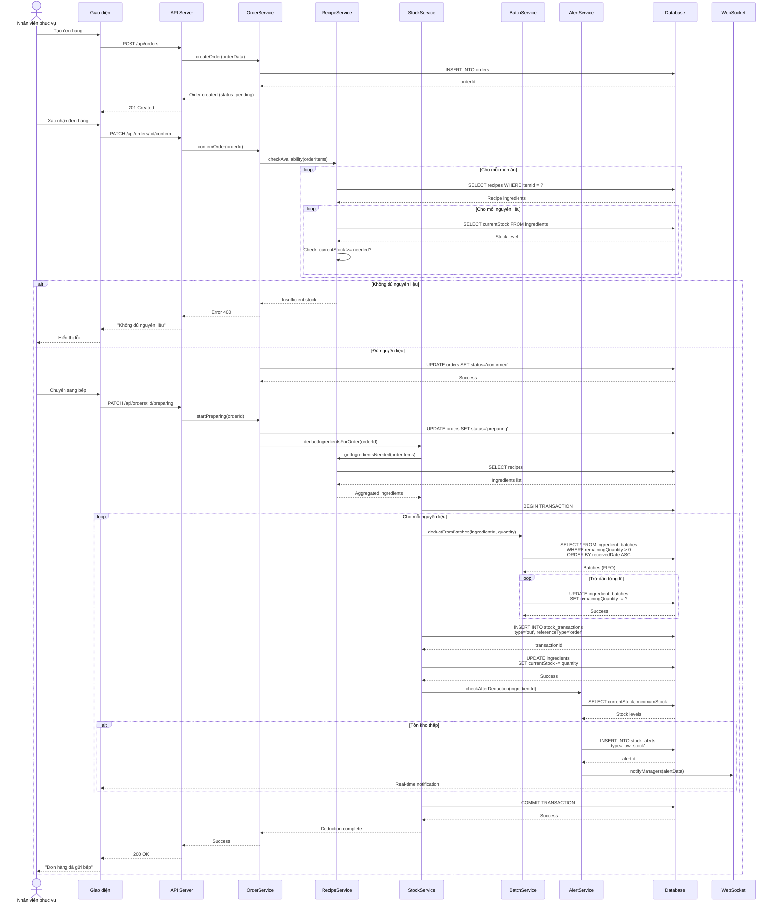

---

## 5. Sơ Đồ Cấu Trúc Database (ERD Focus)

### 5.1 ERD - Quan Hệ Các Bảng Inventory

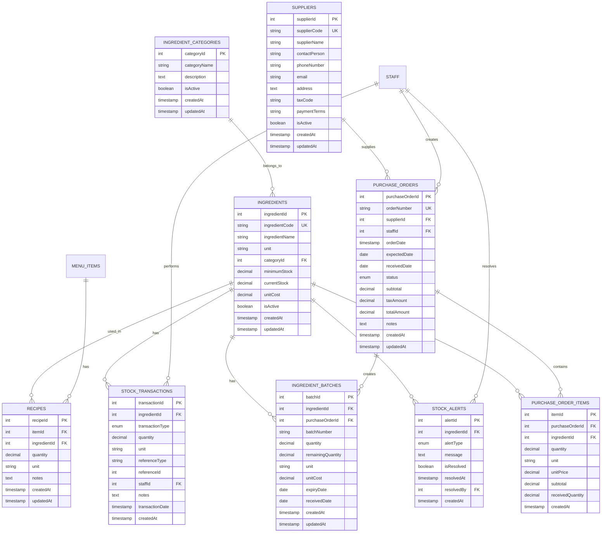

---

## 6. Sơ Đồ Trạng Thái (State Diagram)

### 6.1 Trạng Thái Đơn Đặt Hàng

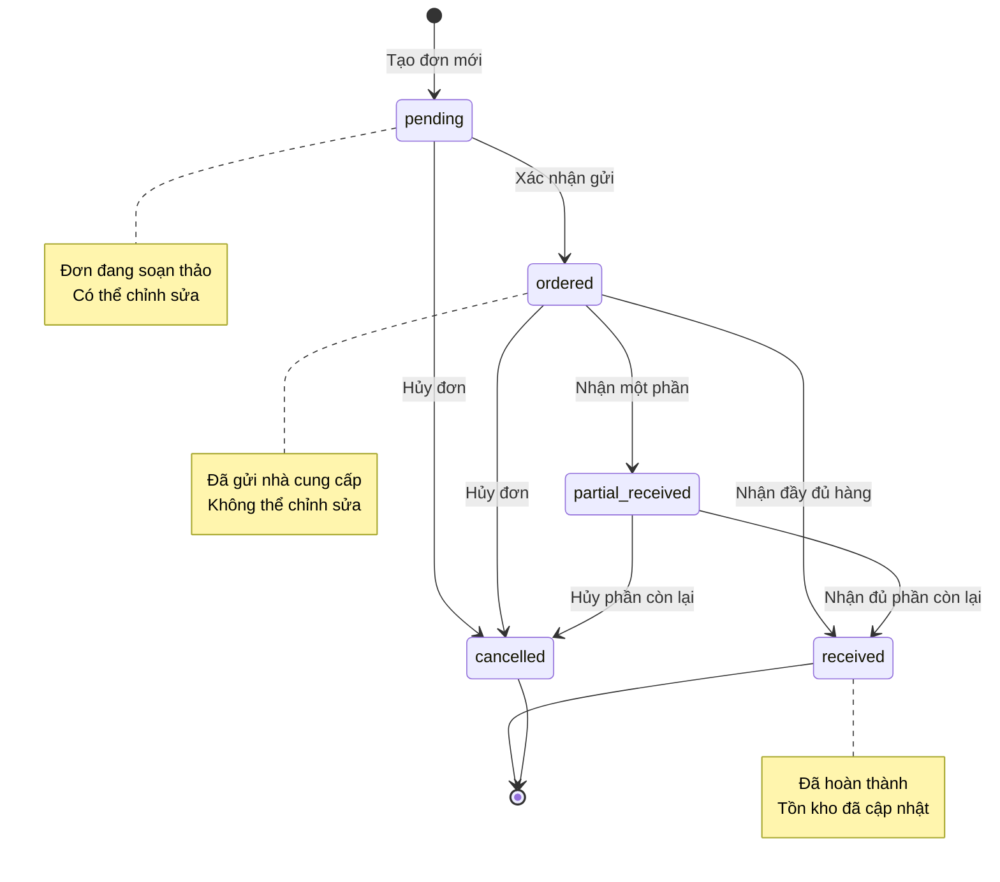

---

### 6.2 Trạng Thái Cảnh Báo Tồn Kho

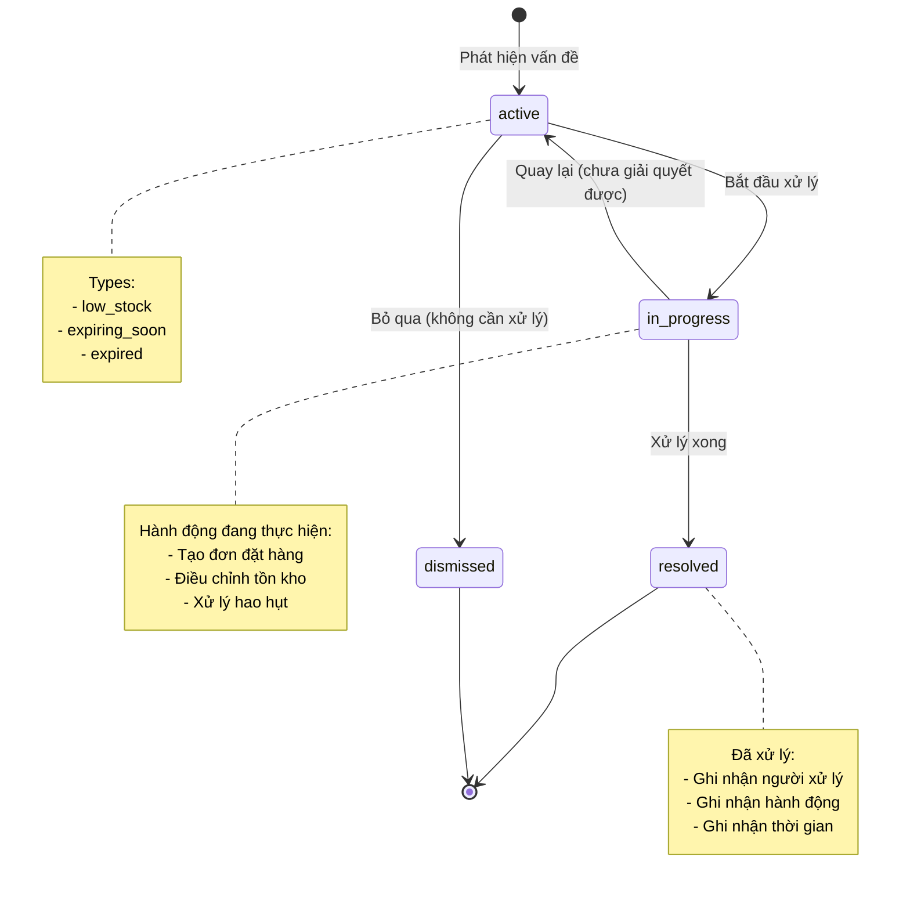

---

## 7. Sơ Đồ Hoạt Động (Activity Diagram)

### 7.1 Activity: Quản Lý Hạn Sử Dụng

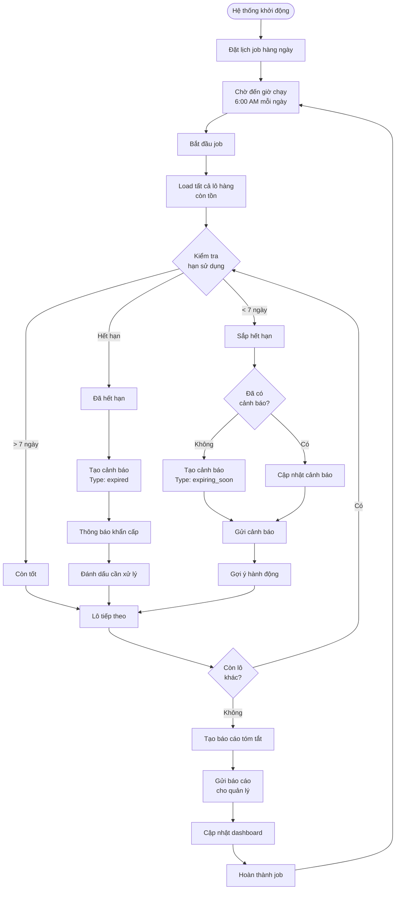

---

## 8. Sơ Đồ Triển Khai (Deployment Diagram)

### 8.1 Architecture Overview - Inventory Module

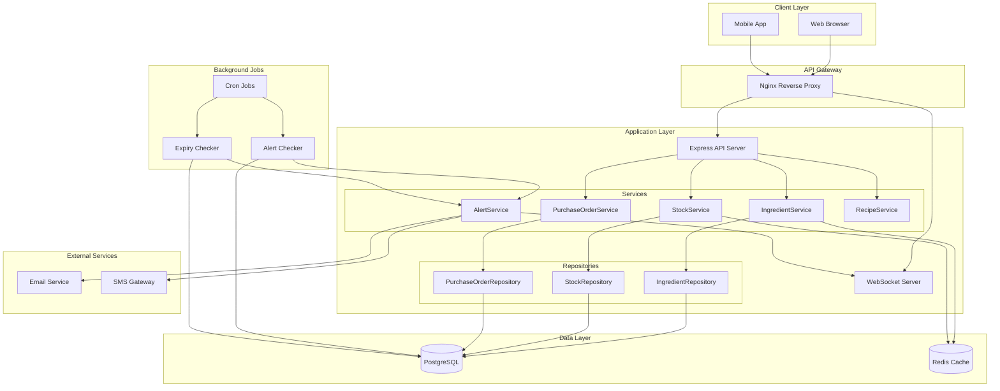

---

## 9. Sơ Đồ Luồng Dữ Liệu (Data Flow)

### 9.1 Data Flow: Từ Đặt Hàng Đến Cập Nhật Tồn Kho

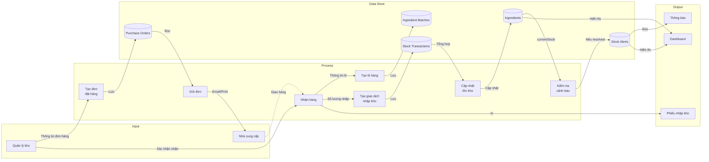

---

## 10. Biểu Đồ Thống Kê và Dashboard

### 10.1 Dashboard KPIs - Inventory Management

```
┌─────────────────────────────────────────────────────────────────┐
│                    INVENTORY DASHBOARD                          │
├─────────────────────────────────────────────────────────────────┤
│                                                                 │
│  📦 Tổng Giá Trị Tồn Kho          🔴 Cảnh Báo Cần Xử Lý       │
│     1,250,000,000 VNĐ                   12 cảnh báo           │
│                                                                 │
│  📊 Vòng Quay Kho                 ⏰ Hàng Sắp Hết Hạn         │
│     8.5 lần/năm                         5 lô hàng             │
│                                                                 │
├─────────────────────────────────────────────────────────────────┤
│                                                                 │
│  Top 5 Nguyên Liệu Giá Trị Cao:                               │
│  ┌──────────────────────────┬─────────────┬──────────────┐   │
│  │ Nguyên liệu              │ Tồn kho     │ Giá trị      │   │
│  ├──────────────────────────┼─────────────┼──────────────┤   │
│  │ 🥩 Thịt bò Úc           │ 250 kg      │ 75,000,000   │   │
│  │ 🦞 Tôm hùm              │ 50 kg       │ 45,000,000   │   │
│  │ 🐟 Cá hồi Na Uy         │ 80 kg       │ 32,000,000   │   │
│  │ 🧈 Bơ Pháp              │ 100 kg      │ 15,000,000   │   │
│  │ 🍄 Nấm truffle          │ 5 kg        │ 12,500,000   │   │
│  └──────────────────────────┴─────────────┴──────────────┘   │
│                                                                 │
│  Cảnh Báo Tồn Kho Thấp:                                       │
│  ┌──────────────────────────┬─────────────┬──────────────┐   │
│  │ Nguyên liệu              │ Hiện tại    │ Tối thiểu    │   │
│  ├──────────────────────────┼─────────────┼──────────────┤   │
│  │ 🌾 Gạo                   │ 20 kg       │ 50 kg        │   │
│  │ 🧅 Hành tây              │ 5 kg        │ 10 kg        │   │
│  │ 🥕 Cà rốt                │ 8 kg        │ 15 kg        │   │
│  │ 🧄 Tỏi                   │ 3 kg        │ 5 kg         │   │
│  │ 🫑 Ớt chuông             │ 4 kg        │ 8 kg         │   │
│  └──────────────────────────┴─────────────┴──────────────┘   │
│                                                                 │
├─────────────────────────────────────────────────────────────────┤
│                                                                 │
│  Biểu Đồ Nhập-Xuất-Tồn (30 ngày):                             │
│                                                                 │
│  Giá trị                                                        │
│  (triệu)                                                        │
│   150├─────────────────────────────────────────────          │
│      │         ╱╲                  ╱╲                          │
│   100├────────╱──╲────────────────╱──╲────────────          │
│      │       ╱    ╲              ╱    ╲                        │
│    50├──────╱──────╲────────────╱──────╲──────────          │
│      │     ╱        ╲          ╱        ╲                      │
│     0└─────────────────────────────────────────────          │
│       1    7    14    21    28   (ngày)                        │
│       ─── Nhập    ─── Xuất    ─── Tồn                         │
│                                                                 │
└─────────────────────────────────────────────────────────────────┘
```

---

## 11. Kết Luận

Các sơ đồ trong tài liệu này cung cấp cái nhìn trực quan về:

1. **Use Case Diagrams**: Ai làm gì trong hệ thống
2. **Business Process Flows**: Quy trình nghiệp vụ chi tiết
3. **Sequence Diagrams**: Tương tác giữa các thành phần
4. **ERD**: Cấu trúc dữ liệu và quan hệ
5. **State Diagrams**: Vòng đời của các đối tượng
6. **Activity Diagrams**: Luồng hoạt động tự động
7. **Deployment Diagrams**: Kiến trúc hệ thống
8. **Data Flow Diagrams**: Luồng dữ liệu

Các sơ đồ này giúp:
- ✅ Hiểu rõ quy trình nghiệp vụ
- ✅ Phát triển và bảo trì hệ thống dễ dàng
- ✅ Đào tạo nhân viên mới
- ✅ Trao đổi với stakeholders
- ✅ Tài liệu hóa kiến thức

---

**Lưu ý**: Các sơ đồ sử dụng cú pháp Mermaid, có thể render trực tiếp trên:
- GitHub
- GitLab
- Markdown editors hỗ trợ Mermaid
- VS Code với extension Mermaid
