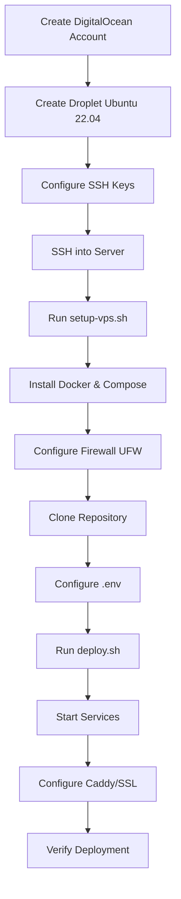
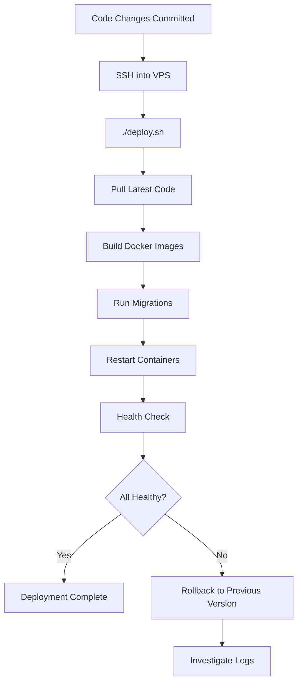

# Design: DigitalOcean Deployment Architecture

## Context

Dự án hiện tại đã có:
- ✅ Docker Compose configs cho development (`docker-compose.dev.yml`)
- ✅ Docker Compose configs cho production (`docker-compose.prod.yml`)
- ✅ Dockerfile multi-stage cho Backend (NestJS) và Frontend (Next.js)
- ✅ Deployment guide cho Vercel + Railway (PaaS approach)
- ⚠️ Mention DigitalOcean VPS nhưng thiếu detailed guide

**Problem**: Sinh viên muốn học infrastructure management và tiết kiệm chi phí, nhưng không có step-by-step Vietnamese guide để deploy lên DigitalOcean VPS.

**Stakeholders**: 
- Sinh viên làm đồ án (primary users)
- Instructors/advisors (review deployment setup)
- Future developers learning DevOps

**Constraints**:
- Budget: $6-10/month (student budget)
- Skill level: Junior developers, limited Linux experience
- Language: Documentation MUST be in Vietnamese
- Time: Should complete deployment in < 2 hours
- Infrastructure: Single VPS (no multi-server, no Kubernetes)

## Goals / Non-Goals

### Goals
1. **Complete Vietnamese guide** từ tạo account đến production deployment
2. **Automation scripts** để giảm manual steps và errors
3. **Security-first approach** với firewall, SSL, và best practices
4. **Cost-effective** setup trên $6/month Droplet
5. **Educational value** - hiểu infrastructure, không chỉ copy-paste
6. **Production-ready** - stable, monitored, backed up

### Non-Goals
1. ❌ Multi-server deployment hoặc load balancing
2. ❌ Kubernetes hoặc container orchestration platforms
3. ❌ Automated CI/CD pipelines (manual deployment is acceptable)
4. ❌ Advanced monitoring (Prometheus, Grafana, etc.)
5. ❌ CDN setup hoặc global distribution
6. ❌ Changing existing Docker Compose or Dockerfiles
7. ❌ Database replication hoặc clustering

## Architecture Overview

### Target Infrastructure

```
┌─────────────────────────────────────────────────┐
│   DigitalOcean Droplet ($6/month)              │
│   Ubuntu 22.04 LTS, 1GB RAM, 25GB SSD         │
├─────────────────────────────────────────────────┤
│                                                 │
│   ┌─────────────────────────────────────────┐  │
│   │  Caddy (Reverse Proxy + SSL)           │  │
│   │  - Auto HTTPS with Let's Encrypt       │  │
│   │  - Port 80/443                         │  │
│   └───────┬─────────────────────────────────┘  │
│           │                                     │
│   ┌───────▼──────────┐    ┌─────────────────┐ │
│   │ Next.js Frontend │    │ NestJS Backend  │ │
│   │ Port: 3000       │    │ Port: 5000      │ │
│   │ (Docker)         │    │ (Docker)        │ │
│   └──────────────────┘    └────┬────────────┘ │
│                                 │              │
│   ┌────────────────────────────┴──────────┐  │
│   │                                        │  │
│   │  ┌──────────────┐  ┌──────────────┐  │  │
│   │  │ PostgreSQL   │  │   Redis      │  │  │
│   │  │ Port: 5432   │  │ Port: 6379   │  │  │
│   │  │ (Docker)     │  │ (Docker)     │  │  │
│   │  └──────────────┘  └──────────────┘  │  │
│   │                                        │  │
│   └────────────────────────────────────────┘  │
│                                                 │
│   Docker Network: restaurant_network           │
│   Docker Volumes: postgres_data, redis_data,   │
│                   server_uploads                │
└─────────────────────────────────────────────────┘
```

### Component Stack

| Component | Technology | Purpose | Port |
|-----------|-----------|---------|------|
| **Reverse Proxy** | Caddy 2.x | SSL termination, routing | 80, 443 |
| **Frontend** | Next.js 16 (Docker) | User interface | 3000 (internal) |
| **Backend** | NestJS (Docker) | REST API, WebSocket | 5000 (internal) |
| **Database** | PostgreSQL 16 (Docker) | Primary data store | 5432 (internal) |
| **Cache** | Redis 7 (Docker) | Session, caching | 6379 (internal) |
| **Container Runtime** | Docker 24.x + Compose V2 | Container orchestration | - |

### Network Architecture

```
Internet
    │
    ▼
Firewall (UFW)
    │ Allow: 22 (SSH), 80 (HTTP), 443 (HTTPS)
    │ Deny: All other ports
    ▼
Caddy (Public Interface)
    │
    ├─► https://yourdomain.com → Next.js:3000
    │
    └─► https://yourdomain.com/api → NestJS:5000
         https://yourdomain.com/socket.io → NestJS:5000 (WebSocket)

Docker Network (Internal)
    restaurant_network (bridge)
        ├─ caddy → frontend, backend
        ├─ frontend → backend
        ├─ backend → postgres, redis
        └─ All containers communicate via service names
```

## Technical Decisions

### Decision 1: Caddy vs Nginx for Reverse Proxy

**Choice**: Caddy as primary (Nginx as alternative)

**Rationale**:
- ✅ **Automatic HTTPS**: Caddy auto-obtains và renews Let's Encrypt certificates (zero config)
- ✅ **Simplicity**: Caddyfile syntax dễ đọc hơn nginx.conf cho beginners
- ✅ **HTTP/2, HTTP/3**: Built-in support
- ✅ **Zero downtime reloads**: Caddy reload không interrupt connections
- ❌ **Less familiar**: Nginx phổ biến hơn, nhưng phức tạp cho students

**Alternative**: Nginx với certbot
- Provide as secondary option in docs
- More manual steps but more learning value về SSL certificates

**Mitigation**: Document both options clearly, recommend Caddy for quick start

### Decision 2: Docker Compose vs Manual Installation

**Choice**: Docker Compose

**Rationale**:
- ✅ **Consistency**: Identical environments across dev và production
- ✅ **Isolation**: Services không conflict với system packages
- ✅ **Easy rollback**: Version control infrastructure as code
- ✅ **Portability**: Có thể migrate sang VPS khác dễ dàng
- ✅ **Resource management**: Container limits prevent memory leaks crashing server
- ❌ **Overhead**: Docker adds ~200MB RAM overhead

**Alternatives considered**:
1. PM2 + systemd services: More lightweight nhưng complex setup
2. Kubernetes: Overkill cho single-server deployment
3. Docker Swarm: Unnecessary cho single-node

**Mitigation**: Optimize container resource limits, add swap memory

### Decision 3: Single Droplet vs Managed Databases

**Choice**: Single Droplet with containerized PostgreSQL/Redis

**Rationale**:
- ✅ **Cost**: $6/month all-in-one vs $15+ for managed DB
- ✅ **Learning**: Students học database management
- ✅ **Control**: Full access to database configs
- ❌ **Risk**: Single point of failure
- ❌ **Backups**: Manual backup setup required

**Mitigation**:
- Automated backup scripts (daily cron job)
- Backup retention policy (7 days local)
- Optional: Upload to DigitalOcean Spaces
- Document recovery procedures clearly

### Decision 4: Domain Name Requirement

**Choice**: Optional - Support both domain và IP-based deployment

**Rationale**:
- 🎯 **With domain** (recommended):
  - Proper SSL certificates
  - Professional setup
  - Better for portfolio/demo
  - Cost: ~$10/year (.com) or free (.tk, .ml - not recommended)
  
- 🎯 **Without domain** (fallback):
  - Use Droplet IP: `http://165.232.XXX.XXX:3000`
  - No SSL (development mode only)
  - Good for testing/learning
  - Free

**Decision**: Document both paths clearly, recommend cheap domain

### Decision 5: File Storage Strategy

**Choice**: Support local + cloud (R2/Cloudinary) hybrid

**Rationale**:
- **Development**: Local storage trong container
- **Production option 1**: Cloudflare R2 (recommended)
  - Cost-effective object storage
  - S3-compatible
  - Good for images/videos
- **Production option 2**: Local storage + backup
  - Files trong Docker volume
  - Included in backup script
  - Simple setup

**Implementation**:
```env
# Option A: Cloud storage
STORAGE_TYPE=r2
R2_ACCOUNT_ID=...
R2_BUCKET_NAME=...

# Option B: Local storage
STORAGE_TYPE=local
# Files stored in /app/uploads volume
```

### Decision 6: Deployment Strategy

**Choice**: Manual deployment with scripts (no automated CI/CD by default)

**Rationale**:
- ✅ **Learning value**: Students understand deployment steps
- ✅ **Simplicity**: No GitHub Actions setup required
- ✅ **Control**: Know exactly what's happening
- ⚠️ **Optional automation**: Provide GitHub Actions workflow as bonus

**Workflow**:
1. SSH into VPS
2. Run `./deploy.sh` script
3. Script pulls code, builds images, restarts services
4. Verify health checks

**Optional enhancement**: Add GitHub Actions workflow for automated deployment (documented separately)

## Security Architecture

### Multi-Layer Security

```
Layer 1: DigitalOcean Account
    ├─ 2FA enabled
    ├─ SSH keys only (no password login)
    └─ Firewall rules (DigitalOcean Cloud Firewall - optional)

Layer 2: Server (UFW Firewall)
    ├─ Allow: 22 (SSH), 80 (HTTP), 443 (HTTPS)
    ├─ Deny: All other inbound
    └─ Rate limiting on SSH (fail2ban - optional)

Layer 3: Application
    ├─ JWT authentication
    ├─ CORS configured (CLIENT_URL whitelist)
    ├─ Helmet.js security headers
    ├─ Rate limiting on API endpoints
    └─ Input validation (Zod)

Layer 4: Database
    ├─ No external exposure (Docker network only)
    ├─ Strong passwords
    └─ Regular backups

Layer 5: SSL/TLS
    ├─ HTTPS enforced
    ├─ Let's Encrypt certificates
    └─ HTTP → HTTPS redirect
```

### Security Checklist (in SECURITY_CHECKLIST.md)
- [ ] SSH key-based authentication (disable password)
- [ ] UFW firewall enabled và configured
- [ ] Strong passwords for PostgreSQL, Redis
- [ ] JWT secrets generated securely (32+ chars)
- [ ] CORS_ORIGIN set to specific domain (not *)
- [ ] Database ports not exposed publicly
- [ ] Regular security updates (`apt update && apt upgrade`)
- [ ] Backups encrypted and stored securely
- [ ] Fail2ban installed (optional but recommended)

## Resource Planning

### Droplet Sizing

**Minimum (Development/Testing)**:
- **Droplet**: $6/month - 1 GB RAM, 1 vCPU, 25 GB SSD
- **Services**: All containers with resource limits
- **Swap**: 1 GB swap memory configured
- **Suitable for**: Low traffic, demos, testing

**Recommended (Production)**:
- **Droplet**: $12/month - 2 GB RAM, 1 vCPU, 50 GB SSD
- **Better performance**: More headroom for traffic spikes
- **Suitable for**: Real usage, moderate traffic

**Resource Allocation**:
```yaml
services:
  postgres:
    mem_limit: 256M
    cpus: 0.5
  
  redis:
    mem_limit: 128M
    cpus: 0.25
  
  server:
    mem_limit: 384M
    cpus: 0.5
  
  client:
    mem_limit: 256M
    cpus: 0.5
  
  caddy:
    mem_limit: 128M
    cpus: 0.25
```

### Disk Space Management
- **PostgreSQL data**: ~100-500 MB (depending on usage)
- **Docker images**: ~1-2 GB
- **Logs**: ~100 MB (with rotation)
- **Backups**: ~50-100 MB per backup (7 days = 350-700 MB)
- **Uploads** (if local storage): Variable
- **Total usage**: ~4-5 GB out of 25 GB (safe margin)

## Deployment Workflow

### Initial Setup (One-time)



### Update Deployment (Recurring)



## Backup Strategy

### Automated Daily Backups

**Cron Job**: Run backup script daily at 3 AM Vietnam time
```cron
0 3 * * * /opt/restaurant-management/deploy/digitalocean/scripts/backup.sh
```

**Backup Script Actions**:
1. Create PostgreSQL dump with timestamp
2. Compress with gzip
3. Save to `/backups` directory
4. Rotate backups (keep 7 days, delete older)
5. Optional: Upload to DigitalOcean Spaces
6. Log backup status

**Backup Files**:
```
/backups/
├── db_backup_2024-11-25_030000.sql.gz
├── db_backup_2024-11-24_030000.sql.gz
├── db_backup_2024-11-23_030000.sql.gz
...
└── backup.log
```

### Recovery Procedure

**Restore from backup**:
```bash
./deploy/digitalocean/scripts/restore.sh /backups/db_backup_2024-11-25_030000.sql.gz
```

**Steps**:
1. Stop application containers
2. Drop and recreate database
3. Restore from backup file
4. Run migrations (if needed)
5. Restart containers
6. Verify data integrity

## Monitoring & Maintenance

### Health Checks

**Automated health monitoring** (optional cron job):
```bash
# Every 5 minutes
*/5 * * * * /opt/restaurant-management/deploy/digitalocean/scripts/health-check.sh
```

**Checks**:
- ✅ All Docker containers running
- ✅ Database connectivity
- ✅ Redis connectivity
- ✅ Frontend endpoint responds (200 OK)
- ✅ Backend API endpoint responds
- ✅ Disk space > 10% free
- ✅ Memory usage < 90%

**Notifications**: Log to file, optional email alerts

### Log Management

**Docker logs**:
```bash
# View logs
docker-compose logs -f [service]

# Limit log size
docker-compose.override.yml:
logging:
  driver: "json-file"
  options:
    max-size: "10m"
    max-file: "3"
```

**System logs**:
- `/var/log/syslog` - System events
- `/var/log/ufw.log` - Firewall logs
- `/var/log/auth.log` - SSH access logs

### Maintenance Tasks

**Weekly**:
- [ ] Review logs for errors
- [ ] Check disk space usage
- [ ] Verify backups completed successfully

**Monthly**:
- [ ] Update system packages: `apt update && apt upgrade`
- [ ] Review security updates
- [ ] Prune unused Docker images: `docker system prune -a`
- [ ] Review and rotate old backups

## Cost Optimization

### GitHub Education Pack
- **$200 DigitalOcean credit** for students
- Valid for 1 year
- Apply at: https://education.github.com

### Resource Optimization
1. **Right-size Droplet**: Start with $6, upgrade if needed
2. **Remove unused images**: `docker system prune` saves space
3. **Optimize builds**: Multi-stage Dockerfiles (already implemented)
4. **Use Docker BuildKit**: Faster builds, better caching
5. **Disable unnecessary services**: Only run what you need

### Cost Breakdown (Monthly)
| Item | Cost |
|------|------|
| Droplet (1GB) | $6.00 |
| Bandwidth (1TB included) | $0.00 |
| Backups (optional) | $1.20 |
| Domain (amortized) | ~$1.00 |
| **Total** | **$7-8** |

**Comparison**: Vercel + Railway ($0-5) vs DigitalOcean ($7-8)
- DigitalOcean: Full control, learning value
- Vercel + Railway: Easier setup, less management

## Migration Path

### From Development to Production

**Differences**:
| Aspect | Development | Production (DigitalOcean) |
|--------|-------------|--------------------------|
| **Domain** | localhost | yourdomain.com |
| **SSL** | No SSL | HTTPS required |
| **Storage** | Local files | R2 or Cloudinary (recommended) |
| **Secrets** | Simple values | Strong generated secrets |
| **Logs** | Console output | File-based with rotation |
| **Backups** | Manual/none | Automated daily |

**Migration checklist**:
- [ ] Generate production JWT secrets
- [ ] Configure production domain
- [ ] Setup SSL certificates
- [ ] Configure cloud storage (optional)
- [ ] Test all features on production
- [ ] Setup monitoring and backups

## Risks & Trade-offs

### Risks

| Risk | Likelihood | Impact | Mitigation |
|------|-----------|--------|------------|
| **Droplet failure** | Low | High | Daily backups, documented recovery |
| **Out of memory** | Medium | High | Resource limits, swap, monitoring |
| **Security breach** | Low | Critical | Firewall, security checklist, updates |
| **Disk full** | Medium | Medium | Log rotation, backup cleanup, alerts |
| **SSL expiry** | Very Low | Medium | Caddy auto-renews, monitoring |
| **Cost overrun** | Low | Low | Budget alerts, student credits |

### Trade-offs

**Single VPS Approach**:
- ✅ **Pro**: Cost-effective, simple, educational
- ❌ **Con**: Single point of failure, limited scalability
- **Acceptable for**: Student thesis, demos, learning projects

**Docker Overhead**:
- ✅ **Pro**: Consistency, isolation, portability
- ❌ **Con**: ~200MB RAM overhead, slightly slower than native
- **Acceptable for**: Benefits outweigh overhead on 1GB+ RAM

**Manual Deployment**:
- ✅ **Pro**: Learning value, control, simplicity
- ❌ **Con**: Slower than CI/CD, human error possible
- **Acceptable for**: Low-frequency deployments, educational context

## Open Questions

- [ ] **Q**: Should we include DigitalOcean Spaces setup for file storage?
  - **A**: Document as optional advanced feature, not required

- [ ] **Q**: Domain registrar recommendation for Vietnamese students?
  - **A**: Suggest affordable options: Namecheap, Cloudflare, Google Domains

- [ ] **Q**: Include email notification setup for monitoring alerts?
  - **A**: Optional advanced section, not in quick start

- [ ] **Q**: Docker Compose profile for development vs production?
  - **A**: Reuse existing dev/prod compose files, add override for VPS-specific

- [ ] **Q**: Firewall rules allow direct database access for remote management tools?
  - **A**: No - security first. Use SSH tunnel if needed (document in troubleshooting)

## Success Metrics

**Deployment Success**:
- ✅ All services running và healthy within 2 hours of starting
- ✅ HTTPS working with valid certificate
- ✅ Can create user, login, and perform core operations
- ✅ WebSocket real-time features working
- ✅ Database persists data after container restart
- ✅ Backups running successfully

**Documentation Success**:
- ✅ Student có thể follow guide without prior VPS experience
- ✅ Troubleshooting section covers 90% of common issues
- ✅ Vietnamese technical terms consistent và understandable
- ✅ Commands copy-pasteable và work without modification

**Educational Value**:
- ✅ Student hiểu infrastructure components
- ✅ Can explain security measures implemented
- ✅ Knows how to debug common deployment issues
- ✅ Confident to modify và maintain their deployment
