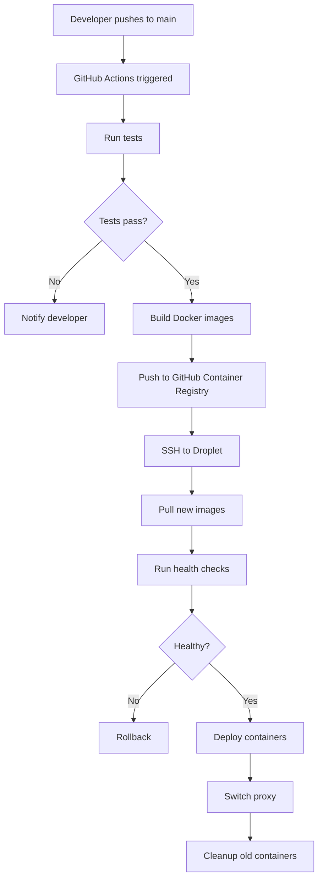

# Design: Digital Ocean Deployment Architecture

## Overview
This design document outlines the technical architecture for deploying the Restaurant Management System to Digital Ocean with student-budget optimization as a primary constraint. The solution balances cost, reliability, and simplicity suitable for a graduation thesis project.

## Architecture Decisions

### 1. Single Droplet vs. Multi-Droplet Architecture

**Decision**: Single Droplet (2GB RAM)

**Rationale**:
- **Cost**: Multi-droplet setup would cost $24-48/month vs. $12-14/month for single droplet
- **Complexity**: Single node is easier to manage for student project
- **Scale**: Adequate for thesis demonstration (10-50 concurrent users)
- **Resources**: Application stack (Next.js, Express, PostgreSQL, Redis) can run on 2GB RAM with optimization

**Trade-offs**:
- ✅ Low cost, simple management
- ❌ Single point of failure
- ❌ No horizontal scaling
- **Mitigation**: Implement comprehensive backup strategy and monitoring

### 2. Database: Container vs. Managed Database

**Decision**: PostgreSQL in Docker Container (with backup strategy)

**Rationale**:
- **Cost**: Container = $0 extra vs. Managed DB = $15/month
- **Data Volume**: Small dataset for graduation project
- **Backup**: Volume-based backups + automated dumps sufficient
- **Recovery**: Can restore from backups within 30 minutes (acceptable for student project)

**Trade-offs**:
- ✅ Zero additional cost
- ✅ Full control over configuration
- ❌ Manual backup management
- ❌ No automatic failover
- **Mitigation**: Automated backup scripts, tested restore procedures, documentation

**Alternative Path**: If presenting to external clients or running post-graduation, upgrade to Managed PostgreSQL ($15/month).

### 3. File Storage: Digital Ocean Spaces vs. Cloudinary

**Decision**: Cloudinary (existing integration)

**Rationale**:
- **Cost**: Cloudinary free tier (25GB storage, 25GB bandwidth) vs. DO Spaces $5/month (250GB)
- **Integration**: Already integrated in codebase
- **Features**: Image optimization, transformations included
- **CDN**: Global CDN included in free tier

**Trade-offs**:
- ✅ Zero cost
- ✅ Already implemented
- ✅ Image optimization built-in
- ❌ Vendor lock-in (minor concern for student project)

### 4. SSL/TLS: Let's Encrypt vs. Cloudflare

**Decision**: Cloudflare (Free Plan)

**Rationale**:
- **Cost**: Both free, but Cloudflare offers more features
- **Management**: Cloudflare automates certificate renewal
- **CDN**: Includes free CDN for static assets
- **DDoS**: Free DDoS protection
- **DNS**: Free DNS management
- **Simplicity**: No need to configure Certbot on server

**Implementation**:
```
User → Cloudflare (SSL termination, CDN) → Digital Ocean Droplet
```

**Trade-offs**:
- ✅ Free SSL + CDN + DDoS protection
- ✅ Simple configuration
- ✅ Better performance (cached static assets)
- ❌ Adds another service dependency (acceptable)

### 5. CI/CD: GitHub Actions vs. Jenkins

**Decision**: GitHub Actions

**Rationale**:
- **Cost**: Free for public repos, 2,000 minutes/month for private
- **Integration**: Native GitHub integration
- **Simplicity**: No server to maintain
- **Features**: Built-in secrets management
- **Learning**: Widely used in industry

**Trade-offs**:
- ✅ Zero cost
- ✅ Easy to configure
- ✅ No infrastructure to maintain
- ❌ Limited to GitHub ecosystem (acceptable)

### 6. Deployment Strategy: Blue-Green vs. Rolling Update

**Decision**: Simple Blue-Green with Docker Compose

**Rationale**:
- **Simplicity**: Easy to implement with Docker Compose
- **Rollback**: Instant rollback capability
- **Downtime**: Minimal downtime (5-10 seconds during switch)
- **Resources**: Both containers can run briefly on 2GB RAM

**Implementation Flow**:
1. Pull new Docker images
2. Start new containers (blue/green)
3. Health check new containers
4. Switch Nginx/Caddy proxy
5. Stop old containers
6. Cleanup old images

**Trade-offs**:
- ✅ Simple rollback
- ✅ Health check before switching
- ❌ Brief resource spike during deployment
- **Mitigation**: Deploy during low-traffic periods

### 7. Monitoring: Self-hosted vs. Cloud Service

**Decision**: Self-hosted (Winston logs + Docker stats)

**Rationale**:
- **Cost**: Free vs. $15-50/month for Datadog/New Relic
- **Needs**: Basic monitoring sufficient for student project
- **Logs**: Winston already implemented
- **Metrics**: Docker stats + Digital Ocean dashboard

**Components**:
- Winston logs with file rotation
- Docker container stats
- Digital Ocean monitoring dashboard
- Custom health check endpoints
- Email alerts via Digital Ocean

**Trade-offs**:
- ✅ Zero cost
- ✅ Sufficient for graduation project
- ❌ No fancy dashboards
- ❌ Manual log analysis

### 8. Reverse Proxy: Nginx vs. Caddy vs. Traefik

**Decision**: Caddy (or simplified Nginx)

**Rationale**:
- **Caddy**: Automatic HTTPS, simple configuration, modern
- **Nginx**: More common, well-documented, proven
- **For this project**: Caddy recommended for simplicity since we use Cloudflare SSL

**Configuration**: Use Caddy as a simple reverse proxy to route:
- `/` → Next.js frontend (port 3000)
- `/api` → Express backend (port 5000)
- WebSocket support for Socket.io

**Trade-offs**:
- Caddy: ✅ Simpler config, ❌ less common
- Nginx: ✅ Well-known, ❌ more config

## System Architecture

### Component Diagram

```
┌─────────────────────────────────────────────────────────────┐
│                        CLOUDFLARE                            │
│  (SSL Termination, CDN, DDoS Protection, DNS)                │
└─────────────────┬───────────────────────────────────────────┘
                  │ HTTPS
                  ▼
┌─────────────────────────────────────────────────────────────┐
│               DIGITAL OCEAN DROPLET (2GB RAM)                │
│                                                               │
│  ┌────────────────────────────────────────────────────────┐ │
│  │                  CADDY/NGINX                            │ │
│  │              (Reverse Proxy)                            │ │
│  └────────┬──────────────────────┬────────────────────────┘ │
│           │                      │                           │
│  ┌────────▼────────┐    ┌───────▼──────────┐               │
│  │  Next.js Client │    │  Express Server  │               │
│  │   (Port 3000)   │    │   (Port 5000)    │               │
│  │                 │    │                  │               │
│  │  - React 19     │    │  - REST API      │               │
│  │  - SSR/SSG      │    │  - Socket.io     │               │
│  │  - i18n         │    │  - JWT Auth      │               │
│  └─────────────────┘    └────────┬─────────┘               │
│                                   │                          │
│         ┌─────────────────────────┼─────────────┐           │
│         │                         │             │           │
│  ┌──────▼──────┐         ┌────────▼────┐  ┌────▼─────┐    │
│  │ PostgreSQL  │         │    Redis    │  │ Uploads  │    │
│  │  (Port 5432)│         │ (Port 6379) │  │  Volume  │    │
│  │             │         │             │  │          │    │
│  │  - Prisma   │         │  - Cache    │  │  - Logs  │    │
│  │  - Backup   │         │  - Session  │  │  - Data  │    │
│  └─────────────┘         └─────────────┘  └──────────┘    │
│                                                             │
└─────────────────────────────────────────────────────────────┘
         │
         │ (Images/Videos only)
         ▼
┌──────────────────┐
│   CLOUDINARY     │
│   (Free Tier)    │
│  - Image Storage │
│  - CDN           │
│  - Transform     │
└──────────────────┘
```

### Resource Allocation (2GB RAM Droplet)

```
Total RAM: 2GB (2048MB)

Allocation:
- System/OS:          512MB  (25%)
- PostgreSQL:         512MB  (25%)
- Redis:              128MB  (6%)
- Express (Node.js):  384MB  (19%)
- Next.js (Node.js):  384MB  (19%)
- Caddy/Nginx:        64MB   (3%)
- Buffer/Cache:       64MB   (3%)
                    --------
                    2048MB  (100%)
```

### Network Flow

1. **User Request** → Cloudflare (SSL, DDoS protection)
2. **Cloudflare** → Digital Ocean Droplet (IP: xxx.xxx.xxx.xxx)
3. **Caddy** → Routes to Next.js (/) or Express (/api)
4. **Express** → PostgreSQL (queries) / Redis (cache, sessions)
5. **Express** → Cloudinary (file uploads)
6. **Socket.io** → WebSocket connection (kitchen orders, real-time)

## Deployment Flow

### Initial Deployment



### Blue-Green Deployment

```bash
# Current (GREEN) environment running
docker-compose -f docker-compose.prod.yml up -d --scale client=1 --scale server=1

# Deploy new (BLUE) environment
docker-compose -f docker-compose.blue.yml pull
docker-compose -f docker-compose.blue.yml up -d

# Health check BLUE
curl http://localhost:3001/health

# Switch Caddy/Nginx to BLUE
# Update proxy config: port 3000 -> 3001, 5000 -> 5001
caddy reload --config /etc/caddy/Caddyfile

# Stop GREEN
docker-compose -f docker-compose.prod.yml down

# Rename BLUE to GREEN for next deployment
mv docker-compose.blue.yml docker-compose.prod.yml
```

## Security Architecture

### Firewall Rules (UFW)

```bash
# Allow only necessary ports
ufw default deny incoming
ufw default allow outgoing

ufw allow 22/tcp      # SSH (limit to your IP if possible)
ufw allow 80/tcp      # HTTP (Cloudflare)
ufw allow 443/tcp     # HTTPS (Cloudflare)

ufw enable
```

### Environment Secrets

```bash
# Stored in GitHub Secrets (for CI/CD)
- DROPLET_SSH_KEY
- JWT_SECRET
- POSTGRES_PASSWORD
- CLOUDINARY_API_SECRET

# On Droplet: /opt/restaurant/.env (protected)
chmod 600 /opt/restaurant/.env
chown deploy:deploy /opt/restaurant/.env
```

### Database Security

- PostgreSQL not exposed to internet (internal Docker network only)
- Strong password (32+ characters)
- Regular backups encrypted
- Connection via internal Docker network only

## Backup Strategy

### Database Backups

**Automated Daily Backups**:
```bash
#!/bin/bash
# /opt/restaurant/scripts/backup-db.sh

DATE=$(date +%Y%m%d_%H%M%S)
BACKUP_DIR="/mnt/volume/backups/postgres"

# Create backup
docker exec restaurant_postgres pg_dump -U $POSTGRES_USER $POSTGRES_DB | \
  gzip > $BACKUP_DIR/backup_$DATE.sql.gz

# Keep last 14 days
find $BACKUP_DIR -name "backup_*.sql.gz" -mtime +14 -delete

# Optional: Upload to external storage
# rclone copy $BACKUP_DIR/backup_$DATE.sql.gz remote:backups/
```

**Cron Schedule**:
```cron
# Run daily at 2 AM
0 2 * * * /opt/restaurant/scripts/backup-db.sh
```

### Volume Snapshots

- Weekly Digital Ocean Volume snapshots ($0.05/GB/month)
- Keep last 4 weekly snapshots
- Manual snapshot before major deployments

### Disaster Recovery

**RTO (Recovery Time Objective)**: 30 minutes
**RPO (Recovery Point Objective)**: 24 hours (daily backups)

**Recovery Steps**:
1. Create new droplet from snapshot (5 min)
2. Attach volume (2 min)
3. Restore database from backup (10 min)
4. Update DNS/Cloudflare (5 min)
5. Verify application (8 min)

## Monitoring & Alerting

### Health Checks

```typescript
// Backend: /health endpoint
app.get('/health', (req, res) => {
  const health = {
    uptime: process.uptime(),
    timestamp: Date.now(),
    status: 'healthy',
    services: {
      database: 'healthy',  // Check Prisma connection
      redis: 'healthy',     // Check Redis ping
    }
  };
  res.json(health);
});
```

### Log Management

```javascript
// Winston configuration
const logger = winston.createLogger({
  level: 'info',
  format: winston.format.json(),
  transports: [
    new winston.transports.File({ 
      filename: 'error.log', 
      level: 'error',
      maxsize: 10485760, // 10MB
      maxFiles: 5
    }),
    new winston.transports.File({ 
      filename: 'combined.log',
      maxsize: 10485760,
      maxFiles: 3
    })
  ]
});
```

### Alerts

**Digital Ocean Monitoring Alerts**:
- CPU > 80% for 10 minutes
- Memory > 90% for 5 minutes
- Disk > 85% full
- HTTP 5xx errors > 10/minute

**Email notifications to student email**

## Cost Optimization Techniques

### 1. Resource Optimization
- Enable gzip compression
- Optimize Docker images (multi-stage builds)
- Use Alpine Linux base images
- Implement Redis caching aggressively
- Database query optimization
- Connection pooling

### 2. Digital Ocean Credits
- Apply for GitHub Student Developer Pack ($200 credit)
- Referral credits
- Participate in Digital Ocean community for credits

### 3. Efficient Asset Delivery
- Use Cloudflare CDN for all static assets
- Implement browser caching headers
- Optimize images via Cloudinary transformations
- Lazy load images on frontend

### 4. Automated Scaling Down
```bash
# Stop non-critical services during low usage (optional)
# Not recommended for thesis demo period
```

### 5. Reserved IP
- Only get Reserved IP ($4/month) if needed for stable domain
- Alternative: Use Cloudflare DDNS to track droplet IP changes

## Technology Stack Summary

| Component | Technology | Cost | Rationale |
|-----------|-----------|------|-----------|
| Compute | Digital Ocean Droplet 2GB | $12/mo | Best price/performance for student |
| Storage | Digital Ocean Volume 25GB | $2.50/mo | Persistent, safe storage |
| Database | PostgreSQL 16 (Docker) | $0 | Included in droplet |
| Cache | Redis 7 (Docker) | $0 | Included in droplet |
| SSL/CDN | Cloudflare Free | $0 | Best free SSL + CDN |
| File Storage | Cloudinary Free | $0 | Already integrated |
| CI/CD | GitHub Actions | $0 | Free for public repos |
| Monitoring | Winston + DO Dashboard | $0 | Sufficient for project |
| Proxy | Caddy 2 | $0 | Open source |
| **TOTAL** | | **~$15/mo** | **With student credit: FREE for 13 months** |

## Performance Targets

| Metric | Target | Rationale |
|--------|--------|-----------|
| Response Time (API) | < 500ms | Acceptable for demo |
| Page Load Time | < 3s | Good UX for thesis presentation |
| Concurrent Users | 20-50 | Adequate for graduation demo |
| Uptime | > 99% | Reliable during evaluation period |
| Database Queries | < 200ms | Optimized with indexing |
| WebSocket Latency | < 100ms | Real-time order updates |

## Scaling Path (Post-Graduation)

If the project continues beyond graduation:

**Phase 1: Vertical Scaling** ($24/month)
- Upgrade to 4GB RAM droplet

**Phase 2: Managed Services** (+$15/month)
- Move to Managed PostgreSQL

**Phase 3: Horizontal Scaling** ($48+/month)
- Separate droplets for frontend/backend
- Load balancer
- Database read replicas

## Trade-offs Summary

| Decision | Cost Saving | Trade-off Accepted |
|----------|-------------|-------------------|
| Single droplet | $12-24/mo | Single point of failure |
| Container database | $15/mo | Manual backup management |
| Cloudinary vs Spaces | $5/mo | Vendor lock-in |
| Self-hosted monitoring | $30/mo | Basic monitoring only |
| No managed Kubernetes | $50+/mo | Manual scaling |
| **Total Savings** | **~$100/mo** | **Acceptable for student project** |

## Conclusion

This architecture provides a production-grade deployment suitable for a graduation thesis while maintaining costs under $20/month (or free with student credits). The design prioritizes:

1. **Cost Efficiency**: Leveraging free tiers and single-node deployment
2. **Reliability**: Backup strategies and health monitoring
3. **Simplicity**: Easy to understand and manage for a student
4. **Professionalism**: Suitable for thesis presentation and evaluation
5. **Scalability Path**: Can upgrade components as needed post-graduation

The technical decisions balance academic requirements with real-world cloud deployment practices, providing valuable learning while maintaining budget constraints.
