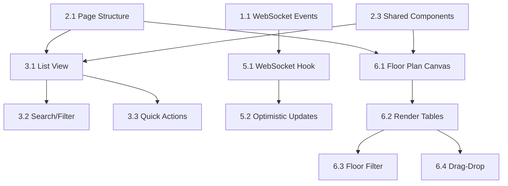

# Implementation Tasks: Table Management

## Phase 1: Core Features (Week 1-2)

### Backend Enhancements
- [ ] **Task 1.1**: Add WebSocket events for table status changes
  - [ ] Create `table:status_changed` event emitter
  - [ ] Create `table:created` event emitter
  - [ ] Create `table:updated` event emitter
  - [ ] Create `table:deleted` event emitter
  - [ ] Add event listeners in socket handler
  - [ ] Test event broadcasting to all connected clients
  - **Validation**: WebSocket events emit within 100ms of database changes

- [ ] **Task 1.2**: Enhance table API endpoints
  - [ ] Add `GET /tables/stats` endpoint for dashboard statistics
  - [ ] Add validation for table status transitions
  - [ ] Add optimistic locking for concurrent updates
  - [ ] Add bulk update endpoint `PATCH /tables/bulk`
  - **Validation**: All endpoints return correct HTTP status codes and error messages

### Frontend Setup
- [ ] **Task 2.1**: Create table page structure
  - [ ] Create `app/client/src/app/(dashboard)/tables/page.tsx`
  - [ ] Create `app/client/src/app/(dashboard)/tables/layout.tsx`
  - [ ] Add route metadata and SEO tags
  - [ ] Implement loading and error states
  - **Validation**: Page renders at `/tables` route without errors

- [ ] **Task 2.2**: Set up Zustand store for table state
  - [ ] Extend `tableStore.ts` with full CRUD actions
  - [ ] Add real-time sync actions (WebSocket integration)
  - [ ] Add optimistic UI update logic
  - [ ] Add error handling and rollback logic
  - **Validation**: Store updates trigger component re-renders correctly

- [ ] **Task 2.3**: Create shared table components
  - [ ] Create `TableStatusBadge` component
  - [ ] Create `TableCard` component (for floor plan)
  - [ ] Create `TableRowActions` component (for list view)
  - [ ] Create `FloorSelector` component
  - **Validation**: Components render with correct styling and props

### List View Implementation
- [ ] **Task 3.1**: Build table list/grid view
  - [ ] Create data table with sortable columns
  - [ ] Implement column headers (Number, Name, Capacity, Floor, Section, Status, QR Code, Actions)
  - [ ] Add row selection (single/multi)
  - [ ] Add pagination controls
  - [ ] Add empty state illustration
  - **Validation**: List displays all tables with correct data

- [ ] **Task 3.2**: Implement search and filtering
  - [ ] Add search input (by table number/name)
  - [ ] Add status filter dropdown (all, available, occupied, reserved, maintenance)
  - [ ] Add floor filter
  - [ ] Add section filter
  - [ ] Add active/inactive toggle
  - [ ] Implement debounced search (300ms)
  - **Validation**: Filters update results correctly, URL params sync with filters

- [ ] **Task 3.3**: Add quick actions menu
  - [ ] Add "Edit" action button
  - [ ] Add "Change Status" dropdown
  - [ ] Add "View QR Code" action
  - [ ] Add "Delete" action with confirmation
  - [ ] Add "Assign to Order" action
  - **Validation**: All actions trigger correct API calls and UI updates

### Table Forms
- [ ] **Task 4.1**: Create table creation dialog
  - [ ] Build modal/dialog component with React Hook Form
  - [ ] Add form fields: tableNumber (required), tableName (optional), capacity (required), minCapacity, floor, section
  - [ ] Implement Zod validation schema
  - [ ] Add client-side validation with error messages
  - [ ] Add submit handler with loading state
  - [ ] Show success/error toast notifications
  - **Validation**: Form validates all fields, shows errors, submits successfully

- [ ] **Task 4.2**: Create table edit dialog
  - [ ] Pre-populate form with existing table data
  - [ ] Allow editing all fields except tableId
  - [ ] Add "Save" and "Cancel" buttons
  - [ ] Implement optimistic UI updates
  - **Validation**: Edits persist correctly, optimistic updates rollback on error

- [ ] **Task 4.3**: Implement status change dialog
  - [ ] Create status selection dropdown with icons
  - [ ] Add transition validation (e.g., can't go from maintenance to occupied directly)
  - [ ] Add confirmation for destructive changes
  - [ ] Add optional notes field
  - **Validation**: Invalid transitions show warning, valid transitions update immediately

### Real-time Updates
- [ ] **Task 5.1**: Set up WebSocket connection for tables
  - [ ] Create `useTableSocket` hook
  - [ ] Connect to Socket.io server on component mount
  - [ ] Subscribe to table events (`table:status_changed`, etc.)
  - [ ] Update Zustand store on event receipt
  - [ ] Handle connection/disconnection events
  - [ ] Implement auto-reconnect logic (exponential backoff)
  - **Validation**: Status changes from other clients reflect within 500ms

- [ ] **Task 5.2**: Add optimistic UI updates
  - [ ] Update local state immediately on user action
  - [ ] Show loading indicator on affected table
  - [ ] Rollback changes if server returns error
  - [ ] Show conflict resolution dialog if needed
  - **Validation**: UI feels instant, errors handled gracefully

## Phase 2: Floor Plan & Enhanced Features (Week 3)

### Floor Plan View
- [ ] **Task 6.1**: Create floor plan canvas
  - [ ] Build canvas component with responsive sizing
  - [ ] Implement zoom controls (+, -, reset)
  - [ ] Add pan/drag canvas functionality (mouse + touch)
  - [ ] Add grid overlay (optional toggle)
  - [ ] Add minimap for navigation (optional)
  - **Validation**: Canvas scales and pans smoothly on all devices

- [ ] **Task 6.2**: Render table cards on canvas
  - [ ] Position tables in grid layout (if no coordinates stored)
  - [ ] Render TableCard components with status colors
  - [ ] Add hover effects and tooltips
  - [ ] Show occupancy indicator (e.g., "3/4 seats occupied")
  - [ ] Add click handler to open table details
  - **Validation**: All tables visible and interactive

- [ ] **Task 6.3**: Implement floor/section filtering
  - [ ] Add floor selector dropdown in toolbar
  - [ ] Add section filter chips
  - [ ] Filter tables displayed on canvas
  - [ ] Update table count indicator
  - **Validation**: Filters update canvas instantly

- [ ] **Task 6.4**: Add drag-and-drop positioning (optional)
  - [ ] Make table cards draggable
  - [ ] Show drop zones on canvas
  - [ ] Save positions to backend (requires schema update)
  - [ ] Add "Save Layout" button
  - [ ] Add "Reset to Default" button
  - **Validation**: Positions persist after page reload

### QR Code Management
- [ ] **Task 7.1**: Implement QR code generation
  - [ ] Install `qrcode` library
  - [ ] Create QR code generation utility
  - [ ] Generate unique codes for each table (format: `TABLE-{tableNumber}`)
  - [ ] Add "Generate QR" button in table form
  - [ ] Auto-generate on table creation (optional)
  - **Validation**: QR codes scan correctly to table URL

- [ ] **Task 7.2**: Create QR code display dialog
  - [ ] Build modal showing QR code image
  - [ ] Add download button (PNG format)
  - [ ] Add print button
  - [ ] Show table details alongside QR code
  - **Validation**: QR codes download as 300x300px PNG files

- [ ] **Task 7.3**: Bulk QR code generation
  - [ ] Add "Generate All QR Codes" action
  - [ ] Create ZIP download with all QR codes
  - [ ] Add progress indicator for bulk generation
  - **Validation**: ZIP file contains correct QR codes for all active tables

### Bulk Operations
- [ ] **Task 8.1**: Implement bulk selection
  - [ ] Add "Select All" checkbox in table header
  - [ ] Add individual row checkboxes
  - [ ] Show selection count in toolbar
  - [ ] Add "Clear Selection" button
  - **Validation**: Selection state syncs correctly across pages

- [ ] **Task 8.2**: Add bulk actions menu
  - [ ] Add "Bulk Change Status" action
  - [ ] Add "Bulk Delete" action with confirmation
  - [ ] Add "Bulk Export" action (CSV/JSON)
  - [ ] Add "Bulk Activate/Deactivate" action
  - [ ] Show progress indicator for bulk operations
  - **Validation**: Bulk actions complete successfully, show error summary if any fail

### Advanced Features
- [ ] **Task 9.1**: Add table statistics dashboard
  - [ ] Create stats cards (total tables, available, occupied, reserved, maintenance)
  - [ ] Add charts (occupancy rate over time, floor distribution)
  - [ ] Add average table turnover time metric
  - **Validation**: Stats update in real-time

- [ ] **Task 9.2**: Implement table history/audit log
  - [ ] Create history table in database (or use existing audit log)
  - [ ] Show status change history in table details
  - [ ] Show who made changes and when
  - **Validation**: History displays chronologically with user info

- [ ] **Task 9.3**: Add keyboard shortcuts
  - [ ] Implement shortcuts: `Ctrl+N` (new table), `/` (focus search), `Esc` (close dialogs)
  - [ ] Show shortcut hints in tooltips
  - [ ] Add keyboard shortcut help modal (`?` key)
  - **Validation**: All shortcuts work correctly

## Phase 3: Polish & Testing (Week 4-5)

### UI/UX Polish
- [ ] **Task 10.1**: Responsive design implementation
  - [ ] Test on mobile (320px-767px)
  - [ ] Test on tablet (768px-1023px)
  - [ ] Test on desktop (1024px+)
  - [ ] Adjust layouts for each breakpoint
  - [ ] Optimize touch interactions for mobile
  - **Validation**: All features work on all screen sizes

- [ ] **Task 10.2**: Accessibility improvements
  - [ ] Add ARIA labels to all interactive elements
  - [ ] Ensure keyboard navigation works (Tab, Enter, Escape)
  - [ ] Test with screen readers
  - [ ] Add focus indicators
  - [ ] Ensure color contrast meets WCAG AA standards
  - **Validation**: Lighthouse accessibility score > 95

- [ ] **Task 10.3**: Loading states and animations
  - [ ] Add skeleton loaders for initial load
  - [ ] Add smooth transitions for status changes
  - [ ] Add micro-animations for user actions
  - [ ] Optimize animation performance (use CSS transforms)
  - **Validation**: Animations run at 60fps

### Testing
- [ ] **Task 11.1**: Unit tests
  - [ ] Test table components (render, props, events)
  - [ ] Test Zustand store actions and selectors
  - [ ] Test form validation logic
  - [ ] Test utility functions (QR generation, etc.)
  - **Validation**: 80%+ code coverage

- [ ] **Task 11.2**: Integration tests
  - [ ] Test table CRUD flow end-to-end
  - [ ] Test WebSocket event handling
  - [ ] Test status change workflows
  - [ ] Test bulk operations
  - **Validation**: All critical paths covered

- [ ] **Task 11.3**: Performance testing
  - [ ] Load test with 200+ tables
  - [ ] Test WebSocket with 50+ concurrent connections
  - [ ] Measure initial page load time (< 2s)
  - [ ] Optimize bundle size
  - **Validation**: No performance degradation with max expected load

### Documentation
- [ ] **Task 12.1**: Update user documentation
  - [ ] Write table management user guide
  - [ ] Create video tutorial (optional)
  - [ ] Update FAQ section
  - **Validation**: Documentation covers all features

- [ ] **Task 12.2**: Update developer documentation
  - [ ] Document component API and props
  - [ ] Document WebSocket event schema
  - [ ] Update API documentation
  - **Validation**: New developers can understand codebase

## Validation Checklist

### Functional Requirements
- [ ] Users can view all tables in list and floor plan views
- [ ] Users can create new tables with validation
- [ ] Users can edit existing table details
- [ ] Users can delete tables (with confirmation)
- [ ] Users can change table status
- [ ] Status changes reflect in real-time for all users
- [ ] Users can filter tables by status, floor, section
- [ ] Users can search tables by number or name
- [ ] Users can generate QR codes for tables
- [ ] Users can perform bulk operations

### Non-Functional Requirements
- [ ] Page loads in < 2 seconds
- [ ] WebSocket updates arrive in < 500ms
- [ ] UI is responsive on all devices
- [ ] Accessibility score > 95
- [ ] No console errors or warnings
- [ ] Works in Chrome, Firefox, Safari, Edge (latest versions)

### Business Requirements
- [ ] Supports 50-200 tables per restaurant
- [ ] Handles 100+ concurrent users
- [ ] Zero data loss during status transitions
- [ ] 95%+ WebSocket uptime
- [ ] Staff can complete operations in < 30 seconds

## Dependencies Between Tasks

## Notes
- Tasks can be parallelized where no dependencies exist
- Phase 1 tasks are highest priority for MVP
- Phase 2 tasks add significant user value
- Phase 3 ensures production readiness
- Each task should be completed and validated before marking as done
