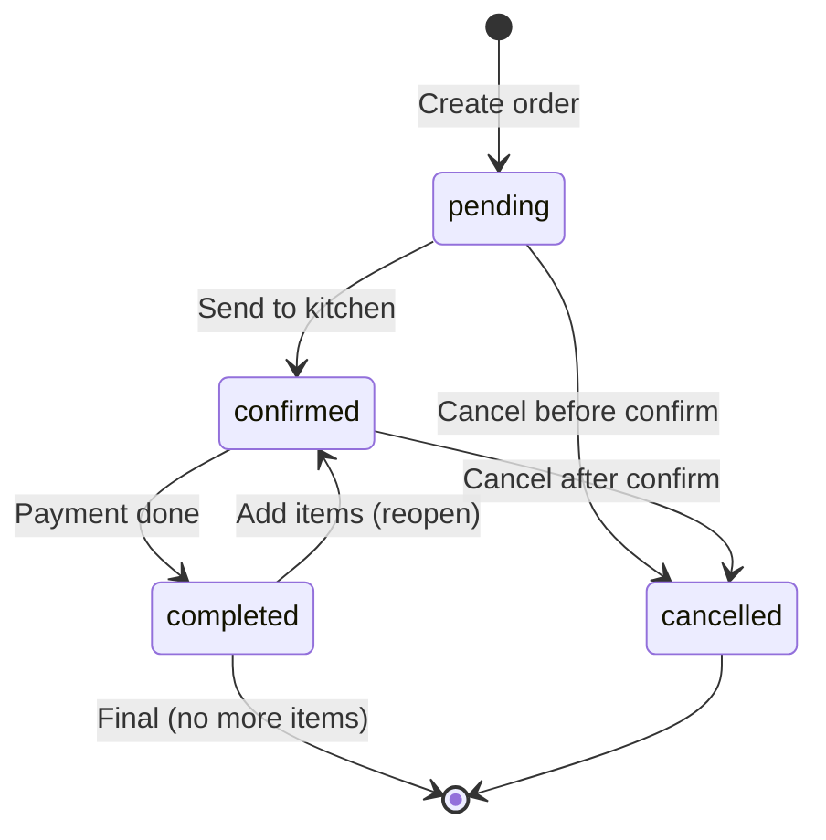
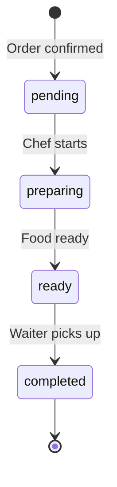

# Technical Design: Status Enum Simplification

## Context

Hệ thống quản lý nhà hàng hiện tại có 3 bộ status enum riêng biệt cho Order, OrderItem, và KitchenOrder, tổng cộng 18 trạng thái. Điều này gây ra:
- Sự trùng lặp về mặt nghiệp vụ
- Khó đồng bộ giữa các module
- Logic phức tạp không cần thiết
- Frontend phải xử lý quá nhiều UI states

## Goals

✅ **Goals:**
- Giảm số lượng status từ 18 xuống 11 (reduction ~39%)
- Loại bỏ trùng lặp giữa OrderStatus và KitchenOrderStatus
- Đơn giản hóa luồng chuyển trạng thái
- Giữ nguyên tính năng nghiệp vụ
- Đảm bảo tương thích ngược cho data hiện có

❌ **Non-Goals:**
- Thay đổi quy trình nghiệp vụ cốt lõi
- Thêm tính năng mới
- Thay đổi UI/UX (chỉ đơn giản hóa)

## Decisions

### Decision 1: Tách biệt trách nhiệm giữa Order và Kitchen

**What:** OrderStatus quản lý trạng thái tổng thể, KitchenOrderStatus quản lý chi tiết bếp

**Why:** 
- Order là view của nhân viên phục vụ và khách hàng
- KitchenOrder là view của đầu bếp
- Tách biệt giúp mỗi module tập trung vào trách nhiệm riêng

**How:**
```
OrderStatus:
- pending: Đơn mới tạo
- confirmed: Đã gửi bếp (bất kể bếp đang làm gì)
- completed: Đã thanh toán xong
- cancelled: Đã hủy

KitchenOrderStatus:
- pending: Chờ đầu bếp
- preparing: Đang nấu
- ready: Sẵn sàng lấy
- completed: Đã lấy
```

### Decision 2: Bỏ "cancelled" trong KitchenOrderStatus

**What:** Khi Order bị hủy, xóa luôn KitchenOrder thay vì set status = cancelled

**Why:**
- Đơn giản hơn: Không cần maintain trạng thái cancelled
- KitchenOrder là temporary data cho việc nấu
- Khi đơn hủy, không cần keep KitchenOrder trong DB

**Alternatives considered:**
- ❌ Giữ cancelled status: Phức tạp, dư thừa
- ✅ Cascade delete: Đơn giản, clear data

### Decision 3: Đơn giản hóa OrderItemStatus

**What:** Chỉ giữ 3 trạng thái: pending, ready, cancelled

**Why:**
- OrderItem status phụ thuộc vào KitchenOrder
- Không cần duplicate "preparing" vì có KitchenOrderStatus
- "served" không cần thiết vì khi KitchenOrder completed là đã phục vụ

### Decision 4: Migration Strategy

**What:** 3-phase migration

**Phase 1: Database Schema**
```sql
-- Add new enum types
CREATE TYPE new_order_status AS ENUM ('pending', 'confirmed', 'completed', 'cancelled');
CREATE TYPE new_kitchen_order_status AS ENUM ('pending', 'preparing', 'ready', 'completed');
CREATE TYPE new_order_item_status AS ENUM ('pending', 'ready', 'cancelled');

-- Migrate data with mapping
UPDATE orders SET new_status = CASE
    WHEN status = 'pending' THEN 'pending'::new_order_status
    WHEN status IN ('confirmed', 'preparing', 'ready', 'serving') THEN 'confirmed'::new_order_status
    WHEN status = 'completed' THEN 'completed'::new_order_status
    WHEN status = 'cancelled' THEN 'cancelled'::new_order_status
END;

UPDATE kitchen_orders SET new_status = CASE
    WHEN status IN ('pending', 'confirmed') THEN 'pending'::new_kitchen_order_status
    WHEN status IN ('preparing', 'almost_ready') THEN 'preparing'::new_kitchen_order_status
    WHEN status = 'ready' THEN 'ready'::new_kitchen_order_status
    WHEN status = 'completed' THEN 'completed'::new_kitchen_order_status
    -- DELETE if status = 'cancelled'
END;

-- Drop old columns and rename
ALTER TABLE orders DROP COLUMN status;
ALTER TABLE orders RENAME COLUMN new_status TO status;
```

**Phase 2: Backend**
- Update enums in Prisma schema
- Run `prisma generate`
- Update DTOs, services, validators
- Update tests

**Phase 3: Frontend**
- Update TypeScript types
- Update constants and mappings
- Update UI components
- Update translations

## Status Transition Rules

### Order Status Transitions



**Valid transitions:**
- `pending` → `confirmed` (send to kitchen)
- `pending` → `cancelled` (cancel early)
- `confirmed` → `completed` (payment)
- `confirmed` → `cancelled` (cancel after confirm)
- `completed` → `confirmed` (add items - reopen order)

### Kitchen Order Status Transitions



**Valid transitions:**
- `pending` → `preparing` (chef starts cooking)
- `preparing` → `ready` (food is ready)
- `ready` → `completed` (waiter picks up)

**Special case: Cancellation**
- When Order.status = cancelled → DELETE KitchenOrder (cascade)

### OrderItem Status

**Simple mapping:**
- `pending`: Default khi tạo
- `ready`: Khi món đã xong (theo KitchenOrder)
- `cancelled`: Khi món bị hủy

## Data Migration Mapping

| Old Value | New Value | Notes |
|-----------|-----------|-------|
| **OrderStatus** | | |
| pending | pending | No change |
| confirmed | confirmed | No change |
| preparing | confirmed | Collapse to confirmed |
| ready | confirmed | Collapse to confirmed |
| serving | confirmed | Collapse to confirmed |
| completed | completed | No change |
| cancelled | cancelled | No change |
| **KitchenOrderStatus** | | |
| pending | pending | No change |
| confirmed | pending | Collapse to pending |
| preparing | preparing | No change |
| almost_ready | preparing | Collapse to preparing |
| ready | ready | No change |
| completed | completed | No change |
| cancelled | DELETE | Remove from DB |
| **OrderItemStatus** | | |
| pending | pending | No change |
| preparing | pending | Map to pending |
| ready | ready | No change |
| served | ready | Map to ready |
| cancelled | cancelled | No change |

## Risks & Mitigations

### Risk 1: Data loss during migration
**Impact:** High  
**Likelihood:** Medium  
**Mitigation:**
- Backup database before migration
- Test migration on staging first
- Create rollback script
- Verify data integrity post-migration

### Risk 2: Breaking existing API clients
**Impact:** High  
**Likelihood:** Low (internal system only)  
**Mitigation:**
- Update all frontend code simultaneously
- Add API versioning if needed
- Clear documentation

### Risk 3: Business logic breaks
**Impact:** High  
**Likelihood:** Medium  
**Mitigation:**
- Comprehensive testing
- Update all status checks in code
- Monitor production logs

## Migration Plan

### Pre-Migration
1. Backup production database
2. Create migration scripts (forward + rollback)
3. Test on staging environment
4. Update documentation

### Migration Execution
1. **Database** (0-downtime):
   - Add new enum types
   - Add new status columns
   - Migrate data with mapping
   - Drop old columns
   - Rename new columns
   - Duration: ~5-10 minutes

2. **Backend** (requires deployment):
   - Update Prisma schema
   - Update services and DTOs
   - Deploy new version
   - Duration: ~2 minutes downtime

3. **Frontend** (requires deployment):
   - Update types and constants
   - Update UI components
   - Deploy new version
   - Duration: ~2 minutes downtime

### Rollback Plan
If issues detected within 24h:
1. Restore database from backup
2. Revert backend deployment
3. Revert frontend deployment
4. Investigate issue before retry

### Post-Migration
- Monitor error logs for 48h
- Check data integrity
- Gather user feedback
- Update team documentation

## Open Questions

1. **Q:** Should we keep cancelled orders in KitchenOrder table for audit?  
   **A:** No - audit trail is in Order table and reservation_audits. KitchenOrder is working data.

2. **Q:** How to handle in-flight orders during migration?  
   **A:** Migration can happen during low-traffic hours (2-4 AM). Active orders will be mapped correctly.

3. **Q:** Do we need API versioning?  
   **A:** No - internal system only, can update all clients simultaneously.

4. **Q:** What happens when customer adds items after payment?  
   **A:** Order reopens: `completed` → `confirmed`. New KitchenOrder created for new items only. This logic already exists in `addItemsToOrder` service method.
